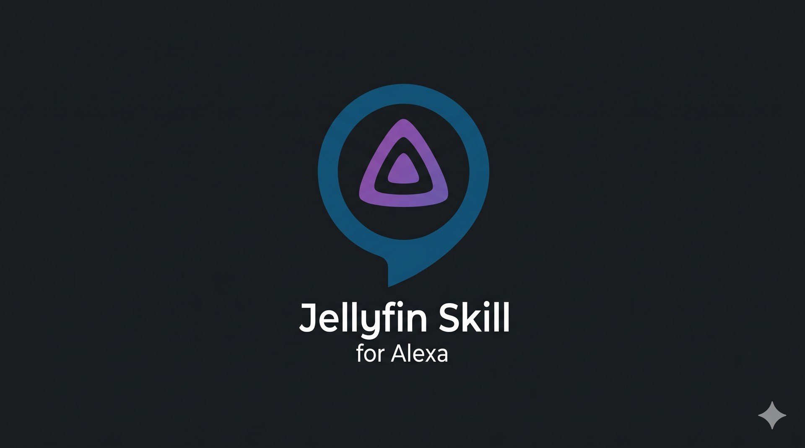
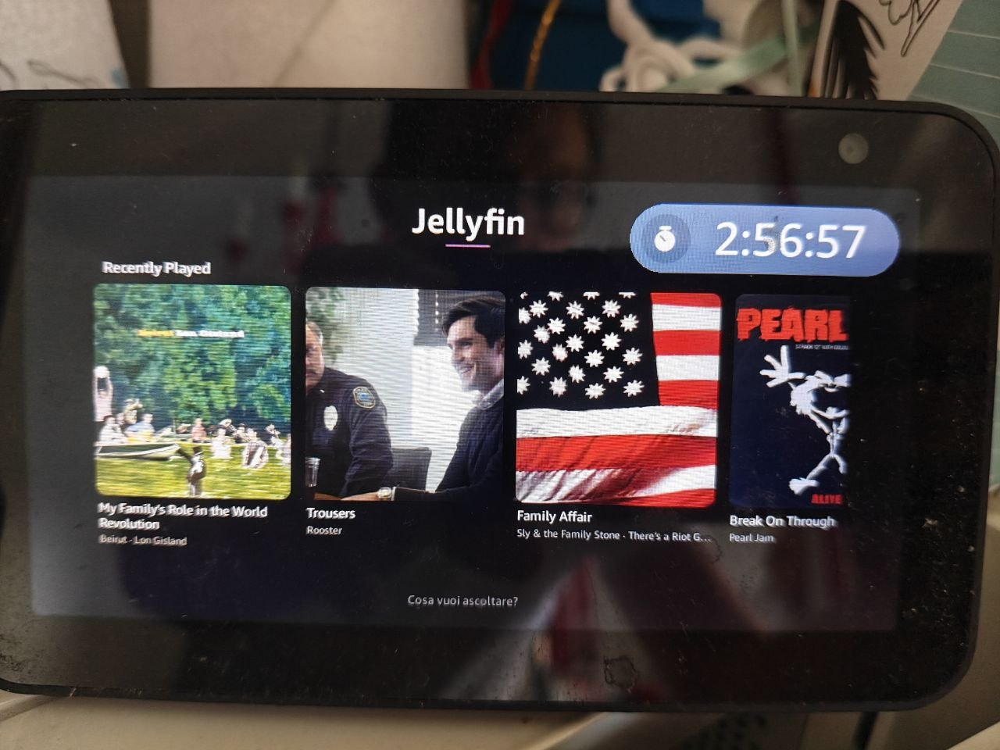
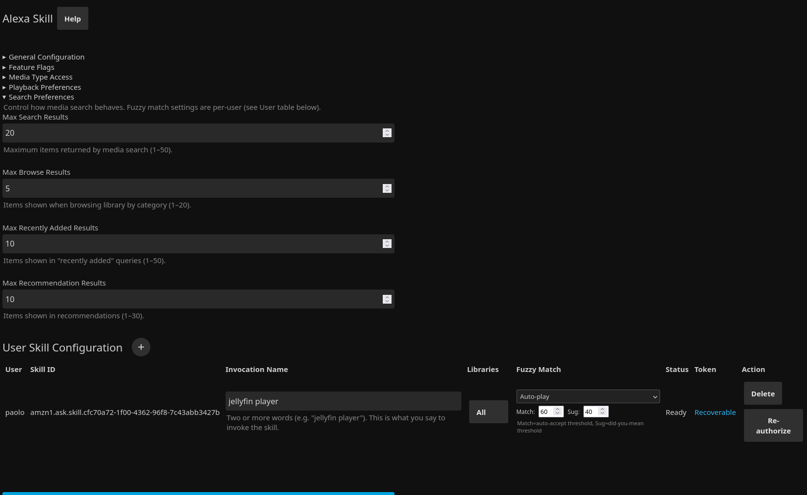

<div align="center">



# Jellyfin Alexa Plugin

**Control your Jellyfin media server with Alexa voice commands.**

Play music, videos, playlists, search your library, manage favorites, and more — across 17 locales.

<br/>

[](https://github.com/paoloantinori/jellyfin-alexa-plugin/actions/workflows/ci.yml)
[](https://github.com/paoloantinori/jellyfin-alexa-plugin/releases)
[](LICENSE)

<br/>

<p>
  
  &nbsp;&nbsp;&nbsp;
  
</p>

<br/>

<i>Fork of the <a href="https://github.com/infinityofspace/jellyfin-alexa-plugin">original project by infinityofspace</a>, migrated to Jellyfin 10.11.x with additional features and bug fixes.</i>

<br/>

⚠️ _Alpha software: features may change between releases. Always back up your configuration before updating._

</div>

---

## ✨ Highlights

<table>
<tr>
<td width="50%">

### 🎵 Music & Audio
Play songs, albums, artists, audiobooks, podcasts, and playlists. Conversational song search with multi-turn dialog. Phonetic matching for accented speech. AutoPlay radio mode when the queue ends.

</td>
<td width="50%">

### 📺 Video & TV
Play movies, TV episodes, and channels. Resume playback with three-tier position fallback. APL visual carousel with tappable image cards on Echo Show devices.

</td>
</tr>
<tr>
<td width="50%">

### 🔍 Smart Search
4-tier artist search fallback chain. Bigram index for O(1) song title lookup. ASR compound-word fix. Configurable Fast/Thorough modes per user.

</td>
<td width="50%">

### 🌍 17 Locales
Full custom utterances in 11 languages: English (5 variants), Spanish (3), French (2), German, Italian, Portuguese, Arabic, Dutch, Hindi, and Japanese.

</td>
</tr>
</table>

---

## 📋 Table of Contents

1. [About](#about)
2. [Features](#features)
3. [Prerequisites](#prerequisites)
4. [Installation](#installation)
5. [Amazon Developer Setup](#amazon-developer-setup)
6. [Plugin Configuration](#plugin-configuration)
7. [LWA Authorization](#lwa-authorization)
8. [Account Linking](#account-linking)
9. [Testing](#testing)
10. [Supported Languages](#supported-languages)
11. [FAQ](#faq)
12. [Troubleshooting](#troubleshooting)
13. [Third Party Notices](#third-party-notices)
14. [All Voice Commands by Language](VOICE_COMMANDS.md)
15. [License](#license)

## About

A Jellyfin plugin that creates a personal Alexa skill to play and control media from your Jellyfin server using voice commands. Each Jellyfin user gets their own skill with a customizable invocation name, per-user library access controls, and configurable fuzzy matching. Supports custom interaction model deployment for advanced users who want to add their own intents or utterances.

## Features

- **Playback control**: play songs, albums, artists, videos, TV episodes, audiobooks, podcasts, channels, and playlists
- **Search & discovery**: search your library, get recommendations, browse by category, play random media
- **Conversational song search**: multi-turn "find a song" dialog — guide the skill with artist name and keywords, then pick from disambiguated results
- **APL visual carousel**: browse/search results displayed as tappable image cards on Echo Show devices, with album art and media thumbnails
- **APL NowPlaying screen**: progress bar with elapsed/total time display on Echo Show devices during audio playback, plus enriched companion app card showing song, artist, album, and track number
- **Resume offer**: when reopening the skill, offers to resume where you left off instead of starting fresh
- **ASR compound-word fix**: automatically retries split compound words when Alexa's speech recognition joins or separates words (e.g., "soulcoughing" → "soul coughing")
- **Queue management**: add to queue, play next, clear/list queue, shuffle, repeat, start over
- **Radio mode**: radio station based on your library with on/off toggle
- **Favorites**: play your favorites, add/remove favorites by voice
- **Genre & mood**: play by genre, by decade, or by mood (happy, sad, relaxing, workout, etc.)
- **Library browsing**: browse movies, series, albums, genres; see in-progress media; continue watching
- **Media info**: ask what's playing — song name, artist, album, duration, genre, year
- **Sleep timer**: stop playback after a specified duration
- **Voice profiles**: "Learn my voice" and "Who am I" for multi-user voice recognition
- **Follow me**: transfer playback between Alexa devices
- **Multi-user**: each Jellyfin user gets their own skill with individual settings
- **Per-user fuzzy matching**: configurable match behavior (confirm/auto-play) and threshold
- **Custom interaction models**: deploy your own interaction model via URL for any locale
- **Multi-language**: 17 locales across 11 languages with 58 intents each
- **Audio and video**: supports both audio playback (AudioPlayer) and video launching
- **Audiobook seek bar**: multi-chapter audiobooks on Echo Show get a full-book seek bar via HLS concat streaming, with accurate seeking across chapters
- **Robust resume**: three-tier position fallback (Alexa context → Jellyfin session → device queue) ensures playback resumes correctly even after session state is cleared
- **Fast/Thorough search mode**: per-user choice between fast single-query auto-play or thorough multi-tier fallback with disambiguation
- **PostPlay AutoPlay**: when a single song ends and the queue is empty, automatically enqueues similar tracks from your library (configurable per-user or globally)
- **Phonetic matching**: Double Metaphone pre-filter improves fuzzy matching for non-English artist names (e.g., "soul coughing" matches even with heavy accent distortion)
- **Phonetic song search**: When an exact title match fails, a phonetic fallback matches misspelled song titles (e.g., "rapsodi" finds "Rhapsody", "fotograf" finds "Photograph"). Protected by a feature flag so native speakers can opt out

## Prerequisites

Before you begin, you need:

1. **Jellyfin 10.11.x** server (earlier versions are not supported)
2. **Publicly accessible HTTPS URL** for your Jellyfin server with a valid SSL certificate
   - Options: wildcard certificate, trusted CA certificate, or self-signed certificate
   - Your server must be reachable from the internet (Amazon's servers need to reach it)
3. **Amazon Developer account** (free) — [create one here](https://developer.amazon.com/en-US/docs/alexa/ask-overviews/create-developer-account.html)

## Installation

### Option 1: Plugin Repository (Recommended)

1. Open the admin dashboard of your Jellyfin server
2. Go to **Plugins** and select the **Repositories** tab
3. Add a new repository with this URL (name can be anything):
   ```
   https://raw.githubusercontent.com/paoloantinori/jellyfin-alexa-plugin/main/manifest.json
   ```
4. Go to the **Catalog** tab and find **AlexaSkill** under the **General** category
5. Install the plugin and restart your Jellyfin server

### Option 2: Manual Installation

1. Download the latest release from the [releases page](https://github.com/paoloantinori/jellyfin-alexa-plugin/releases)
2. Extract the ZIP file
3. Create a folder named `Jellyfin.Plugin.AlexaSkill` inside your Jellyfin server's `plugins` directory
4. Copy the extracted files into that folder
5. Restart your Jellyfin server

### Option 3: Build from Source

```bash
git clone https://github.com/paoloantinori/jellyfin-alexa-plugin.git
cd jellyfin-alexa-plugin
git checkout <version>      # use the latest release tag
dotnet publish --configuration Release
```

Copy the contents of `Jellyfin.Plugin.AlexaSkill/bin/Release/net9.0/publish/` to your Jellyfin `plugins/Jellyfin.Plugin.AlexaSkill/` folder, then restart Jellyfin.

## Development

### Build & Test

```bash
dotnet build Jellyfin.Plugin.AlexaSkill.sln
dotnet test Jellyfin.Plugin.AlexaSkill.Tests
```

### Validation Scripts

```bash
python3 scripts/validate_interaction_models.py  # Check all 17 models
python3 scripts/validate_locales.py             # Check locale key coverage
python3 scripts/validate_versions.py            # Check version consistency
python3 scripts/validate_apl.py                 # Check APL templates
```

See `CLAUDE.md` in the repository for detailed development documentation including handler patterns, interaction model editing, and project layout.

## Amazon Developer Setup

The plugin uses **Login with Amazon (LWA)** to create and manage your Alexa skill. You need to create a Security Profile in your Amazon Developer account.

### Step 1: Create a Security Profile

1. Go to the [Amazon Developer Security Profiles page](https://developer.amazon.com/settings/console/securityprofile)
2. Click **Create a New Security Profile**
3. Fill in the details:
   - **Security Profile Name**: something like "Jellyfin Alexa Plugin"
   - **Security Profile Description**: "LWA profile for my Jellyfin Alexa skill"
   - **Privacy Policy URL**: you can use your Jellyfin server URL
4. Click **Save**

### Step 2: Get Your Client ID and Client Secret

1. In the Security Profile you just created, click **Web Settings** (or the gear icon)
2. Click **Edit**
3. Note down the **Client ID** — you'll need this in plugin configuration
4. Click **Show Secret** and note down the **Client Secret**
5. Under **Allowed Return URLs**, add your Jellyfin server's callback URL:
   ```
   https://YOUR-SERVER-URL/alexaskill/lwa/callback
   ```
   Replace `YOUR-SERVER-URL` with your actual public HTTPS address (e.g., `https://jellyfin.example.com/alexaskill/lwa/callback`)
6. Click **Save**

## Plugin Configuration

<div align="center">
  
</div>

1. Open your Jellyfin admin dashboard
2. Go to **Plugins** and find **AlexaSkill** in the installed plugins list
3. Click on the plugin to open its configuration page

### General Settings

| Setting | Description |
|---------|-------------|
| **Server Address** | Your Jellyfin server's public HTTPS URL (e.g., `https://jellyfin.example.com`) |
| **SSL Certificate Type** | The type of your SSL certificate: Wildcard, Trusted, or SelfSigned |
| **LWA Client ID** | The Client ID from your Amazon Security Profile |
| **LWA Client Secret** | The Client Secret from your Amazon Security Profile |

### Adding a User Skill

1. In the plugin configuration, you'll see a table of users
2. Click **Add** to create a new skill for a Jellyfin user
3. Select the Jellyfin user from the dropdown
4. Optionally customize the **invocation name** (default: "Jellyfin Player", Italian: "Mia Collezione")

Per-user settings include **fuzzy match behavior** (Confirm or Auto-Play), **fuzzy match threshold** (0–100), **allowed libraries** (restrict to specific top-level folders), **content type access** (music, videos, audiobooks, books), **search response mode** (Fast or Thorough), and **PostPlay behavior** (Stop or AutoPlay). Fast mode skips fallback tiers and auto-plays the first match; Thorough runs the full fallback chain with disambiguation. AutoPlay continues with similar tracks when a song ends and the queue is empty.

### Feature Flags

Toggle individual features on or off from the configuration page: radio mode, podcasts, mood music, sleep timer, chapter navigation, recommendations, artist library queries, voice profile recognition, resume offer, and ASR compound-word correction.

### Custom Interaction Model

Deploy a custom interaction model from a URL to override the built-in model for any of the 17 supported locales. This allows adding custom intents or utterances without modifying the plugin source. Use the **Deploy** button after entering the model URL and selecting the target locale. The **Restore** button reverts to the default embedded model.

## LWA Authorization

After adding a user, you need to authorize with Amazon:

1. In the plugin configuration, click **Authorize** next to the user
2. A new browser tab opens to the Amazon login page
3. Sign in with your Amazon account and approve the access request
4. You'll be redirected back to your Jellyfin server
5. The plugin automatically creates the Alexa skill and uploads the interaction models. If you re-authorize (e.g., after a token expiry), the existing skill is reused rather than creating a duplicate

The status column shows the current state:
- **LWA Auth Pending**: waiting for Amazon login
- **Skill Creating**: skill is being created in Amazon Developer Console
- **Account Link Pending**: skill is ready, waiting for account linking in Alexa app
- **Ready**: fully configured and operational

## Account Linking

The final step links your Jellyfin account to the Alexa skill:

1. Open the **Alexa app** on your phone
2. Go to **Skills & Games** and search for your skill's invocation name
3. Or go directly to your skills at [alexa.amazon.com](https://alexa.amazon.com)
4. Enable the skill — you'll be prompted to link your account
5. Enter your **Jellyfin username and password** on the linking page
6. After successful linking, the skill is ready to use

## Testing

### Automated NLU Tests

Validate that Alexa's NLU resolves utterances to the correct intents using the SMAPI `profile-nlu` endpoint:

```bash
./scripts/run_nlu_tests.sh                  # all locales
./scripts/run_nlu_tests.sh -k "it-IT"       # single locale
./scripts/run_nlu_tests.sh --dry-run         # validate fixture structure only
```

Requires the `ask` CLI authenticated and either `~/.ask/ask_states.json` with a skill ID or the `ASK_SKILL_ID` environment variable. Test fixtures live in `tests/integration/fixtures/*.yaml`.

### Automated E2E Tests

Full-chain integration tests that send utterances through Alexa's complete pipeline (NLU + skill execution + Jellyfin API) via SMAPI `simulate-skill`:

```bash
./scripts/run_e2e_tests.sh                                         # requires live Jellyfin server
./scripts/run_e2e_tests.sh --dry-run                               # validate fixtures only
```

E2E tests are auto-skipped if no Jellyfin server is configured. Provide connection details via CLI flags or environment variables:

| Flag | Env Var | Description |
|------|--------|-------------|
| `--jellyfin-url` | `JELLYFIN_URL` | Jellyfin server base URL (e.g. `https://jellyfin.example.com`) |
| `--jellyfin-api-key` | `JELLYFIN_API_KEY` | Jellyfin API key |
| `--jellyfin-user` | `JELLYFIN_USER` | Jellyfin username |

E2E test fixtures are in `tests/integration/fixtures/e2e_*.yaml`. Note that `simulate-skill` routes through Alexa's full NLU which competes with built-in Amazon skills, making some locales (especially en-US) unreliable for automated testing.

### Using the Alexa Simulator

1. Go to the [Alexa Developer Console](https://developer.amazon.com/alexa/console/ask)
2. Find your skill and click **Test**
3. Switch to **Development** mode
4. Use the simulator to type or speak commands, e.g.:
   - "Alexa, tell Jellyfin Player to play songs by Daft Punk"
   - "Alexa, ask Jellyfin Player what's playing"
   - "Alexa, chiedi a mia collezione di suonare musica dei queen" (Italian)

**Tip**: Before adding new utterances to the interaction model, type them in the simulator first. The **JSON Input** tab shows exactly which intent Alexa resolved and what slot values it extracted. If it says "No intent was resolved" or routes to the wrong intent, you need to adjust your sample utterances or invocation name — no amount of handler-side logic can fix a routing problem.

### Using Your Echo Device

Once account linking is complete, try:
- "Alexa, open Jellyfin Player"
- "Alexa, tell Jellyfin Player to play the album Discovery"
- "Alexa, ask Jellyfin Player to play my favorites"
- "Alexa, chiedi a mia collezione di suonare i pink floyd" (Italian)

## Supported Languages

The skill supports **17 locales** across **11 languages**, each with full custom utterances in the interaction model files at [`Jellyfin.Plugin.AlexaSkill/Alexa/InteractionModel/`](Jellyfin.Plugin.AlexaSkill/Alexa/InteractionModel/).

| Language | Locale | Interaction Model |
|----------|--------|-------------------|
| Arabic | ar-SA | [`model_ar-SA.json`](Jellyfin.Plugin.AlexaSkill/Alexa/InteractionModel/model_ar-SA.json) |
| Dutch | nl-NL | [`model_nl-NL.json`](Jellyfin.Plugin.AlexaSkill/Alexa/InteractionModel/model_nl-NL.json) |
| English (US) | en-US | [`model_en-US.json`](Jellyfin.Plugin.AlexaSkill/Alexa/InteractionModel/model_en-US.json) |
| English (UK) | en-GB | [`model_en-GB.json`](Jellyfin.Plugin.AlexaSkill/Alexa/InteractionModel/model_en-GB.json) |
| English (Australia) | en-AU | [`model_en-AU.json`](Jellyfin.Plugin.AlexaSkill/Alexa/InteractionModel/model_en-AU.json) |
| English (Canada) | en-CA | [`model_en-CA.json`](Jellyfin.Plugin.AlexaSkill/Alexa/InteractionModel/model_en-CA.json) |
| English (India) | en-IN | [`model_en-IN.json`](Jellyfin.Plugin.AlexaSkill/Alexa/InteractionModel/model_en-IN.json) |
| French (France) | fr-FR | [`model_fr-FR.json`](Jellyfin.Plugin.AlexaSkill/Alexa/InteractionModel/model_fr-FR.json) |
| French (Canada) | fr-CA | [`model_fr-CA.json`](Jellyfin.Plugin.AlexaSkill/Alexa/InteractionModel/model_fr-CA.json) |
| German | de-DE | [`model_de-DE.json`](Jellyfin.Plugin.AlexaSkill/Alexa/InteractionModel/model_de-DE.json) |
| Hindi | hi-IN | [`model_hi-IN.json`](Jellyfin.Plugin.AlexaSkill/Alexa/InteractionModel/model_hi-IN.json) |
| Italian | it-IT | [`model_it-IT.json`](Jellyfin.Plugin.AlexaSkill/Alexa/InteractionModel/model_it-IT.json) |
| Japanese | ja-JP | [`model_ja-JP.json`](Jellyfin.Plugin.AlexaSkill/Alexa/InteractionModel/model_ja-JP.json) |
| Portuguese (Brazil) | pt-BR | [`model_pt-BR.json`](Jellyfin.Plugin.AlexaSkill/Alexa/InteractionModel/model_pt-BR.json) |
| Spanish (Spain) | es-ES | [`model_es-ES.json`](Jellyfin.Plugin.AlexaSkill/Alexa/InteractionModel/model_es-ES.json) |
| Spanish (Mexico) | es-MX | [`model_es-MX.json`](Jellyfin.Plugin.AlexaSkill/Alexa/InteractionModel/model_es-MX.json) |
| Spanish (US) | es-US | [`model_es-US.json`](Jellyfin.Plugin.AlexaSkill/Alexa/InteractionModel/model_es-US.json) |

Each JSON file contains all 58 intents with locale-specific sample utterances. To see the complete list of voice commands for any language, open the corresponding interaction model file and look at the `samples` arrays within each intent.

For a formatted reference of all voice commands by language, see [VOICE_COMMANDS.md](VOICE_COMMANDS.md).

## FAQ

### My invocation name doesn't work — Alexa doesn't recognize it

Choosing an invocation name is trickier than it seems. Two common pitfalls:

1. **Foreign words in a non-matching locale**: If your Echo device is set to, say, Italian (it-IT), Alexa's speech recognition is tuned for Italian phonology. An invocation name containing English or other foreign words may be misrecognized or fail to trigger consistently. Pick a name that sounds natural in the device's locale language. For example, "mia collezione" works well for Italian because every word is native Italian.

2. **Keywords that collide with built-in Alexa features**: Words like "video", "music", "radio", "tv", or "book" are heavily used by Amazon's own skills and services. An invocation name containing these words can cause Alexa to route your request to a built-in skill instead of yours, or leave the intent unresolved. Avoid these keywords entirely.

If you're unsure whether a name will work, test it in the [Alexa Developer Console](https://developer.amazon.com/alexa/console/ask) simulator before committing (see the [Testing section](#using-the-alexa-simulator)).

### How do I verify that my utterances route to the correct intent?

Use the **Alexa Developer Console** simulator. Go to your skill → **test** → enable **Development** mode → type or speak an utterance. The simulator shows which intent Alexa resolved, the extracted slot values, and the full request JSON. This is the fastest way to confirm that a new utterance or invocation name works before trying it on a real device.

## Troubleshooting

### "There was a problem with the requested skill's response"

- Verify your Jellyfin server is publicly accessible at the configured URL
- Check that your SSL certificate is valid
- Ensure the skill endpoint in the Alexa Developer Console matches your server URL

### Authorization fails or token expires

- Go back to plugin configuration and click **Authorize** again
- Check that your LWA Client ID and Client Secret are correct
- Verify the **Allowed Return URL** in your Amazon Security Profile matches `https://YOUR-SERVER-URL/alexaskill/lwa/callback`

### Interaction model build fails

- Check the Alexa Developer Console for error messages
- Ensure no other skills use the same invocation name
- Try deleting and re-creating the user skill in plugin configuration

### Account linking fails in the Alexa app

- Verify your Jellyfin credentials are correct
- Check that the plugin's **Account Linking Client ID** is set (auto-generated on first configuration)
- Ensure your Jellyfin server's account linking endpoint is reachable

### Plugin not appearing in Jellyfin

- Confirm the plugin repository URL is correct
- Check the Jellyfin logs for errors during plugin loading
- Verify you're running Jellyfin 10.11.x or later

### Configuration file

The plugin stores its configuration at `plugins/configurations/Jellyfin.Plugin.AlexaSkill.xml` in your Jellyfin data directory.

## Third Party Notices

| Module | License | Project |
|--------|---------|---------|
| Alexa.NET | [License](https://raw.githubusercontent.com/timheuer/alexa-skills-dotnet/master/LICENSE) | [Project](https://github.com/timheuer/alexa-skills-dotnet) |
| Alexa.NET.Management | [License](https://raw.githubusercontent.com/stoiveyp/Alexa.NET.Management/main/LICENSE) | [Project](https://github.com/stoiveyp/Alexa.NET.Management) |
| Amazon.Lambda.Core | [License](https://raw.githubusercontent.com/aws/aws-lambda-dotnet/master/LICENSE) | [Project](https://github.com/aws/aws-lambda-dotnet/tree/master/Libraries/src/Amazon.Lambda.Core) |
| Amazon.Lambda.Serialization.Json | [License](https://raw.githubusercontent.com/aws/aws-lambda-dotnet/master/LICENSE) | [Project](https://github.com/aws/aws-lambda-dotnet/tree/master/Libraries/src/Amazon.Lambda.Serialization.Json) |
| Refit | [License](https://raw.githubusercontent.com/reactiveui/refit/main/LICENSE) | [Project](https://github.com/reactiveui/refit) |
| Jellyfin.Controller | [License](https://raw.githubusercontent.com/jellyfin/jellyfin/master/LICENSE) | [Project](https://github.com/jellyfin/jellyfin) |

## License

[GPL-3.0](LICENSE)
