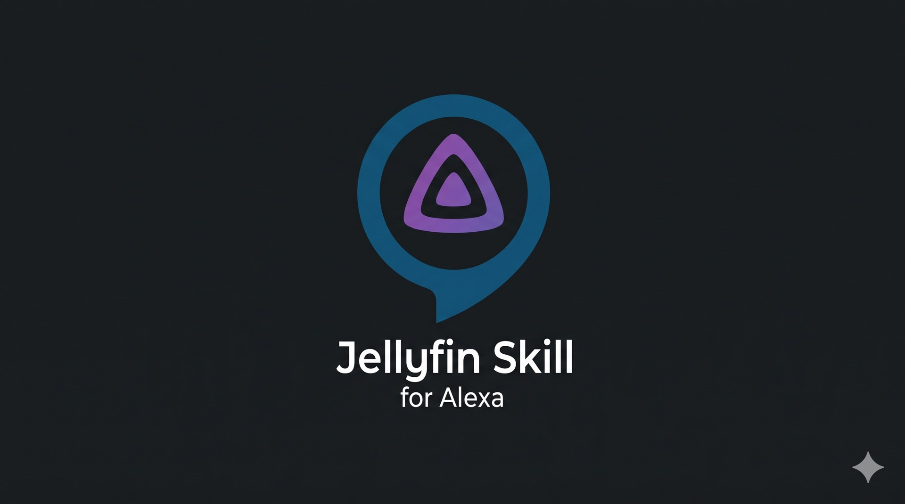
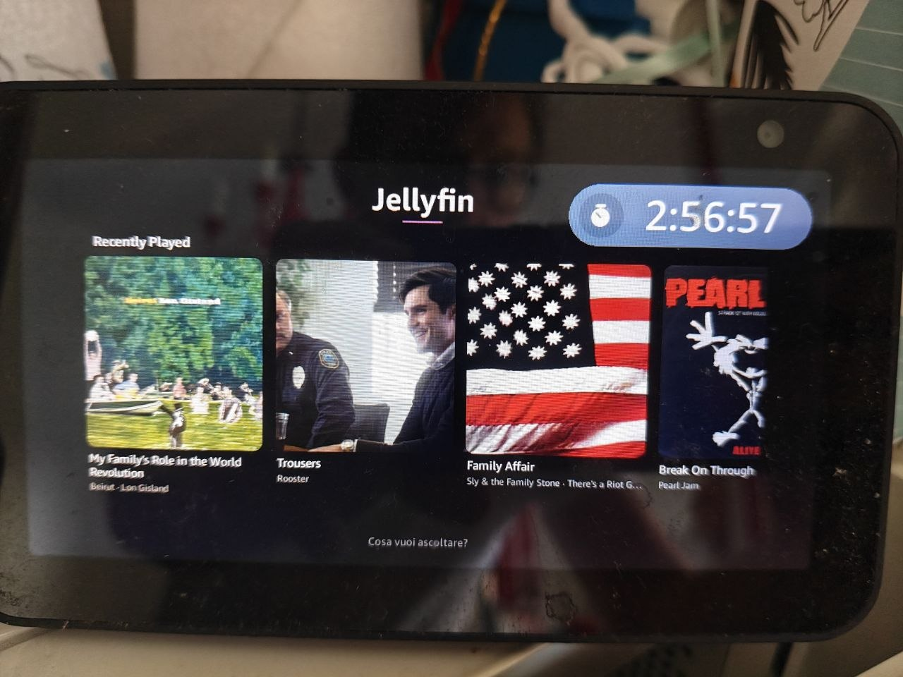
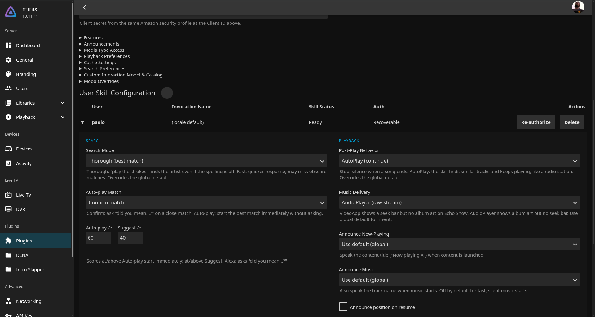

<div align="center">



# Jellyfin Alexa Plugin

**Control your Jellyfin media server with Alexa voice commands.**

Play music, videos, playlists, search your library, manage favorites, and more — across 17 locales.

<br/>

[](https://github.com/paoloantinori/jellyfin-alexa-plugin/actions/workflows/ci.yml)
[](https://github.com/paoloantinori/jellyfin-alexa-plugin/releases)
[](LICENSE)

<br/>

<p>
  
  &nbsp;&nbsp;&nbsp;
  
</p>

<br/>

<i>Fork of the <a href="https://github.com/infinityofspace/jellyfin-alexa-plugin">original project by infinityofspace</a>, migrated to Jellyfin 10.11.x with additional features and bug fixes.</i>

<br/>

⚠️ _Alpha software: features may change between releases. Always back up your configuration before updating._

</div>

---

## ✨ Highlights

<table>
<tr>
<td width="50%">

### 🎵 Music & Audio
Play songs, albums, artists, audiobooks, podcasts, and playlists. Conversational song search with multi-turn dialog. Phonetic matching for accented speech. AutoPlay radio mode when the queue ends.

</td>
<td width="50%">

### 📺 Video & TV
Play movies, TV episodes, and channels. Resume playback with three-tier position fallback. APL visual carousel with tappable image cards on Echo Show devices.

</td>
</tr>
<tr>
<td width="50%">

### 🔍 Smart Search
4-tier artist search fallback chain. Bigram index for O(1) song title lookup. ASR compound-word fix. Configurable Fast/Thorough modes per user.

</td>
<td width="50%">

### 🌍 17 Locales
Full custom utterances in 11 languages: English (5 variants), Spanish (3), French (2), German, Italian, Portuguese, Arabic, Dutch, Hindi, and Japanese.

</td>
</tr>
</table>

---

## 📋 Table of Contents

1. [About](#about)
2. [Features](#features)
3. [Prerequisites](#prerequisites)
4. [Installation](#installation)
5. [Amazon Developer Setup](#amazon-developer-setup)
6. [Plugin Configuration](#plugin-configuration)
7. [LWA Authorization](#lwa-authorization)
8. [Account Linking](#account-linking)
9. [Testing](#testing)
10. [Supported Languages](#supported-languages)
11. [FAQ](#faq)
12. [Troubleshooting](#troubleshooting)
13. [Development](#development)
14. [Third Party Notices](#third-party-notices)
15. [All Voice Commands by Language](VOICE_COMMANDS.md)
16. [License](#license)

## About

A Jellyfin plugin that creates a personal Alexa skill to play and control media from your Jellyfin server using voice commands. Each Jellyfin user gets their own skill with a customizable invocation name, per-user library access controls, and configurable fuzzy matching. Supports custom interaction model deployment for advanced users who want to add their own intents or utterances.

## Features

### 🎵 Playback & queue
- **Broad media support**: play songs, albums, artists, videos, TV episodes, audiobooks, podcasts, channels, and playlists — both audio (AudioPlayer) and video launching
- **Queue management**: add to queue, play next, clear/list queue, shuffle, repeat, start over
- **Radio mode**: a radio station based on your library, with on/off toggle
- **Sleep timer**: stop playback after a specified duration
- **Music delivery choice** (per-user): on Echo Show, choose the seek-bar VideoApp view or plain instant AudioPlayer playback
- **Now-playing announce**: optional spoken announcement ("Now playing X") when content launches. Separate toggles for video/book launches (default on) and music plays (opt-in)

### 🔍 Search & discovery
- **Search your library**: search, get recommendations, browse by category, play random media
- **Conversational song search**: multi-turn "find a song" dialog — guide the skill with artist name and keywords, then pick from disambiguated results
- **Library browsing**: browse movies, series, albums, genres; see in-progress media; continue watching
- **Favorites**: play your favorites, add/remove favorites by voice
- **Genre & mood**: play by genre, by decade, or by mood (relaxing, chill, happy, sad, focus, workout, party, sleep, dinner, and more — aligned to the moods users recognize from Spotify)
- **Media info**: ask what's playing — song name, artist, album, duration, genre, year

### 🧠 Smart matching
- **Per-user fuzzy matching**: configurable match behavior (confirm/auto-play) and threshold
- **Phonetic artist matching**: Double Metaphone pre-filter improves matching for non-English names (e.g., "soul coughing" matches even with heavy accent distortion)
- **Phonetic song search**: when an exact title match fails, a phonetic fallback matches misspelled titles (e.g., "rapsodi" finds "Rhapsody", "fotograf" finds "Photograph"); feature-flagged so native speakers can opt out
- **Romance phonetic synonyms**: generates Italian/Spanish/French/Portuguese pronunciation variants for English artist and album names (e.g., "Coughing" → "Cofin"/"Coffin") so Alexa's ASR recognizes accented speech; uploaded to the catalog automatically
- **Cross-media artist suggestion**: when a song or album isn't found but a plausible artist matches, the skill offers to play that artist instead of a dead-end "not found" (configurable: ask first / play directly / off)
- **ASR compound-word fix**: retries split compound words when Alexa's speech recognition joins or separates them (e.g., "soulcoughing" → "soul coughing")
- **Abbreviation matching**: titles stored with abbreviations ("Decatur St.") are found when you say the full word ("Decatur Street"). Covers St./Rd./Ave./Pt./Vol. bidirectionally
- **Accent-drift tolerance**: a single misheard word in a multi-word title no longer blocks the match; the un-drifted words carry it (e.g., "Decature" heard as "the cater" still finds "Decatur St.")
- **Smart ranking**: when multiple songs match partially, the one whose remaining words are closest to what you said ranks first (e.g., "Decatur St." beats "St. Gregory" when you said "street")
- **Cross-locale English tolerance**: English function words ("the", "and") are stripped regardless of the device locale, so English titles spoken on non-English Echos match correctly
- **Fast/Thorough search mode**: per-user choice between fast single-query auto-play or thorough multi-tier fallback with disambiguation

### ▶️ Resume & continuity
- **Resume offer**: when reopening the skill, offers to resume where you left off instead of starting fresh
- **Robust resume**: three-tier position fallback (Alexa context → Jellyfin session → device queue) ensures playback resumes correctly even after session state is cleared
- **PostPlay AutoPlay**: when a single song ends and the queue is empty, automatically enqueues similar tracks from your library (configurable per-user or globally)

### 📺 Echo Show & visuals
- **Audiobook seek bar**: multi-chapter audiobooks on Echo Show get a full-book seek bar via HLS concat streaming, with accurate seeking across chapters
- **APL visual carousel**: browse/search results displayed as tappable image cards on Echo Show devices, with album art and media thumbnails
- **APL NowPlaying screen**: progress bar with elapsed/total time display on Echo Show devices during audio playback, plus an enriched companion app card showing song, artist, album, and track number

### 👥 Multi-user, voice & config
- **Multi-user**: each Jellyfin user gets their own skill with individual settings
- **Per-user settings**: library access, content-type access, fuzzy matching, search mode, PostPlay, and music delivery — all configurable per user or globally
- **Voice profiles**: "Learn my voice" and "Who am I" for multi-user voice recognition
- **Follow me**: transfer playback between Alexa devices (pull model: speak "follow me" to the destination Echo). Two limitations: the current track restarts from the beginning on the new device (position is not carried over), and the source device does not stop automatically, so pause it manually (custom Alexa skills cannot send a stop command to another device)
- **Custom interaction models**: deploy your own interaction model via URL for any locale

### 🌍 Languages
- **17 locales across 11 languages** (58 intents each): English (5 variants), Spanish (3), French (2), German, Italian, Portuguese, Arabic, Dutch, Hindi, and Japanese

### 🔒 Security
- **Signed stream tokens**: the video-audio streaming endpoints (used for audiobook HLS, single-song VideoApp, and seek-bar playback) are gated by signed, item-scoped HMAC tokens. Anyone who learns a Jellyfin item GUID cannot stream it without a valid token minted by the skill. Tokens expire after 10 hours.

## Prerequisites

Before you begin, you need:

1. **Jellyfin 10.11.x** server (earlier versions are not supported)
2. **Publicly accessible HTTPS URL** for your Jellyfin server with a valid SSL certificate
   - Options: wildcard certificate, trusted CA certificate, or self-signed certificate
   - Your server must be reachable from the internet (Amazon's servers need to reach it)
3. **Amazon Developer account** (free) — [create one here](https://developer.amazon.com/en-US/docs/alexa/ask-overviews/create-developer-account.html)

## Installation

### Option 1: Plugin Repository (Recommended)

1. Open the admin dashboard of your Jellyfin server
2. Go to **Plugins** and select the **Repositories** tab
3. Add a new repository with this URL (name can be anything):
   ```
   https://raw.githubusercontent.com/paoloantinori/jellyfin-alexa-plugin/main/manifest.json
   ```
4. Go to the **Catalog** tab and find **AlexaSkill** under the **General** category
5. Install the plugin and restart your Jellyfin server

### Option 2: Manual Installation

1. Download the latest release from the [releases page](https://github.com/paoloantinori/jellyfin-alexa-plugin/releases)
2. Extract the ZIP file
3. Create a folder named `Jellyfin.Plugin.AlexaSkill` inside your Jellyfin server's `plugins` directory
4. Copy the extracted files into that folder
5. Restart your Jellyfin server

### Option 3: Build from Source

```bash
git clone https://github.com/paoloantinori/jellyfin-alexa-plugin.git
cd jellyfin-alexa-plugin
git checkout <version>      # use the latest release tag
dotnet publish --configuration Release
```

Copy the contents of `Jellyfin.Plugin.AlexaSkill/bin/Release/net9.0/publish/` to your Jellyfin `plugins/Jellyfin.Plugin.AlexaSkill/` folder, then restart Jellyfin.

## Development

### Build & Test

```bash
dotnet build Jellyfin.Plugin.AlexaSkill.sln
dotnet test Jellyfin.Plugin.AlexaSkill.Tests
```

### Validation Scripts

```bash
python3 scripts/validate_interaction_models.py  # Check all 17 models
python3 scripts/validate_locales.py             # Check locale key coverage
python3 scripts/validate_versions.py            # Check version consistency
python3 scripts/validate_apl.py                 # Check APL templates
```

See `CLAUDE.md` in the repository for detailed development documentation including handler patterns, interaction model editing, and project layout.

## Amazon Developer Setup

The plugin uses **Login with Amazon (LWA)** to create and manage your Alexa skill. You need to create a Security Profile in your Amazon Developer account.

### Step 1: Create a Security Profile

1. Go to the [Amazon Developer Security Profiles page](https://developer.amazon.com/settings/console/securityprofile)
2. Click **Create a New Security Profile**
3. Fill in the details:
   - **Security Profile Name**: something like "Jellyfin Alexa Plugin"
   - **Security Profile Description**: "LWA profile for my Jellyfin Alexa skill"
   - **Privacy Policy URL**: you can use your Jellyfin server URL
4. Click **Save**

### Step 2: Get Your Client ID and Client Secret

1. In the Security Profile you just created, click **Web Settings** (or the gear icon)
2. Click **Edit**
3. Note down the **Client ID** — you'll need this in plugin configuration
4. Click **Show Secret** and note down the **Client Secret**
5. Under **Allowed Return URLs**, add your Jellyfin server's callback URL:
   ```
   https://YOUR-SERVER-URL/alexaskill/lwa/callback
   ```
   Replace `YOUR-SERVER-URL` with your actual public HTTPS address (e.g., `https://jellyfin.example.com/alexaskill/lwa/callback`)
6. Click **Save**

## Plugin Configuration

<div align="center">
  
</div>

The configuration page has two sections: global settings at the top (server address, SSL, Amazon credentials, feature toggles, announcements, playback defaults, cache, search, catalog sync, mood overrides), and the per-user skill table below (each row expands to show search mode, playback, music delivery, invocation name, and library access for that user).

1. Open your Jellyfin admin dashboard
2. Go to **Plugins** and find **AlexaSkill** in the installed plugins list
3. Click on the plugin to open its configuration page

### General Settings

| Setting | Description |
|---------|-------------|
| **Server Address** | Your Jellyfin server's public HTTPS URL (e.g., `https://jellyfin.example.com`) |
| **SSL Certificate Type** | The type of your SSL certificate: Wildcard, Trusted, or SelfSigned |
| **LWA Client ID** | The Client ID from your Amazon Security Profile |
| **LWA Client Secret** | The Client Secret from your Amazon Security Profile |

### Adding a User Skill

1. In the plugin configuration, you'll see a table of users. Each row shows the **user name**, **invocation name**, **skill status** (Ready / Recoverable / Auth pending), and **auth** state, plus **Re-authorize** and **Delete** actions.
2. Click **Add** to create a new skill for a Jellyfin user
3. Select the Jellyfin user from the dropdown
4. **Save** to create the skill (a new user only persists the invocation name at first).
5. Click a row (or its chevron) to **expand** it and reveal the per-user settings grouped into three panels:
   - **Invocation & Libraries**: the invocation name (leave **empty** for locale defaults — Italian: "Mia Collezione"; all other locales: "Jellyfin Player" — or enter a custom two-or-more-word name that applies to **all** locales) plus the allowed-libraries picker. Saving a changed invocation name redeploys it to Amazon automatically (~15–30s); use **Reset** to return to locale defaults.
   - **Search**: fuzzy match behavior, thresholds, and search response mode.
   - **Playback**: PostPlay behavior, music delivery (seek bar vs. raw stream), and announcement options.

The summary row stays visible when collapsed, so skill status is glanceable without expanding each user.

Per-user settings include **fuzzy match behavior** (Confirm or Auto-Play), **fuzzy match threshold** (0–100), **allowed libraries** (restrict to specific top-level folders), **content type access** (music, videos, audiobooks, books), **search response mode** (Fast or Thorough), **PostPlay behavior** (Stop or AutoPlay), and **cross-media artist suggestion** (Confirm, Auto-Serve, or Off). Fast mode skips fallback tiers and auto-plays the first match; Thorough runs the full fallback chain with disambiguation. AutoPlay continues with similar tracks when a song ends and the queue is empty. The cross-media artist suggestion offers a plausible artist when a song or album isn't found (e.g., a mispronounced name), so you get a helpful prompt instead of a dead-end "not found".

### Catalog Sync

The plugin uploads your Jellyfin library (artists and albums) to Amazon's catalog slot types with **phonetic synonyms** so Alexa recognizes names spoken with a non-English accent. By default (since v0.11.2.0) this covers **all active locales**. To restrict it, set **Catalog Sync Locales** in the configuration: leave empty for Italian only, use `*` for all active locales (the default), or list specific locales (e.g., `de-DE,en-US`). The sync runs weekly and on startup (skipped if synced within the last 12 hours).

### Feature Flags

Toggle individual features on or off from the configuration page: radio mode, podcasts, mood music, sleep timer, chapter navigation, recommendations, artist library queries, voice profile recognition, resume offer, and ASR compound-word correction.

**Podcasts**: Jellyfin has no dedicated podcast type, so podcasts must be stored as albums in your Music library (one album per podcast show, one audio track per episode). The skill plays the latest episode by name.

### Custom Interaction Model

Deploy a custom interaction model from a URL to override the built-in model for any of the 17 supported locales. This allows adding custom intents or utterances without modifying the plugin source. Use the **Deploy** button after entering the model URL and selecting the target locale. The **Restore** button reverts to the default embedded model.

## LWA Authorization

After adding a user, you need to authorize with Amazon:

1. In the plugin configuration, click **Authorize** next to the user
2. A new browser tab opens to the Amazon login page
3. Sign in with your Amazon account and approve the access request
4. You'll be redirected back to your Jellyfin server
5. The plugin automatically creates the Alexa skill and uploads the interaction models. If you re-authorize (e.g., after a token expiry), the existing skill is reused rather than creating a duplicate

The status column shows the current state:
- **LWA Auth Pending**: waiting for Amazon login
- **Skill Creating**: skill is being created in Amazon Developer Console
- **Account Link Pending**: skill is ready, waiting for account linking in Alexa app
- **Ready**: fully configured and operational

## Account Linking

The final step links your Jellyfin account to the Alexa skill:

1. Open the **Alexa app** on your phone
2. Go to **Skills & Games** and search for your skill's invocation name
3. Or go directly to your skills at [alexa.amazon.com](https://alexa.amazon.com)
4. Enable the skill — you'll be prompted to link your account
5. Enter your **Jellyfin username and password** on the linking page
6. After successful linking, the skill is ready to use

## Testing

> 🎨 **[Voice Command Explorer](https://paoloantinori.github.io/jellyfin-alexa-plugin/)** — browse every voice command and how it routes between intents, interactively, in all 17 locales (utterance transition graphs).

### What the committed models contain (and what they don't)

The interaction model JSONs in this repo are the STATIC base: intents, sample utterances, and built-in slot types. They intentionally contain **no catalog data**. Your library's artist and album names are injected at RUNTIME by the plugin: a scheduled catalog sync (`CatalogSyncService`) uploads your library to SMAPI catalog slot types as dynamic values, with locale-specific phonetic synonyms (so an Italian speaker saying "sol coffin" still matches *Soul Coughing*). Two consequences worth knowing. First, the interaction-model state a real user has on Amazon cannot be reconstructed from this repo alone: the committed models plus your library ARE the deployed model. Second, if artist or album one-shot routing regresses, check the catalog sync status in the plugin config page before touching the JSONs. This architecture is deliberate; see the "Replacing catalog-backed custom slot types" anti-pattern in `CLAUDE.md` before swapping custom types for built-ins.

### Automated NLU Tests

Validate that Alexa's NLU resolves utterances to the correct intents using the SMAPI `profile-nlu` endpoint:

```bash
./scripts/run_nlu_tests.sh                  # all locales
./scripts/run_nlu_tests.sh -k "it-IT"       # single locale
./scripts/run_nlu_tests.sh --dry-run         # validate fixture structure only
```

Requires the `ask` CLI authenticated and either `~/.ask/ask_states.json` with a skill ID or the `ASK_SKILL_ID` environment variable. Test fixtures live in `tests/integration/fixtures/*.yaml`.

### Automated E2E Tests

Full-chain integration tests that send utterances through Alexa's complete pipeline (NLU + skill execution + Jellyfin API) via SMAPI `simulate-skill`:

```bash
./scripts/run_e2e_tests.sh                                         # requires live Jellyfin server
./scripts/run_e2e_tests.sh --dry-run                               # validate fixtures only
```

E2E tests are auto-skipped if no Jellyfin server is configured. Provide connection details via CLI flags or environment variables:

| Flag | Env Var | Description |
|------|--------|-------------|
| `--jellyfin-url` | `JELLYFIN_URL` | Jellyfin server base URL (e.g. `https://jellyfin.example.com`) |
| `--jellyfin-api-key` | `JELLYFIN_API_KEY` | Jellyfin API key |
| `--jellyfin-user` | `JELLYFIN_USER` | Jellyfin username |

E2E test fixtures are in `tests/integration/fixtures/e2e_*.yaml`. Note that `simulate-skill` routes through Alexa's full NLU which competes with built-in Amazon skills, making some locales (especially en-US) unreliable for automated testing.

### Using the Alexa Simulator

1. Go to the [Alexa Developer Console](https://developer.amazon.com/alexa/console/ask)
2. Find your skill and click **Test**
3. Switch to **Development** mode
4. Use the simulator to type or speak commands, e.g.:
   - "Alexa, tell Jellyfin Player to play songs by Daft Punk"
   - "Alexa, ask Jellyfin Player what's playing"
   - "Alexa, chiedi a mia collezione di suonare musica dei queen" (Italian)

**Tip**: Before adding new utterances to the interaction model, type them in the simulator first. The **JSON Input** tab shows exactly which intent Alexa resolved and what slot values it extracted. If it says "No intent was resolved" or routes to the wrong intent, you need to adjust your sample utterances or invocation name — no amount of handler-side logic can fix a routing problem.

### Using Your Echo Device

Once account linking is complete, try:
- "Alexa, open Jellyfin Player"
- "Alexa, tell Jellyfin Player to play the album Discovery"
- "Alexa, ask Jellyfin Player to play my favorites"
- "Alexa, chiedi a mia collezione di suonare i pink floyd" (Italian)

## Supported Languages

The skill supports **17 locales** across **11 languages**, each with full custom utterances in the interaction model files at [`Jellyfin.Plugin.AlexaSkill/Alexa/InteractionModel/`](Jellyfin.Plugin.AlexaSkill/Alexa/InteractionModel/).

| Language | Locale | Interaction Model |
|----------|--------|-------------------|
| Arabic | ar-SA | [`model_ar-SA.json`](Jellyfin.Plugin.AlexaSkill/Alexa/InteractionModel/model_ar-SA.json) |
| Dutch | nl-NL | [`model_nl-NL.json`](Jellyfin.Plugin.AlexaSkill/Alexa/InteractionModel/model_nl-NL.json) |
| English (US) | en-US | [`model_en-US.json`](Jellyfin.Plugin.AlexaSkill/Alexa/InteractionModel/model_en-US.json) |
| English (UK) | en-GB | [`model_en-GB.json`](Jellyfin.Plugin.AlexaSkill/Alexa/InteractionModel/model_en-GB.json) |
| English (Australia) | en-AU | [`model_en-AU.json`](Jellyfin.Plugin.AlexaSkill/Alexa/InteractionModel/model_en-AU.json) |
| English (Canada) | en-CA | [`model_en-CA.json`](Jellyfin.Plugin.AlexaSkill/Alexa/InteractionModel/model_en-CA.json) |
| English (India) | en-IN | [`model_en-IN.json`](Jellyfin.Plugin.AlexaSkill/Alexa/InteractionModel/model_en-IN.json) |
| French (France) | fr-FR | [`model_fr-FR.json`](Jellyfin.Plugin.AlexaSkill/Alexa/InteractionModel/model_fr-FR.json) |
| French (Canada) | fr-CA | [`model_fr-CA.json`](Jellyfin.Plugin.AlexaSkill/Alexa/InteractionModel/model_fr-CA.json) |
| German | de-DE | [`model_de-DE.json`](Jellyfin.Plugin.AlexaSkill/Alexa/InteractionModel/model_de-DE.json) |
| Hindi | hi-IN | [`model_hi-IN.json`](Jellyfin.Plugin.AlexaSkill/Alexa/InteractionModel/model_hi-IN.json) |
| Italian | it-IT | [`model_it-IT.json`](Jellyfin.Plugin.AlexaSkill/Alexa/InteractionModel/model_it-IT.json) |
| Japanese | ja-JP | [`model_ja-JP.json`](Jellyfin.Plugin.AlexaSkill/Alexa/InteractionModel/model_ja-JP.json) |
| Portuguese (Brazil) | pt-BR | [`model_pt-BR.json`](Jellyfin.Plugin.AlexaSkill/Alexa/InteractionModel/model_pt-BR.json) |
| Spanish (Spain) | es-ES | [`model_es-ES.json`](Jellyfin.Plugin.AlexaSkill/Alexa/InteractionModel/model_es-ES.json) |
| Spanish (Mexico) | es-MX | [`model_es-MX.json`](Jellyfin.Plugin.AlexaSkill/Alexa/InteractionModel/model_es-MX.json) |
| Spanish (US) | es-US | [`model_es-US.json`](Jellyfin.Plugin.AlexaSkill/Alexa/InteractionModel/model_es-US.json) |

Each JSON file contains all 58 intents with locale-specific sample utterances. To see the complete list of voice commands for any language, open the corresponding interaction model file and look at the `samples` arrays within each intent.

For a formatted reference of all voice commands by language, see [VOICE_COMMANDS.md](VOICE_COMMANDS.md).

## FAQ

### My invocation name doesn't work — Alexa doesn't recognize it

Choosing an invocation name is trickier than it seems. Two common pitfalls:

1. **Foreign words in a non-matching locale**: If your Echo device is set to, say, Italian (it-IT), Alexa's speech recognition is tuned for Italian phonology. An invocation name containing English or other foreign words may be misrecognized or fail to trigger consistently. Pick a name that sounds natural in the device's locale language. For example, "mia collezione" works well for Italian because every word is native Italian.

2. **Keywords that collide with built-in Alexa features**: Words like "video", "music", "radio", "tv", or "book" are heavily used by Amazon's own skills and services. An invocation name containing these words can cause Alexa to route your request to a built-in skill instead of yours, or leave the intent unresolved. Avoid these keywords entirely.

If you're unsure whether a name will work, test it in the [Alexa Developer Console](https://developer.amazon.com/alexa/console/ask) simulator before committing (see the [Testing section](#using-the-alexa-simulator)).

You can also change the invocation name from the plugin configuration: saving redeploys it to Amazon automatically (~15–30s while the models rebuild). Leave the field empty to use the locale defaults (Italian: "Mia Collezione"; other locales: "Jellyfin Player"), or set a custom name that applies to every locale — no need to edit the Alexa Developer Console manually.

### How do I verify that my utterances route to the correct intent?

Use the **Alexa Developer Console** simulator. Go to your skill → **test** → enable **Development** mode → type or speak an utterance. The simulator shows which intent Alexa resolved, the extracted slot values, and the full request JSON. This is the fastest way to confirm that a new utterance or invocation name works before trying it on a real device.

### Why does "play a different playlist" go to Amazon Music while my playlist is playing?

While music is playing from the skill, Alexa only routes **pause** and **resume** back to it automatically (it's the active audio player). A request to play something *new* (a different playlist, album, artist, or song) is treated as a fresh music search, so Alexa sends it to your **default music service** (Amazon Music, Spotify, …) instead of the skill. The skill never receives that request.

To switch to different content while something is playing, include the skill's name in the request:

- English: *"Alexa, ask **Jellyfin Player** to play the playlist **Rock**"*
- Italian: *"Alexa, chiedi a **Mia Collezione** di riprodurre la playlist **Rock**"*

This is an inherent limitation of custom Alexa skills: they cannot register as the device's default music player, so follow-on "play X" requests need the explicit invocation. It is not a bug in the plugin and behaves the same on every custom Jellyfin/Alexa skill.

### Why doesn't "stop" or "next" work while music is playing?

During playback, Alexa reliably routes **pause** and **resume** back to the skill (it's the active audio player), but generic music commands like **"stop"**, **"next"**, and **"previous"** are frequently claimed by your **default music service** (Amazon Music, Spotify, …). The skill never receives them, so nothing happens. You can confirm this in the Alexa simulator's debug output, where the utterance resolves to `<IntentForDifferentSkill>`.

This is the same platform limitation as the "play different content" case above — custom skills can't own the device's music slot — not a plugin bug.

Workarounds:

- Use **"Alexa, pause"** (Italian: *"Alexa, pausa"*). Pause always routes to the active player and stops the audio, even immediately after playback starts.
- If "stop" does nothing, try it again a moment later. Stop routing to the skill is intermittent: sometimes the utterance reaches the skill immediately, sometimes it is claimed by the default music service or lost in routing, with no pattern we or other Alexa skill developers have been able to pin down. "Pause" is the dependable alternative.
- Force the skill with its invocation name: English *"Alexa, ask Jellyfin Player to stop"*, Italian *"Alexa, chiedi a Mia Collezione ferma"* (use the imperative **ferma**/**stop**, not the infinitive "fermare").

### Why is there no progress bar / scrubber when music plays?

Music playback through this skill uses Amazon's `AudioPlayer` interface, which only provides play/pause/next/previous controls. The native music player with the seek bar is reserved for the Music/Radio/Podcast Skill API, which requires an Amazon partnership and is not available to custom skills. Every third-party Jellyfin (or Plex) skill has the same limitation; it is not a plugin bug.

What you can get instead:

- **Audiobooks on Echo Show** do have a full seek bar, because they play through the video interface (`VideoApp`). The trade-off is no album art or on-screen metadata on that path.
- The plugin setting **Native controls for audio** reroutes music through the video interface as well, gaining the seek bar at the cost of on-device transcoding (slower first play) and compatibility issues on some devices. If you enable it and playback breaks, turn it off again; the default (plain `AudioPlayer`) is the reliable path.

### Why does "next" sometimes answer "Sorry, I can't move to the next track"?

If you ask for the next track well before the current song is near its end, the Echo's own buffering sometimes answers with its built-in error message instead of passing the request to the skill. The skill is never consulted in that case, so nothing is skipped. Asking again, or waiting until the track is closer to its end, works. This comes from the device's preloaded-buffer behavior and cannot be changed from the skill side.

### What does "follow me" (moving playback to another Echo) actually do?

Saying *"Alexa, chiedi a Mia Collezione seguimi"* (English: *"ask Jellyfin Player to follow me"*) starts playback of the current track on the Echo you are speaking to. Two things to know:

1. Use the imperative form **"seguimi"**, not *"di seguirmi"*: the latter is often split by speech recognition into separate words and fails to match.
2. Playback starts the **current track from the beginning** on the new device, and the previous Echo is not always stopped automatically. Pause or stop the old device yourself if both are playing.

### Why do some Live TV / IPTV channels show a black screen or fail to play?

Live TV channels launch through the Echo's video player (`VideoApp.Launch`) — the same interface used for movies and episodes. That player decodes only a fixed set of formats. Per Amazon's [VideoApp Interface Reference](https://developer.amazon.com/en-US/docs/alexa/custom-skills/videoapp-interface-reference.html):

| Streaming format | Supported audio |
|------------------|-----------------|
| **HLS**, MPEG-TS | **AAC only** |
| SmoothStreaming, MP4, M4A | AAC, Dolby, Dolby Digital Plus |

with video restricted to **H.264** (or MPEG-4), a maximum resolution of **1280×720**, and the stream delivered over **HTTPS**.

IPTV and Live TV channels are HLS streams, so they play reliably only when the channel is **H.264 video + AAC audio**. Channels that use other codecs — **H.265/HEVC** video, or **AC-3 / E-AC-3 / Dolby** audio — exceed what the Echo's player can decode, so they show a black screen or never start. This is an Echo Show codec limitation, not a plugin bug: the plugin hands the channel's stream directly to the device, which either can or cannot decode it.

There is no plugin-side transcoding for this today. The plugin plays IPTV/M3U channels directly (no re-encode), and hardware tuners that need transcoding (HDHomeRun/DVB) are served through Jellyfin's dynamic HLS, which also targets H.264/AAC. If a channel won't play, the practical fix is to use an H.264 + AAC source, or transcode the feed upstream of Jellyfin.

### How are my Amazon and Jellyfin tokens stored? (security)

The plugin stores Amazon (Login with Amazon / SMAPI) and Jellyfin authentication tokens in the Jellyfin plugin configuration file (`plugins/configurations/Jellyfin.Plugin.AlexaSkill.xml` in your Jellyfin data directory) in plaintext. This is standard for Jellyfin plugins — the configuration is admin-only — but because these are long-lived credentials:

- Anyone with read access to the config file, or a Jellyfin backup that includes it, can extract the tokens and impersonate the linked accounts.
- Restrict filesystem access to the Jellyfin data directory, and treat backups as sensitive.
- Debug logging of Alexa request bodies redacts the access token, apiAccessToken, and Amazon userId, though enabling debug logging for triage may still surface other identifiers in log lines.

Encryption of tokens at rest is not currently implemented.

The video-audio streaming endpoints (audiobook HLS, VideoApp seek-bar playback) are additionally protected by **signed item-scoped stream tokens** (HMAC-SHA256, 10-hour TTL). These tokens are auto-generated per server instance and embedded in stream URLs by the skill. A bare item GUID without a valid token returns HTTP 401, preventing unauthorized streaming even if a GUID is leaked.

### How do I set up podcasts?

Jellyfin has no dedicated podcast type. Podcasts must be stored as **albums in your Music library**: one album per podcast show, with each episode as an audio track (mp3/m4a). To listen, say "play the podcast [name]" (Italian: "riproduci il podcast [nome]"). The skill plays the latest episode (the most recently added track).

### Alexa doesn't recognize my non-English artist/album names

The skill syncs your library's artist and album names to Amazon's catalog so Alexa recognizes them when spoken with an accent. By default (since v0.11.2.0), this sync covers **all active locales**, not just Italian. If you installed an earlier version, the sync may have been Italian-only. To fix: open the plugin config page, find the **Custom Interaction Model & Catalog** section, and make sure the catalog sync locales field is set to `*` (all locales) or lists your specific locales.

For artist names that Alexa consistently mishears (e.g. a Swedish name like "Koop" transcribed as "cup" on an Italian Echo), the skill now uses Double Metaphone phonetic matching to resolve accent drift automatically. No configuration needed.

### I asked for an artist, but Alexa says it can't find a song

A bare artist name ("play Soul Coughing") is ambiguous to Alexa's language understanding: it often gets captured as a *song title* request instead of an artist request, so a miss comes back worded as "no song found". This is intent competition in the language model, not a library problem.

Two reliable fixes:

- Add a **carrier word** before the name: *"play the band Soul Coughing"*, *"play the singer X"* (Italian: *"suona la band X"*, *"metti il cantante X"*, *"il gruppo X"*). The carrier word tells Alexa the name is an artist, and the request routes correctly.
- If the skill answers **"Did you mean X?"**, that is the disambiguation prompt: say *yes* to play the suggested match, or *no* for a clean "not found". Nothing plays without your confirmation on that path, so a wrong suggestion can never start on its own.

### Mood or genre requests find nothing, even though my artists are tagged with that genre

Jellyfin does not propagate genre tags from an artist to its audio tracks. Mood and genre playback searches the **tracks** (and albums), so tagging genres only on the artist entry in Jellyfin has no effect. Open the artist's albums in Jellyfin and set the genre on the tracks (or on the albums), then retry: *"Alexa, chiedi a Mia Collezione di mettere musica rilassante"* will find the tracks once the genre is on the audio files themselves.

### How do audiobooks work? Where should they be stored?

Audiobooks must be stored in your Jellyfin library with the `AudioBook` content type. Multi-chapter books are played as a single continuous stream via the Echo Show's video player, giving you a **full-book seek bar** (you can scrub to any position across all chapters). Resume remembers your position across sessions.

One known limitation: the seek bar's timeline is **relative to where you resumed**, not the book's absolute start. If you resume at chapter 3, the progress bar starts at 0:00 from that point. The audio position is correct; only the visual reference differs.

### The skill was working fine, then I updated the plugin and now it's broken

Plugin updates can occasionally reset the stored configuration (a known Jellyfin plugin behavior when the plugin version changes). If the skill suddenly asks you to re-link your account or shows zero users:

1. Open the plugin configuration page
2. If your user is gone, re-add it and click **Authorize** again
3. Verify the invocation name and other settings survived; restore from a backup if you made one before updating

This is not specific to this plugin; it affects any Jellyfin plugin that changes version. Making a note of your settings (or a screenshot of the config page) before updating is the practical mitigation.

## Troubleshooting

> **If the skill seems badly broken after a config change or deploy, check this first:** Alexa caches the interaction model and catalog slot data on Amazon's side, and changes take time to propagate. An utterance that worked yesterday may fail today (or vice versa) purely because a model rebuild is still in progress or a catalog version hasn't been promoted yet. Wait 2–5 minutes after any change that triggers a rebuild (invocation name, mood words, catalog sync, "Rebuild models"), then test again. Verify the model build status in the Alexa Developer Console (your skill → **Build** → **Model**) shows "Ready" before assuming a code regression.

### "There was a problem with the requested skill's response"

- Verify your Jellyfin server is publicly accessible at the configured URL
- Check that your SSL certificate is valid
- Ensure the skill endpoint in the Alexa Developer Console matches your server URL

### Behind Cloudflare or a reverse proxy: account linking works, but every voice request fails

If account linking succeeds (it goes through your browser) while every spoken request fails immediately, your proxy or firewall is most likely blocking Alexa itself. Alexa's skill requests are server-to-server `POST` calls from Amazon AWS IP addresses, with no browser fingerprint and not necessarily from your country. Two settings are known to block them, and note that **fixing only one of them is not enough** (a real case needed both, see [#18](https://github.com/paoloantinori/jellyfin-alexa-plugin/issues/18)):

1. **Bot / geo-IP / WAF rules.** Cloudflare's *Bot Fight Mode*, country-blocking rules, and similar filters on other proxies challenge or block Alexa's calls, typically answering with an immediate `403`. Allow `POST` requests to the skill endpoint from any IP, or add a rule that skips bot protection and geo-blocking for your Jellyfin hostname (you can scope it to the skill path later). See also [#8](https://github.com/paoloantinori/jellyfin-alexa-plugin/issues/8), where *Bot Fight Mode* alone was the culprit.
2. **Certificate type must be "Wildcard" on BOTH sides.** In the plugin settings *and* in the Alexa Developer Console (or your LWA security profile), set the SSL certificate type to the wildcard/self-signed option matching your setup. Having "Trusted Certificate" selected on either side breaks the skill-to-server calls even when everything else is correct.

A quick way to tell this class of problem apart from a plugin bug: if the failure is instant (the device reports an error in the same breath) and linking works, it is almost always the network path, not the skill.

### The skill behaves inconsistently (works for some names, not others) after a deploy

This is almost always **interaction-model or catalog propagation lag**, not a code bug. Two common causes:

1. **Catalog slot data hasn't propagated**: the plugin uploads your library to SMAPI catalog slot types (`JellyfinArtist`, `AlbumName`) with phonetic synonyms. After a "Rebuild models" or a catalog sync, Amazon needs time to promote the new catalog version. Until it does, some artist/album names resolve and others don't, inconsistently. Wait a few minutes and retry.
2. **The model build is still in progress**: changes to the interaction model (invocation name, mood words, slot types) trigger an asynchronous rebuild on Amazon's side. During the build, the skill may use a mix of old and new model state. Check the build status in the Alexa Developer Console.

If the inconsistency persists after 10+ minutes with the model showing "Ready", then investigate further (check the Jellyfin logs for the specific request, verify the catalog synced successfully).

### Authorization fails or token expires

- Go back to plugin configuration and click **Authorize** again
- Check that your LWA Client ID and Client Secret are correct
- Verify the **Allowed Return URL** in your Amazon Security Profile matches `https://YOUR-SERVER-URL/alexaskill/lwa/callback`

### Interaction model build fails

- Check the Alexa Developer Console for error messages
- Ensure no other skills use the same invocation name
- Try deleting and re-creating the user skill in plugin configuration

### Account linking fails in the Alexa app

- Verify your Jellyfin credentials are correct
- Check that the plugin's **Account Linking Client ID** is set (auto-generated on first configuration)
- Ensure your Jellyfin server's account linking endpoint is reachable

### The plugin says "Ready", but Alexa still asks me to link the account

The plugin's **Ready** status only means your Jellyfin username and password were accepted and stored. It does not tell you whether Amazon finished the linking on its side. The real test is a playback command: *"Alexa, ask Jellyfin Player to play my favorites"*. If it plays, linking completed and any webview loop you saw during setup was cosmetic; if Alexa answers that you need to link the account, open the plugin configuration and click **Authorize** again.

Related: during linking, the flow may redirect through a regional Amazon domain such as `alexa.amazon.co.jp` even though your account is not Japanese. Amazon picks that host from your account's marketplace, not from the skill's language, and it is harmless. As above, trust the playback test, not the redirect you saw.

### Plugin not appearing in Jellyfin

- Confirm the plugin repository URL is correct
- Check the Jellyfin logs for errors during plugin loading
- Verify you're running Jellyfin 10.11.x or later

### Artist/album search fails for everything right after a Jellyfin restart

The catalog sync runs on Jellyfin startup. If the reverse proxy or tunnel (the public URL Alexa uses to reach your server) isn't fully ready in the first few seconds after a restart, Amazon can't fetch the catalog data and the sync fails for that run — leaving the slot data stale or empty, so one-shot artist/album routing breaks. The plugin now retries this automatically (up to 3 attempts with a fresh fetch URL each time), so it usually self-heals on the next sync. If it doesn't, trigger a manual "Rebuild models" from the plugin config, or simply restart Jellyfin again once the proxy is confirmed reachable.

### Configuration file

The plugin stores its configuration at `plugins/configurations/Jellyfin.Plugin.AlexaSkill.xml` in your Jellyfin data directory.

## Third Party Notices

| Module | License | Project |
|--------|---------|---------|
| Alexa.NET | [License](https://raw.githubusercontent.com/timheuer/alexa-skills-dotnet/master/LICENSE) | [Project](https://github.com/timheuer/alexa-skills-dotnet) |
| Alexa.NET.Management | [License](https://raw.githubusercontent.com/stoiveyp/Alexa.NET.Management/main/LICENSE) | [Project](https://github.com/stoiveyp/Alexa.NET.Management) |
| Amazon.Lambda.Core | [License](https://raw.githubusercontent.com/aws/aws-lambda-dotnet/master/LICENSE) | [Project](https://github.com/aws/aws-lambda-dotnet/tree/master/Libraries/src/Amazon.Lambda.Core) |
| Amazon.Lambda.Serialization.Json | [License](https://raw.githubusercontent.com/aws/aws-lambda-dotnet/master/LICENSE) | [Project](https://github.com/aws/aws-lambda-dotnet/tree/master/Libraries/src/Amazon.Lambda.Serialization.Json) |
| Refit | [License](https://raw.githubusercontent.com/reactiveui/refit/main/LICENSE) | [Project](https://github.com/reactiveui/refit) |
| Jellyfin.Controller | [License](https://raw.githubusercontent.com/jellyfin/jellyfin/master/LICENSE) | [Project](https://github.com/jellyfin/jellyfin) |

## License

[GPL-3.0](LICENSE)
