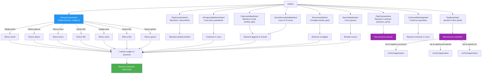

# Navigazione Libreria (it-IT)

```mermaid
graph TD
    Idle["Inattivo"] --> Browse["BrowseLibraryIntent<br/>Sfoglia {browse_category}"]

    Browse -->|"Sfoglia artisti"| Artists["Elenco artisti"]
    Browse -->|"Mostra albums"| Albums["Elenco album"]
    Browse -->|"Elenca brani"| Songs["Elenco brani"]
    Browse -->|"Mostra film"| Movies["Elenco film"]
    Browse -->|"Sfoglia serie"| Series["Elenco serie"]
    Browse -->|"Mostra libri"| Books["Elenco libri"]
    Browse -->|"Elenca generi"| Genres["Elenco generi"]

    Artists --> Selection["L'utente sceglie un elemento"]
    Albums --> Selection
    Songs --> Selection
    Movies --> Selection
    Series --> Selection
    Books --> Selection
    Genres --> Selection

    Selection --> PlayItem["Riproduci elemento selezionato"]

    Idle --> Favorites["PlayFavoritesIntent<br/>Riproduci i miei preferiti"]
    Favorites --> PlayFav["Riproduci playlist preferiti"]

    Idle --> RecentlyPlayed["InProgressMediaListIntent<br/>Cosa stavo guardando"]
    RecentlyPlayed --> ProgressList["Contenuti in corso"]
    ProgressList --> Selection

    Idle --> LastAdded["PlayLastAddedIntent<br/>Riproduci novità {media_type}"]
    LastAdded --> RecentList["Elementi aggiunti di recente"]
    RecentList --> Selection

    Idle --> RecentQuery["QueryRecentlyAddedIntent<br/>cosa c'è di nuovo"]
    RecentQuery --> RecentList

    Idle --> Recommend["RecommendIntent<br/>Consiglia {media_type}"]
    Recommend --> RecList["Elementi consigliati"]
    RecList --> Selection

    Idle --> PlayBook["PlayBookIntent<br/>riproduci il libro {book}"]
    PlayBook --> Audiobook["Riproduzione audiolibro"]
    Audiobook -->|"Vai al capitolo successivo"| ChapterNext["GoToChapterIntent"]
    Audiobook -->|"Vai al capitolo precedente"| ChapterPrev["GoToChapterIntent"]
    Audiobook -->|"Vai al capitolo {n}"| ChapterNum["GoToChapterIntent"]

    Idle --> PlayPodcast["PlayPodcastIntent<br/>Riproduci il podcast {podcast_name}"]
    PlayPodcast --> PodcastPlay["Riproduzione podcast"]

    Idle --> ContinueWatch["ContinueWatchingIntent<br/>Continua a guardare"]
    ContinueWatch --> ResumePlayback["Riprendi contenuto in corso"]

    Idle --> SearchMedia["SearchMediaIntent<br/>Cerca {query}"]
    SearchMedia --> SearchResults["Risultati ricerca"]
    SearchResults --> Selection

    style PlayItem fill:#4CAF50,color:#fff
    style Audiobook fill:#9C27B0,color:#fff
    style PodcastPlay fill:#9C27B0,color:#fff
    style Browse fill:#2196F3,color:#fff
```
