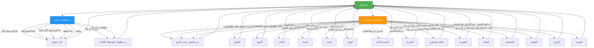

# استعلامات معلومات الوسائط (ar-SA)

```mermaid
graph TD
    Playing["يعمل الآن"] --> GenericQ["استعلامات عامة"]
    Playing --> SlotQ["استعلامات مخصصة"]

    GenericQ -->|"ما الذي يعمل الآن"| TitleResp["الرد بعنوان"]
    GenericQ -->|"ماذا أستمع إليه"| TitleResp
    GenericQ -->|"ما الذي يعمل الآن حالياً"| TitleResp
    GenericQ -->|"ماذا أشاهد"| TitleResp
    GenericQ -->|"ما هذا"| TitleResp
    GenericQ -->|"أخبرني عن هذا"| FullInfo["رد معلومات الوسائط الكاملة"]
    GenericQ -->|"معلومات عن هذا"| FullInfo

    SlotQ -->|"ما {media_info_type} هذا"| SlotResp["رد مخصص حسب النوع"]
    SlotQ -->|"أخبرني بـ {media_info_type}"| SlotResp
    SlotQ -->|"ما هو الـ {media_info_type}"| SlotResp

    SlotQ -->|"ما هو العنوان /<br/>ما اسم هذه الأغنية"| Title["العنوان"]
    SlotQ -->|"ما الألبوم هذا منه"| Album["الألبوم"]
    SlotQ -->|"من يغني هذا /<br/>من يؤدي هذا"| Artist["الفنان"]
    SlotQ -->|"في أي سنة صدر هذا"| Year["السنة"]
    SlotQ -->|"كم مدة هذا /<br/>كم مدة هذه الأغنية"| Duration["المدة"]
    SlotQ -->|"ما نوع هذا"| Genre["النوع"]
    SlotQ -->|"أخبرني عن هذا الفنان"| Biography["السيرة الذاتية"]
    SlotQ -->|"من أخرج هذا /<br/>من هو المخرج"| Director["المخرج"]
    SlotQ -->|"من يمثل في هذا /<br/>من في هذا"| Cast["طاقم الممثلين"]
    SlotQ -->|"أي موسم هذا /<br/>ما رقم الموسم"| Season["الموسم"]
    SlotQ -->|"أي حلقة هذه /<br/>ما رقم الحلقة"| Episode["الحلقة"]
    SlotQ -->|"ما هذا المسلسل"| Series["المسلسل"]
    SlotQ -->|"من هو المؤلف /<br/>من كتب هذا"| Author["المؤلف"]
    SlotQ -->|"من هو الراوي /<br/>من يروي هذا"| Narrator["الراوي"]
    SlotQ -->|"ما هو التقييم /<br/>كيف تم تقييم هذا"| Rating["التقييم"]

    TitleResp --> Playing
    FullInfo --> Playing
    SlotResp --> Playing
    Title --> Playing
    Album --> Playing
    Artist --> Playing
    Year --> Playing
    Duration --> Playing
    Genre --> Playing
    Biography --> Playing
    Director --> Playing
    Cast --> Playing
    Season --> Playing
    Episode --> Playing
    Series --> Playing
    Author --> Playing
    Narrator --> Playing
    Rating --> Playing

    style Playing fill:#4CAF50,color:#fff
    style GenericQ fill:#2196F3,color:#fff
    style SlotQ fill:#FF9800,color:#fff
```
