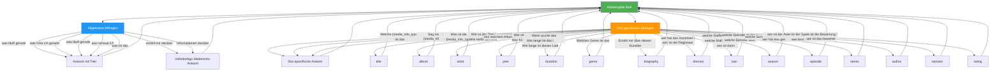

# Medieninformationsabfragen (de-DE)

```mermaid
graph TD
    Playing["Wiedergabe läuft"] --> GenericQ["Allgemeine Abfragen"]
    Playing --> SlotQ["Slot-spezifische Abfragen"]

    GenericQ -->|"was läuft gerade"| TitleResp["Antwort mit Titel"]
    GenericQ -->|"was höre ich gerade"| TitleResp
    GenericQ -->|"was läuft gerade"| TitleResp
    GenericQ -->|"was schaue ich"| TitleResp
    GenericQ -->|"was ist das"| TitleResp
    GenericQ -->|"erzähl mir darüber"| FullInfo["Vollständige Medieninfo-Antwort"]
    GenericQ -->|"Informationen darüber"| FullInfo

    SlotQ -->|"Welche {media_info_type} ist das"| SlotResp["Slot-spezifische Antwort"]
    SlotQ -->|"Sag mir die {media_info_type}"| SlotResp
    SlotQ -->|"Was ist die {media_info_type}"| SlotResp

    SlotQ -->|"Wie ist der Titel /<br/>Wie heißt das Lied"| Title["title"]
    SlotQ -->|"Von welchem Album ist das"| Album["album"]
    SlotQ -->|"Wer singt das /<br/>Wer führt das auf"| Artist["artist"]
    SlotQ -->|"Wann wurde das veröffentlicht"| Year["year"]
    SlotQ -->|"Wie lange ist das /<br/>Wie lange ist dieses Lied"| Duration["duration"]
    SlotQ -->|"Welches Genre ist das"| Genre["genre"]
    SlotQ -->|"Erzähl mir über diesen Künstler"| Biography["biography"]
    SlotQ -->|"wer hat das inszeniert /<br/>wer ist der Regisseur"| Director["director"]
    SlotQ -->|"wer spielt da mit /<br/>wer ist darin"| Cast["cast"]
    SlotQ -->|"welche Staffel ist das /<br/>welche Staffel läuft"| Season["season"]
    SlotQ -->|"welche Episode ist das /<br/>welche Episode läuft"| Episode["episode"]
    SlotQ -->|"welche Serie ist das"| Series["series"]
    SlotQ -->|"wer ist der Autor /<br/>wer hat das geschrieben"| Author["author"]
    SlotQ -->|"wer ist der Sprecher /<br/>wer liest das"| Narrator["narrator"]
    SlotQ -->|"wie ist die Bewertung /<br/>wie ist das bewertet"| Rating["rating"]

    TitleResp --> Playing
    FullInfo --> Playing
    SlotResp --> Playing
    Title --> Playing
    Album --> Playing
    Artist --> Playing
    Year --> Playing
    Duration --> Playing
    Genre --> Playing
    Biography --> Playing
    Director --> Playing
    Cast --> Playing
    Season --> Playing
    Episode --> Playing
    Series --> Playing
    Author --> Playing
    Narrator --> Playing
    Rating --> Playing

    style Playing fill:#4CAF50,color:#fff
    style GenericQ fill:#2196F3,color:#fff
    style SlotQ fill:#FF9800,color:#fff
```
