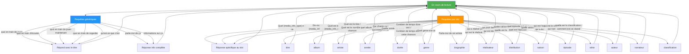

# Requêtes d'informations multimédia (fr-FR)

```mermaid
graph TD
    Playing["En cours de lecture"] --> GenericQ["Requêtes génériques"]
    Playing --> SlotQ["Requêtes par slot"]

    GenericQ -->|"quoi en train de jouer"| TitleResp["Répond avec le titre"]
    GenericQ -->|"quoi en train d'écouter"| TitleResp
    GenericQ -->|"quoi en train de jouer maintenant"| TitleResp
    GenericQ -->|"quoi en train de regarder"| TitleResp
    GenericQ -->|"qu'est-ce que c'est"| TitleResp
    GenericQ -->|"parle-moi de ça"| FullInfo["Réponse info complète"]
    GenericQ -->|"informations sur ça"| FullInfo

    SlotQ -->|"Quel {media_info_type} est-ce"| SlotResp["Réponse spécifique au slot"]
    SlotQ -->|"Dis-moi le {media_info_type}"| SlotResp
    SlotQ -->|"Quel est le {media_info_type}"| SlotResp

    SlotQ -->|"Quel est le titre /<br/>Quel est le nom de la chanson"| Title["titre"]
    SlotQ -->|"De quel album est-ce"| Album["album"]
    SlotQ -->|"Qui chante ça /<br/>Qui interprète ça"| Artist["artiste"]
    SlotQ -->|"Quelle année de sortie"| Year["année"]
    SlotQ -->|"Combien de temps dure ceci /<br/>Combien de temps dure cette chanson"| Duration["durée"]
    SlotQ -->|"Quel genre est-ce"| Genre["genre"]
    SlotQ -->|"Parle-moi de cet artiste"| Biography["biographie"]
    SlotQ -->|"qui a réalisé ça /<br/>qui est le réalisateur"| Director["réalisateur"]
    SlotQ -->|"qui joue dans ça /<br/>qui est dedans"| Cast["distribution"]
    SlotQ -->|"quelle saison est-ce /<br/>quelle est la saison"| Season["saison"]
    SlotQ -->|"quel épisode est-ce /<br/>quel est l'épisode"| Episode["épisode"]
    SlotQ -->|"quelle série est-ce"| Series["série"]
    SlotQ -->|"qui est l'auteur /<br/>qui a écrit ça"| Author["auteur"]
    SlotQ -->|"qui est le narrateur /<br/>qui narre ça"| Narrator["narrateur"]
    SlotQ -->|"quelle est la classification /<br/>comment est-ce classé"| Rating["classification"]

    TitleResp --> Playing
    FullInfo --> Playing
    SlotResp --> Playing
    Title --> Playing
    Album --> Playing
    Artist --> Playing
    Year --> Playing
    Duration --> Playing
    Genre --> Playing
    Biography --> Playing
    Director --> Playing
    Cast --> Playing
    Season --> Playing
    Episode --> Playing
    Series --> Playing
    Author --> Playing
    Narrator --> Playing
    Rating --> Playing

    style Playing fill:#4CAF50,color:#fff
    style GenericQ fill:#2196F3,color:#fff
    style SlotQ fill:#FF9800,color:#fff
```
