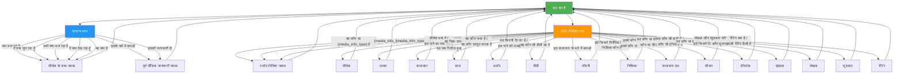

# मीडिया जानकारी प्रश्न (hi-IN)

```mermaid
graph TD
    Playing["चल रहा है"] --> GenericQ["सामान्य प्रश्न"]
    Playing --> SlotQ["स्लॉट-विशिष्ट प्रश्न"]

    GenericQ -->|"क्या बज रहा है"| TitleResp["शीर्षक के साथ जवाब"]
    GenericQ -->|"मैं क्या सुन रहा हूँ"| TitleResp
    GenericQ -->|"अभी क्या बज रहा है"| TitleResp
    GenericQ -->|"मैं क्या देख रहा हूँ"| TitleResp
    GenericQ -->|"यह क्या है"| TitleResp
    GenericQ -->|"इसके बारे में बताओ"| FullInfo["पूर्ण मीडिया जानकारी जवाब"]
    GenericQ -->|"इसकी जानकारी दो"| FullInfo

    SlotQ -->|"यह कौन सा {media_info_type} है"| SlotResp["स्लॉट-विशिष्ट जवाब"]
    SlotQ -->|"{media_info_type} बताओ"| SlotResp
    SlotQ -->|"{media_info_type} क्या है"| SlotResp

    SlotQ -->|"शीर्षक क्या है /<br/>इस गाने का नाम क्या है"| Title["शीर्षक"]
    SlotQ -->|"यह किस एल्बम का है"| Album["एल्बम"]
    SlotQ -->|"यह कौन गाता है /<br/>यह कौन प्रस्तुत करता है"| Artist["कलाकार"]
    SlotQ -->|"यह कब रिलीज़ हुआ"| Year["साल"]
    SlotQ -->|"यह कितनी देर का है /<br/>इस गाने की लंबाई क्या है"| Duration["अवधि"]
    SlotQ -->|"यह कौन सी शैली का है"| Genre["शैली"]
    SlotQ -->|"इस कलाकार के बारे में बताओ"| Biography["जीवनी"]
    SlotQ -->|"इसे किसने निर्देशित किया /<br/>निर्देशक कौन है"| Director["निर्देशक"]
    SlotQ -->|"इसमें कौन है /<br/>इसमें कौन कौन है"| Cast["कलाकार दल"]
    SlotQ -->|"यह कौन सा सीज़न है /<br/>कौन सा सीज़न है"| Season["सीज़न"]
    SlotQ -->|"यह कौन सी कड़ी है /<br/>कौन सी एपिसोड है"| Episode["एपिसोड"]
    SlotQ -->|"यह कौन सा शो है"| Series["श्रृंखला"]
    SlotQ -->|"लेखक कौन है /<br/>इसे किसने लिखा"| Author["लेखक"]
    SlotQ -->|"सूत्रकार कौन है /<br/>कौन सुनाता है"| Narrator["सूत्रकार"]
    SlotQ -->|"रेटिंग क्या है /<br/>इसकी रेटिंग कैसी है"| Rating["रेटिंग"]

    TitleResp --> Playing
    FullInfo --> Playing
    SlotResp --> Playing
    Title --> Playing
    Album --> Playing
    Artist --> Playing
    Year --> Playing
    Duration --> Playing
    Genre --> Playing
    Biography --> Playing
    Director --> Playing
    Cast --> Playing
    Season --> Playing
    Episode --> Playing
    Series --> Playing
    Author --> Playing
    Narrator --> Playing
    Rating --> Playing

    style Playing fill:#4CAF50,color:#fff
    style GenericQ fill:#2196F3,color:#fff
    style SlotQ fill:#FF9800,color:#fff
```
