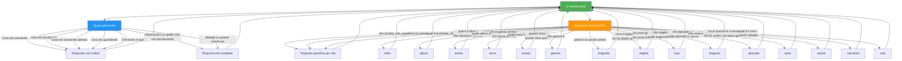

# Query Informazioni Multimediali (it-IT)

```mermaid
graph TD
    Playing["In riproduzione"] --> GenericQ["Query generiche"]
    Playing --> SlotQ["Query per slot specifico"]

    GenericQ -->|"Cosa sta suonando"| TitleResp["Risponde con il titolo"]
    GenericQ -->|"cosa sto ascoltando"| TitleResp
    GenericQ -->|"Cosa sta suonando adesso"| TitleResp
    GenericQ -->|"cosa sto guardando"| TitleResp
    GenericQ -->|"Che brano è questo"| TitleResp
    GenericQ -->|"informazioni su quello che sta riproducendo"| FullInfo["Risposta info complete"]
    GenericQ -->|"dettagli su questo contenuto"| FullInfo

    SlotQ -->|"che {media_info_type} è"| SlotResp["Risposta specifica per slot"]
    SlotQ -->|"dimmi la {media_info_type}"| SlotResp
    SlotQ -->|"qual è la {media_info_type}"| SlotResp

    SlotQ -->|"qual è il titolo /<br/>che canzone è questa"| Title["titolo"]
    SlotQ -->|"quale album è questo"| Album["album"]
    SlotQ -->|"chi è questo artista /<br/>Chi suona adesso"| Artist["artista"]
    SlotQ -->|"quale anno è uscito"| Year["anno"]
    SlotQ -->|"quanto dura /<br/>quanto dura questo"| Duration["durata"]
    SlotQ -->|"che genere è"| Genre["genere"]
    SlotQ -->|"parlami di questo artista"| Biography["biografia"]
    SlotQ -->|"chi è il regista /<br/>chi ha diretto questo"| Director["regista"]
    SlotQ -->|"chi sono gli attori /<br/>chi recita in questo"| Cast["cast"]
    SlotQ -->|"che stagione è /<br/>quale stagione è questa"| Season["stagione"]
    SlotQ -->|"che episodio è /<br/>quale episodio è questo"| Episode["episodio"]
    SlotQ -->|"che serie è questa"| Series["serie"]
    SlotQ -->|"chi è l'autore /<br/>chi ha scritto questo"| Author["autore"]
    SlotQ -->|"chi è il narratore /<br/>chi narra questo"| Narrator["narratore"]
    SlotQ -->|"qual è il voto /<br/>com'è valutato"| Rating["voto"]

    TitleResp --> Playing
    FullInfo --> Playing
    SlotResp --> Playing
    Title --> Playing
    Album --> Playing
    Artist --> Playing
    Year --> Playing
    Duration --> Playing
    Genre --> Playing
    Biography --> Playing
    Director --> Playing
    Cast --> Playing
    Season --> Playing
    Episode --> Playing
    Series --> Playing
    Author --> Playing
    Narrator --> Playing
    Rating --> Playing

    style Playing fill:#4CAF50,color:#fff
    style GenericQ fill:#2196F3,color:#fff
    style SlotQ fill:#FF9800,color:#fff
```
