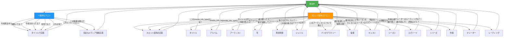

# メディア情報クエリ (ja-JP)

```mermaid
graph TD
    Playing["再生中"] --> GenericQ["一般的なクエリ"]
    Playing --> SlotQ["スロット固有のクエリ"]

    GenericQ -->|"今何再生中？"| TitleResp["タイトルで応答"]
    GenericQ -->|"何聴いてる？"| TitleResp
    GenericQ -->|"今何かかってる？"| TitleResp
    GenericQ -->|"何見てる？"| TitleResp
    GenericQ -->|"これは何？"| TitleResp
    GenericQ -->|"これについて教えて"| FullInfo["完全なメディア情報応答"]
    GenericQ -->|"この情報を教えて"| FullInfo

    SlotQ -->|"この{media_info_type}は何？"| SlotResp["スロット固有の応答"]
    SlotQ -->|"{media_info_type}を教えて"| SlotResp
    SlotQ -->|"{media_info_type}は何？"| SlotResp

    SlotQ -->|"タイトルは何？ /<br/>この曲の名前は？"| Title["タイトル"]
    SlotQ -->|"このアルバムは何？"| Album["アルバム"]
    SlotQ -->|"誰が歌ってる？ /<br/>誰が演奏してる？"| Artist["アーティスト"]
    SlotQ -->|"いつリリースされた？"| Year["年"]
    SlotQ -->|"長さはどれくらい？ /<br/>この曲の長さは？"| Duration["再生時間"]
    SlotQ -->|"ジャンルは何？"| Genre["ジャンル"]
    SlotQ -->|"このアーティストについて教えて"| Biography["バイオグラフィー"]
    SlotQ -->|"誰が監督した？ /<br/>監督は誰？"| Director["監督"]
    SlotQ -->|"誰が出演してる？ /<br/>キャストは誰？"| Cast["キャスト"]
    SlotQ -->|"何シーズン目？ /<br/>シーズンは何？"| Season["シーズン"]
    SlotQ -->|"何話目？ /<br/>エピソードは何？"| Episode["エピソード"]
    SlotQ -->|"この番組は何？"| Series["シリーズ"]
    SlotQ -->|"作者は誰？ /<br/>誰が書いた？"| Author["作者"]
    SlotQ -->|"ナレーターは誰？ /<br/>誰が読んでる？"| Narrator["ナレーター"]
    SlotQ -->|"レーティングは？ /<br/>評価はどう？"| Rating["レーティング"]

    TitleResp --> Playing
    FullInfo --> Playing
    SlotResp --> Playing
    Title --> Playing
    Album --> Playing
    Artist --> Playing
    Year --> Playing
    Duration --> Playing
    Genre --> Playing
    Biography --> Playing
    Director --> Playing
    Cast --> Playing
    Season --> Playing
    Episode --> Playing
    Series --> Playing
    Author --> Playing
    Narrator --> Playing
    Rating --> Playing

    style Playing fill:#4CAF50,color:#fff
    style GenericQ fill:#2196F3,color:#fff
    style SlotQ fill:#FF9800,color:#fff
```
