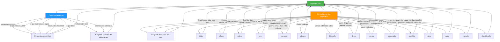

# Consultas de Informações de Mídia (pt-BR)

```mermaid
graph TD
    Playing["Reproduzindo"] --> GenericQ["Consultas genéricas"]
    Playing --> SlotQ["Consultas por slot específico"]

    GenericQ -->|"o que está tocando"| TitleResp["Responde com o título"]
    GenericQ -->|"o que estou ouvindo"| TitleResp
    GenericQ -->|"o que está tocando agora"| TitleResp
    GenericQ -->|"o que estou assistindo"| TitleResp
    GenericQ -->|"o que é isso"| TitleResp
    GenericQ -->|"me fale sobre isso"| FullInfo["Resposta completa de informações"]
    GenericQ -->|"informações sobre isso"| FullInfo

    SlotQ -->|"Qual {media_info_type} é este"| SlotResp["Resposta específica por slot"]
    SlotQ -->|"Me diga a {media_info_type}"| SlotResp
    SlotQ -->|"Qual é a {media_info_type}"| SlotResp

    SlotQ -->|"Qual é o título /<br/>Qual é o nome da música"| Title["título"]
    SlotQ -->|"De qual álbum é este"| Album["álbum"]
    SlotQ -->|"Quem canta esta /<br/>Quem toca esta"| Artist["artista"]
    SlotQ -->|"Em que ano foi lançado"| Year["ano"]
    SlotQ -->|"Quanto tempo dura /<br/>Quanto tempo dura esta música"| Duration["duração"]
    SlotQ -->|"Qual é o gênero"| Genre["gênero"]
    SlotQ -->|"Me fale sobre este artista"| Biography["biografia"]
    SlotQ -->|"quem dirigiu isso /<br/>quem é o diretor"| Director["diretor"]
    SlotQ -->|"quem atua nisso /<br/>quem está nisso"| Cast["elenco"]
    SlotQ -->|"qual temporada é esta /<br/>qual temporada é"| Season["temporada"]
    SlotQ -->|"qual episódio é este /<br/>qual episódio é"| Episode["episódio"]
    SlotQ -->|"qual série é esta"| Series["série"]
    SlotQ -->|"quem é o autor /<br/>quem escreveu isso"| Author["autor"]
    SlotQ -->|"quem é o narrador /<br/>quem narra isso"| Narrator["narrador"]
    SlotQ -->|"qual é a classificação /<br/>como isso é avaliado"| Rating["classificação"]

    TitleResp --> Playing
    FullInfo --> Playing
    SlotResp --> Playing
    Title --> Playing
    Album --> Playing
    Artist --> Playing
    Year --> Playing
    Duration --> Playing
    Genre --> Playing
    Biography --> Playing
    Director --> Playing
    Cast --> Playing
    Season --> Playing
    Episode --> Playing
    Series --> Playing
    Author --> Playing
    Narrator --> Playing
    Rating --> Playing

    style Playing fill:#4CAF50,color:#fff
    style GenericQ fill:#2196F3,color:#fff
    style SlotQ fill:#FF9800,color:#fff
```
