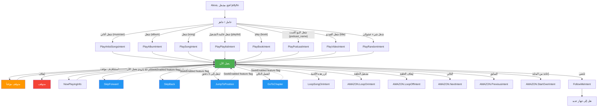

# دورة حياة التشغيل (ar-SA)

```mermaid
graph TD
    Launch["Alexa, افتح مشغل jellyfin"] --> Idle["خامل / جاهز"]

    Idle -->|"شغل أغاني {musician}"| PlayArtist["PlayArtistSongsIntent"]
    Idle -->|"شغل {album}"| PlayAlbum["PlayAlbumIntent"]
    Idle -->|"شغل {song}"| PlaySong["PlaySongIntent"]
    Idle -->|"شغل قائمة التشغيل {playlist}"| PlayPlaylist["PlayPlaylistIntent"]
    Idle -->|"play {book}"| PlayBook["PlayBookIntent"]
    Idle -->|"شغل البودكاست {podcast_name}"| PlayPodcast["PlayPodcastIntent"]
    Idle -->|"شغل الفيديو {title}"| PlayVideo["PlayVideoIntent"]
    Idle -->|"شغل شيء عشوائي"| PlayRandom["PlayRandomIntent"]

    PlayArtist --> Playing
    PlayAlbum --> Playing
    PlaySong --> Playing
    PlayPlaylist --> Playing
    PlayBook --> Playing
    PlayPodcast --> Playing
    PlayVideo --> Playing
    PlayRandom --> Playing

    Playing["يعمل الآن"] -->|"إيقاف مؤقت"| Paused["متوقف مؤقتاً"]
    Paused -->|"استئناف"| Playing
    Playing -->|"إيقاف"| Stopped["متوقف"]
    Playing -->|"ما الذي يعمل الآن"| NowPlaying["NowPlayingInfo"]

    NowPlaying --> Playing

    Playing -->|"تخطي للأمام 30 ثانية"| SkipFwd["SkipForward"]
    Playing -->|"تخطي للخلف 30 ثانية"| SkipBack["SkipBack"]
    Playing -->|"انتقل إلى 5 دقائق"| JumpPos["JumpToPosition"]
    Playing -->|"الفصل التالي"| Chapter["GoToChapter"]

    SkipFwd -.->|"SeekEnabled feature flag"| Playing
    SkipBack -.->|"SeekEnabled feature flag"| Playing
    JumpPos -.->|"SeekEnabled feature flag"| Playing
    Chapter -.->|"SeekEnabled feature flag"| Playing

    Playing -->|"كرر هذه الأغنية"| LoopSong["LoopSongOnIntent"]
    Playing -->|"تشغيل الحلقة"| LoopAll["AMAZON.LoopOnIntent"]
    Playing -->|"إيقاف الحلقة"| LoopOff["AMAZON.LoopOffIntent"]

    Playing -->|"التالي"| Next["AMAZON.NextIntent"]
    Playing -->|"السابق"| Prev["AMAZON.PreviousIntent"]
    Playing -->|"إعادة من البداية"| StartOver["AMAZON.StartOverIntent"]

    Playing -->|"تابعني"| FollowMe["FollowMeIntent"]
    FollowMe --> Transfer["نقل إلى جهاز جديد"]

    style Playing fill:#4CAF50,color:#fff
    style Paused fill:#FF9800,color:#fff
    style Stopped fill:#f44336,color:#fff
    style SkipFwd fill:#2196F3,color:#fff
    style SkipBack fill:#2196F3,color:#fff
    style JumpPos fill:#2196F3,color:#fff
    style Chapter fill:#2196F3,color:#fff
```
