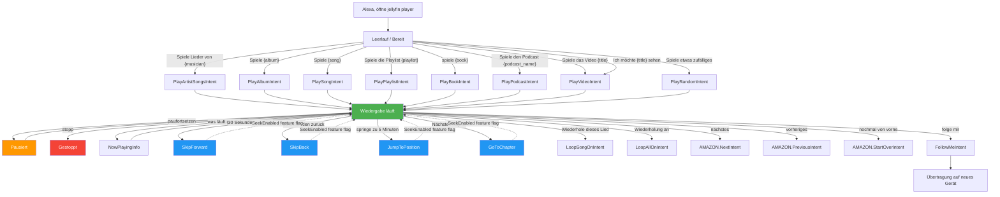

# Wiedergabe-Lebenszyklus (de-DE)

```mermaid
graph TD
    Launch["Alexa, öffne jellyfin player"] --> Idle["Leerlauf / Bereit"]

    Idle -->|"Spiele Lieder von {musician}"| PlayArtist["PlayArtistSongsIntent"]
    Idle -->|"Spiele {album}"| PlayAlbum["PlayAlbumIntent"]
    Idle -->|"Spiele {song}"| PlaySong["PlaySongIntent"]
    Idle -->|"Spiele die Playlist {playlist}"| PlayPlaylist["PlayPlaylistIntent"]
    Idle -->|"spiele {book}"| PlayBook["PlayBookIntent"]
    Idle -->|"Spiele den Podcast {podcast_name}"| PlayPodcast["PlayPodcastIntent"]
    Idle -->|"Spiele das Video {title}"| PlayVideo["PlayVideoIntent"]
    Idle -->|"Ich möchte {title} sehen"| PlayVideo
    Idle -->|"Spiele etwas zufälliges"| PlayRandom["PlayRandomIntent"]

    PlayArtist --> Playing
    PlayAlbum --> Playing
    PlaySong --> Playing
    PlayPlaylist --> Playing
    PlayBook --> Playing
    PlayPodcast --> Playing
    PlayVideo --> Playing
    PlayRandom --> Playing

    Playing["Wiedergabe läuft"] -->|"pause"| Paused["Pausiert"]
    Paused -->|"fortsetzen"| Playing
    Playing -->|"stopp"| Stopped["Gestoppt"]
    Playing -->|"was läuft gerade"| NowPlaying["NowPlayingInfo"]

    NowPlaying --> Playing

    Playing -->|"30 Sekunden vorwärts"| SkipFwd["SkipForward"]
    Playing -->|"30 Sekunden zurück"| SkipBack["SkipBack"]
    Playing -->|"springe zu 5 Minuten"| JumpPos["JumpToPosition"]
    Playing -->|"Nächstes Kapitel"| Chapter["GoToChapter"]

    SkipFwd -.->|"SeekEnabled feature flag"| Playing
    SkipBack -.->|"SeekEnabled feature flag"| Playing
    JumpPos -.->|"SeekEnabled feature flag"| Playing
    Chapter -.->|"SeekEnabled feature flag"| Playing

    Playing -->|"Wiederhole dieses Lied"| LoopSong["LoopSongOnIntent"]
    Playing -->|"Wiederholung an"| LoopAll["LoopAllOnIntent"]

    Playing -->|"nächstes"| Next["AMAZON.NextIntent"]
    Playing -->|"vorheriges"| Prev["AMAZON.PreviousIntent"]
    Playing -->|"nochmal von vorne"| StartOver["AMAZON.StartOverIntent"]

    Playing -->|"folge mir"| FollowMe["FollowMeIntent"]
    FollowMe --> Transfer["Übertragung auf neues Gerät"]

    style Playing fill:#4CAF50,color:#fff
    style Paused fill:#FF9800,color:#fff
    style Stopped fill:#f44336,color:#fff
    style SkipFwd fill:#2196F3,color:#fff
    style SkipBack fill:#2196F3,color:#fff
    style JumpPos fill:#2196F3,color:#fff
    style Chapter fill:#2196F3,color:#fff
```
