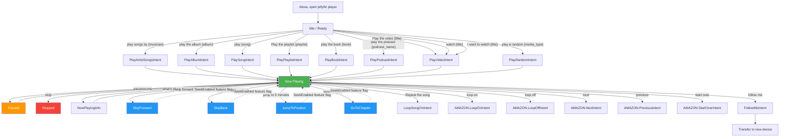

# Playback Lifecycle (en-CA)

```mermaid
graph TD
    Launch["Alexa, open jellyfin player"] --> Idle["Idle / Ready"]

    Idle -->|"play songs by {musician}"| PlayArtist["PlayArtistSongsIntent"]
    Idle -->|"play the album {album}"| PlayAlbum["PlayAlbumIntent"]
    Idle -->|"play {song}"| PlaySong["PlaySongIntent"]
    Idle -->|"Play the playlist {playlist}"| PlayPlaylist["PlayPlaylistIntent"]
    Idle -->|"play the book {book}"| PlayBook["PlayBookIntent"]
    Idle -->|"play the podcast {podcast_name}"| PlayPodcast["PlayPodcastIntent"]
    Idle -->|"Play the video {title}"| PlayVideo["PlayVideoIntent"]
    Idle -->|"watch {title}"| PlayVideo
    Idle -->|"I want to watch {title}"| PlayVideo
    Idle -->|"play a random {media_type}"| PlayRandom["PlayRandomIntent"]

    PlayArtist --> Playing
    PlayAlbum --> Playing
    PlaySong --> Playing
    PlayPlaylist --> Playing
    PlayBook --> Playing
    PlayPodcast --> Playing
    PlayVideo --> Playing
    PlayRandom --> Playing

    Playing["Now Playing"] -->|"pause"| Paused["Paused"]
    Paused -->|"resume"| Playing
    Playing -->|"stop"| Stopped["Stopped"]
    Playing -->|"what's playing"| NowPlaying["NowPlayingInfo"]

    NowPlaying --> Playing

    Playing -->|"skip forward 30 seconds"| SkipFwd["SkipForward"]
    Playing -->|"skip back 30 seconds"| SkipBack["SkipBack"]
    Playing -->|"jump to 5 minutes"| JumpPos["JumpToPosition"]
    Playing -->|"Next chapter"| Chapter["GoToChapter"]

    SkipFwd -.->|"SeekEnabled feature flag"| Playing
    SkipBack -.->|"SeekEnabled feature flag"| Playing
    JumpPos -.->|"SeekEnabled feature flag"| Playing
    Chapter -.->|"SeekEnabled feature flag"| Playing

    Playing -->|"Repeat the song"| LoopSong["LoopSongOnIntent"]
    Playing -->|"loop on"| LoopAll["AMAZON.LoopOnIntent"]
    Playing -->|"loop off"| LoopOff["AMAZON.LoopOffIntent"]

    Playing -->|"next"| Next["AMAZON.NextIntent"]
    Playing -->|"previous"| Prev["AMAZON.PreviousIntent"]
    Playing -->|"start over"| StartOver["AMAZON.StartOverIntent"]

    Playing -->|"follow me"| FollowMe["FollowMeIntent"]
    FollowMe --> Transfer["Transfer to new device"]

    style Playing fill:#4CAF50,color:#fff
    style Paused fill:#FF9800,color:#fff
    style Stopped fill:#f44336,color:#fff
    style SkipFwd fill:#2196F3,color:#fff
    style SkipBack fill:#2196F3,color:#fff
    style JumpPos fill:#2196F3,color:#fff
    style Chapter fill:#2196F3,color:#fff
```
