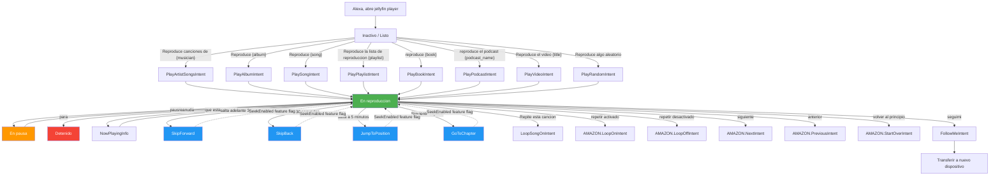

# Ciclo de vida de reproduccion (es-US)

```mermaid
graph TD
    Launch["Alexa, abre jellyfin player"] --> Idle["Inactivo / Listo"]

    Idle -->|"Reproduce canciones de {musician}"| PlayArtist["PlayArtistSongsIntent"]
    Idle -->|"Reproduce {album}"| PlayAlbum["PlayAlbumIntent"]
    Idle -->|"Reproduce {song}"| PlaySong["PlaySongIntent"]
    Idle -->|"Reproduce la lista de reproduccion {playlist}"| PlayPlaylist["PlayPlaylistIntent"]
    Idle -->|"reproduce {book}"| PlayBook["PlayBookIntent"]
    Idle -->|"reproduce el podcast {podcast_name}"| PlayPodcast["PlayPodcastIntent"]
    Idle -->|"Reproduce el video {title}"| PlayVideo["PlayVideoIntent"]
    Idle -->|"Reproduce algo aleatorio"| PlayRandom["PlayRandomIntent"]

    PlayArtist --> Playing
    PlayAlbum --> Playing
    PlaySong --> Playing
    PlayPlaylist --> Playing
    PlayBook --> Playing
    PlayPodcast --> Playing
    PlayVideo --> Playing
    PlayRandom --> Playing

    Playing["En reproduccion"] -->|"pausa"| Paused["En pausa"]
    Paused -->|"reanuda"| Playing
    Playing -->|"para"| Stopped["Detenido"]
    Playing -->|"que esta sonando"| NowPlaying["NowPlayingInfo"]

    NowPlaying --> Playing

    Playing -->|"salta adelante 30 segundos"| SkipFwd["SkipForward"]
    Playing -->|"salta atras 30 segundos"| SkipBack["SkipBack"]
    Playing -->|"salta a 5 minutos"| JumpPos["JumpToPosition"]
    Playing -->|"Siguiente capitulo"| Chapter["GoToChapter"]

    SkipFwd -.->|"SeekEnabled feature flag"| Playing
    SkipBack -.->|"SeekEnabled feature flag"| Playing
    JumpPos -.->|"SeekEnabled feature flag"| Playing
    Chapter -.->|"SeekEnabled feature flag"| Playing

    Playing -->|"Repite esta cancion"| LoopSong["LoopSongOnIntent"]
    Playing -->|"repetir activado"| LoopAll["AMAZON.LoopOnIntent"]
    Playing -->|"repetir desactivado"| LoopOff["AMAZON.LoopOffIntent"]

    Playing -->|"siguiente"| Next["AMAZON.NextIntent"]
    Playing -->|"anterior"| Prev["AMAZON.PreviousIntent"]
    Playing -->|"volver al principio"| StartOver["AMAZON.StartOverIntent"]

    Playing -->|"seguimi"| FollowMe["FollowMeIntent"]
    FollowMe --> Transfer["Transferir a nuevo dispositivo"]

    style Playing fill:#4CAF50,color:#fff
    style Paused fill:#FF9800,color:#fff
    style Stopped fill:#f44336,color:#fff
    style SkipFwd fill:#2196F3,color:#fff
    style SkipBack fill:#2196F3,color:#fff
    style JumpPos fill:#2196F3,color:#fff
    style Chapter fill:#2196F3,color:#fff
```
