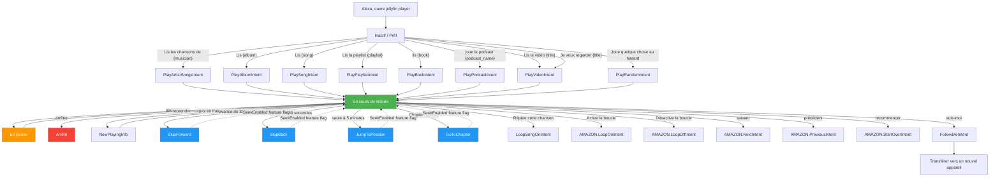

# Cycle de lecture (fr-FR)

```mermaid
graph TD
    Launch["Alexa, ouvre jellyfin player"] --> Idle["Inactif / Prêt"]

    Idle -->|"Lis les chansons de {musician}"| PlayArtist["PlayArtistSongsIntent"]
    Idle -->|"Lis {album}"| PlayAlbum["PlayAlbumIntent"]
    Idle -->|"Lis {song}"| PlaySong["PlaySongIntent"]
    Idle -->|"Lis la playlist {playlist}"| PlayPlaylist["PlayPlaylistIntent"]
    Idle -->|"lis {book}"| PlayBook["PlayBookIntent"]
    Idle -->|"joue le podcast {podcast_name}"| PlayPodcast["PlayPodcastIntent"]
    Idle -->|"Lis la vidéo {title}"| PlayVideo["PlayVideoIntent"]
    Idle -->|"Je veux regarder {title}"| PlayVideo
    Idle -->|"Joue quelque chose au hasard"| PlayRandom["PlayRandomIntent"]

    PlayArtist --> Playing
    PlayAlbum --> Playing
    PlaySong --> Playing
    PlayPlaylist --> Playing
    PlayBook --> Playing
    PlayPodcast --> Playing
    PlayVideo --> Playing
    PlayRandom --> Playing

    Playing["En cours de lecture"] -->|"pause"| Paused["En pause"]
    Paused -->|"reprendre"| Playing
    Playing -->|"arrêter"| Stopped["Arrêté"]
    Playing -->|"quoi en train de jouer"| NowPlaying["NowPlayingInfo"]

    NowPlaying --> Playing

    Playing -->|"avance de 30 secondes"| SkipFwd["SkipForward"]
    Playing -->|"recule de 30 secondes"| SkipBack["SkipBack"]
    Playing -->|"saute à 5 minutes"| JumpPos["JumpToPosition"]
    Playing -->|"Chapitre suivant"| Chapter["GoToChapter"]

    SkipFwd -.->|"SeekEnabled feature flag"| Playing
    SkipBack -.->|"SeekEnabled feature flag"| Playing
    JumpPos -.->|"SeekEnabled feature flag"| Playing
    Chapter -.->|"SeekEnabled feature flag"| Playing

    Playing -->|"Répète cette chanson"| LoopSong["LoopSongOnIntent"]
    Playing -->|"Active la boucle"| LoopAll["AMAZON.LoopOnIntent"]
    Playing -->|"Désactive la boucle"| LoopOff["AMAZON.LoopOffIntent"]

    Playing -->|"suivant"| Next["AMAZON.NextIntent"]
    Playing -->|"précédent"| Prev["AMAZON.PreviousIntent"]
    Playing -->|"recommencer"| StartOver["AMAZON.StartOverIntent"]

    Playing -->|"suis-moi"| FollowMe["FollowMeIntent"]
    FollowMe --> Transfer["Transférer vers un nouvel appareil"]

    style Playing fill:#4CAF50,color:#fff
    style Paused fill:#FF9800,color:#fff
    style Stopped fill:#f44336,color:#fff
    style SkipFwd fill:#2196F3,color:#fff
    style SkipBack fill:#2196F3,color:#fff
    style JumpPos fill:#2196F3,color:#fff
    style Chapter fill:#2196F3,color:#fff
```
