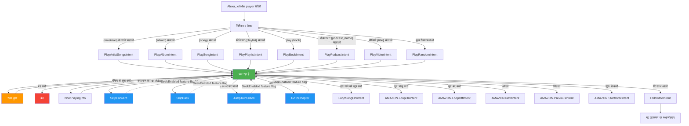

# प्लेबैक जीवनचक्र (hi-IN)

```mermaid
graph TD
    Launch["Alexa, jellyfin player खोलो"] --> Idle["निष्क्रिय / तैयार"]

    Idle -->|"{musician} के गाने चलाओ"| PlayArtist["PlayArtistSongsIntent"]
    Idle -->|"{album} चलाओ"| PlayAlbum["PlayAlbumIntent"]
    Idle -->|"{song} चलाओ"| PlaySong["PlaySongIntent"]
    Idle -->|"प्लेलिस्ट {playlist} चलाओ"| PlayPlaylist["PlayPlaylistIntent"]
    Idle -->|"play {book}"| PlayBook["PlayBookIntent"]
    Idle -->|"पॉडकास्ट {podcast_name} चलाओ"| PlayPodcast["PlayPodcastIntent"]
    Idle -->|"वीडियो {title} चलाओ"| PlayVideo["PlayVideoIntent"]
    Idle -->|"कुछ रैंडम चलाओ"| PlayRandom["PlayRandomIntent"]

    PlayArtist --> Playing
    PlayAlbum --> Playing
    PlaySong --> Playing
    PlayPlaylist --> Playing
    PlayBook --> Playing
    PlayPodcast --> Playing
    PlayVideo --> Playing
    PlayRandom --> Playing

    Playing["चल रहा है"] -->|"रोको"| Paused["रुका हुआ"]
    Paused -->|"फिर से शुरू करो"| Playing
    Playing -->|"बंद करो"| Stopped["बंद"]
    Playing -->|"क्या बज रहा है"| NowPlaying["NowPlayingInfo"]

    NowPlaying --> Playing

    Playing -->|"30 सेकंड आगे जाओ"| SkipFwd["SkipForward"]
    Playing -->|"30 सेकंड पीछे जाओ"| SkipBack["SkipBack"]
    Playing -->|"5 मिनट पर जाओ"| JumpPos["JumpToPosition"]
    Playing -->|"अगला चैप्टर"| Chapter["GoToChapter"]

    SkipFwd -.->|"SeekEnabled feature flag"| Playing
    SkipBack -.->|"SeekEnabled feature flag"| Playing
    JumpPos -.->|"SeekEnabled feature flag"| Playing
    Chapter -.->|"SeekEnabled feature flag"| Playing

    Playing -->|"इस गाने को लूप करो"| LoopSong["LoopSongOnIntent"]
    Playing -->|"लूप चालू करो"| LoopAll["AMAZON.LoopOnIntent"]
    Playing -->|"लूप बंद करो"| LoopOff["AMAZON.LoopOffIntent"]

    Playing -->|"अगला"| Next["AMAZON.NextIntent"]
    Playing -->|"पिछला"| Prev["AMAZON.PreviousIntent"]
    Playing -->|"शुरू से करो"| StartOver["AMAZON.StartOverIntent"]

    Playing -->|"मेरे साथ आओ"| FollowMe["FollowMeIntent"]
    FollowMe --> Transfer["नए उपकरण पर स्थानांतरण"]

    style Playing fill:#4CAF50,color:#fff
    style Paused fill:#FF9800,color:#fff
    style Stopped fill:#f44336,color:#fff
    style SkipFwd fill:#2196F3,color:#fff
    style SkipBack fill:#2196F3,color:#fff
    style JumpPos fill:#2196F3,color:#fff
    style Chapter fill:#2196F3,color:#fff
```
