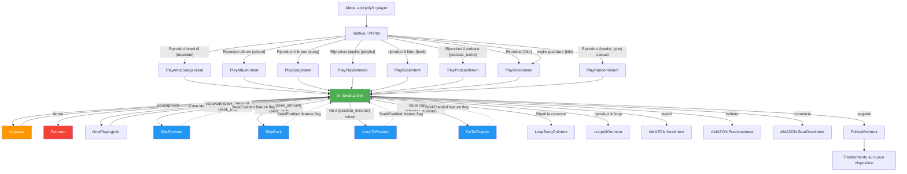

# Ciclo di vita della riproduzione (it-IT)

```mermaid
graph TD
    Launch["Alexa, apri jellyfin player"] --> Idle["Inattivo / Pronto"]

    Idle -->|"Riproduci brani di {musician}"| PlayArtist["PlayArtistSongsIntent"]
    Idle -->|"Riproduci album {album}"| PlayAlbum["PlayAlbumIntent"]
    Idle -->|"Riproduci il brano {song}"| PlaySong["PlaySongIntent"]
    Idle -->|"Riproduci playlist {playlist}"| PlayPlaylist["PlayPlaylistIntent"]
    Idle -->|"riproduci il libro {book}"| PlayBook["PlayBookIntent"]
    Idle -->|"Riproduci il podcast {podcast_name}"| PlayPodcast["PlayPodcastIntent"]
    Idle -->|"Riproduci {title}"| PlayVideo["PlayVideoIntent"]
    Idle -->|"voglio guardare {title}"| PlayVideo
    Idle -->|"Riproduci {media_type} casuali"| PlayRandom["PlayRandomIntent"]

    PlayArtist --> Playing
    PlayAlbum --> Playing
    PlaySong --> Playing
    PlayPlaylist --> Playing
    PlayBook --> Playing
    PlayPodcast --> Playing
    PlayVideo --> Playing
    PlayRandom --> Playing

    Playing["In riproduzione"] -->|"pausa"| Paused["In pausa"]
    Paused -->|"riprendi"| Playing
    Playing -->|"ferma"| Stopped["Fermato"]
    Playing -->|"Cosa sta suonando"| NowPlaying["NowPlayingInfo"]

    NowPlaying --> Playing

    Playing -->|"vai avanti {seek_amount} {seek_unit}"| SkipFwd["SkipForward"]
    Playing -->|"vai indietro {seek_amount} {seek_unit}"| SkipBack["SkipBack"]
    Playing -->|"vai a {position_minutes} minuti"| JumpPos["JumpToPosition"]
    Playing -->|"Vai al capitolo {chapter_number}"| Chapter["GoToChapter"]

    SkipFwd -.->|"SeekEnabled feature flag"| Playing
    SkipBack -.->|"SeekEnabled feature flag"| Playing
    JumpPos -.->|"SeekEnabled feature flag"| Playing
    Chapter -.->|"SeekEnabled feature flag"| Playing

    Playing -->|"Ripeti la canzone"| LoopSong["LoopSongOnIntent"]
    Playing -->|"riproduci in loop"| LoopAll["LoopAllOnIntent"]

    Playing -->|"avanti"| Next["AMAZON.NextIntent"]
    Playing -->|"indietro"| Prev["AMAZON.PreviousIntent"]
    Playing -->|"ricomincia"| StartOver["AMAZON.StartOverIntent"]

    Playing -->|"seguimi"| FollowMe["FollowMeIntent"]
    FollowMe --> Transfer["Trasferimento su nuovo dispositivo"]

    style Playing fill:#4CAF50,color:#fff
    style Paused fill:#FF9800,color:#fff
    style Stopped fill:#f44336,color:#fff
    style SkipFwd fill:#2196F3,color:#fff
    style SkipBack fill:#2196F3,color:#fff
    style JumpPos fill:#2196F3,color:#fff
    style Chapter fill:#2196F3,color:#fff
```
