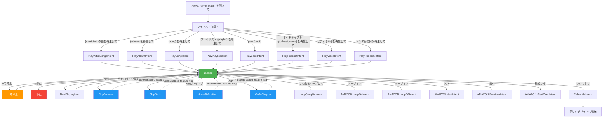

# 再生ライフサイクル (ja-JP)

```mermaid
graph TD
    Launch["Alexa, jellyfin player を開いて"] --> Idle["アイドル / 待機中"]

    Idle -->|"{musician} の曲を再生して"| PlayArtist["PlayArtistSongsIntent"]
    Idle -->|"{album} を再生して"| PlayAlbum["PlayAlbumIntent"]
    Idle -->|"{song} を再生して"| PlaySong["PlaySongIntent"]
    Idle -->|"プレイリスト {playlist} を再生して"| PlayPlaylist["PlayPlaylistIntent"]
    Idle -->|"play {book}"| PlayBook["PlayBookIntent"]
    Idle -->|"ポッドキャスト {podcast_name} を再生して"| PlayPodcast["PlayPodcastIntent"]
    Idle -->|"ビデオ {title} を再生して"| PlayVideo["PlayVideoIntent"]
    Idle -->|"ランダムに何か再生して"| PlayRandom["PlayRandomIntent"]

    PlayArtist --> Playing
    PlayAlbum --> Playing
    PlaySong --> Playing
    PlayPlaylist --> Playing
    PlayBook --> Playing
    PlayPodcast --> Playing
    PlayVideo --> Playing
    PlayRandom --> Playing

    Playing["再生中"] -->|"一時停止"| Paused["一時停止"]
    Paused -->|"再開"| Playing
    Playing -->|"停止"| Stopped["停止"]
    Playing -->|"今何再生中？"| NowPlaying["NowPlayingInfo"]

    NowPlaying --> Playing

    Playing -->|"30秒スキップ"| SkipFwd["SkipForward"]
    Playing -->|"30秒戻す"| SkipBack["SkipBack"]
    Playing -->|"5分にジャンプ"| JumpPos["JumpToPosition"]
    Playing -->|"次のチャプター"| Chapter["GoToChapter"]

    SkipFwd -.->|"SeekEnabled feature flag"| Playing
    SkipBack -.->|"SeekEnabled feature flag"| Playing
    JumpPos -.->|"SeekEnabled feature flag"| Playing
    Chapter -.->|"SeekEnabled feature flag"| Playing

    Playing -->|"この曲をループして"| LoopSong["LoopSongOnIntent"]
    Playing -->|"ループオン"| LoopAll["AMAZON.LoopOnIntent"]
    Playing -->|"ループオフ"| LoopOff["AMAZON.LoopOffIntent"]

    Playing -->|"次へ"| Next["AMAZON.NextIntent"]
    Playing -->|"前へ"| Prev["AMAZON.PreviousIntent"]
    Playing -->|"最初から"| StartOver["AMAZON.StartOverIntent"]

    Playing -->|"ついてきて"| FollowMe["FollowMeIntent"]
    FollowMe --> Transfer["新しいデバイスに転送"]

    style Playing fill:#4CAF50,color:#fff
    style Paused fill:#FF9800,color:#fff
    style Stopped fill:#f44336,color:#fff
    style SkipFwd fill:#2196F3,color:#fff
    style SkipBack fill:#2196F3,color:#fff
    style JumpPos fill:#2196F3,color:#fff
    style Chapter fill:#2196F3,color:#fff
```
