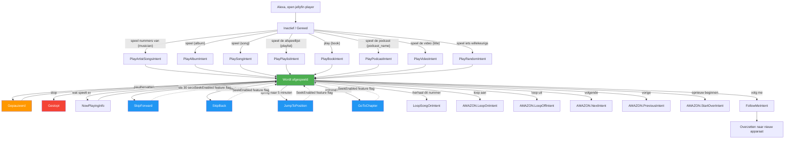

# Afspeellevenscyclus (nl-NL)

```mermaid
graph TD
    Launch["Alexa, open jellyfin player"] --> Idle["Inactief / Gereed"]

    Idle -->|"speel nummers van {musician}"| PlayArtist["PlayArtistSongsIntent"]
    Idle -->|"speel {album}"| PlayAlbum["PlayAlbumIntent"]
    Idle -->|"speel {song}"| PlaySong["PlaySongIntent"]
    Idle -->|"speel de afspeellijst {playlist}"| PlayPlaylist["PlayPlaylistIntent"]
    Idle -->|"play {book}"| PlayBook["PlayBookIntent"]
    Idle -->|"speel de podcast {podcast_name}"| PlayPodcast["PlayPodcastIntent"]
    Idle -->|"speel de video {title}"| PlayVideo["PlayVideoIntent"]
    Idle -->|"speel iets willekeurigs"| PlayRandom["PlayRandomIntent"]

    PlayArtist --> Playing
    PlayAlbum --> Playing
    PlaySong --> Playing
    PlayPlaylist --> Playing
    PlayBook --> Playing
    PlayPodcast --> Playing
    PlayVideo --> Playing
    PlayRandom --> Playing

    Playing["Wordt afgespeeld"] -->|"pauze"| Paused["Gepauzeerd"]
    Paused -->|"hervatten"| Playing
    Playing -->|"stop"| Stopped["Gestopt"]
    Playing -->|"wat speelt er"| NowPlaying["NowPlayingInfo"]

    NowPlaying --> Playing

    Playing -->|"sla 30 seconden over"| SkipFwd["SkipForward"]
    Playing -->|"ga 30 seconden terug"| SkipBack["SkipBack"]
    Playing -->|"spring naar 5 minuten"| JumpPos["JumpToPosition"]
    Playing -->|"volgend hoofdstuk"| Chapter["GoToChapter"]

    SkipFwd -.->|"SeekEnabled feature flag"| Playing
    SkipBack -.->|"SeekEnabled feature flag"| Playing
    JumpPos -.->|"SeekEnabled feature flag"| Playing
    Chapter -.->|"SeekEnabled feature flag"| Playing

    Playing -->|"herhaal dit nummer"| LoopSong["LoopSongOnIntent"]
    Playing -->|"loop aan"| LoopAll["AMAZON.LoopOnIntent"]
    Playing -->|"loop uit"| LoopOff["AMAZON.LoopOffIntent"]

    Playing -->|"volgende"| Next["AMAZON.NextIntent"]
    Playing -->|"vorige"| Prev["AMAZON.PreviousIntent"]
    Playing -->|"opnieuw beginnen"| StartOver["AMAZON.StartOverIntent"]

    Playing -->|"volg me"| FollowMe["FollowMeIntent"]
    FollowMe --> Transfer["Overzetten naar nieuw apparaat"]

    style Playing fill:#4CAF50,color:#fff
    style Paused fill:#FF9800,color:#fff
    style Stopped fill:#f44336,color:#fff
    style SkipFwd fill:#2196F3,color:#fff
    style SkipBack fill:#2196F3,color:#fff
    style JumpPos fill:#2196F3,color:#fff
    style Chapter fill:#2196F3,color:#fff
```
