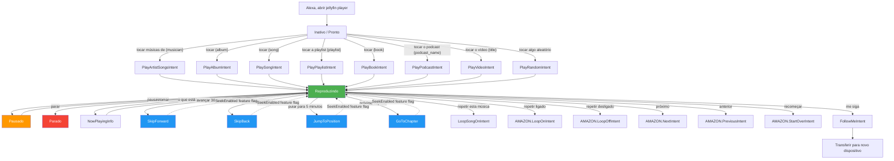

# Ciclo de Reprodução (pt-BR)

```mermaid
graph TD
    Launch["Alexa, abrir jellyfin player"] --> Idle["Inativo / Pronto"]

    Idle -->|"tocar músicas de {musician}"| PlayArtist["PlayArtistSongsIntent"]
    Idle -->|"tocar {album}"| PlayAlbum["PlayAlbumIntent"]
    Idle -->|"tocar {song}"| PlaySong["PlaySongIntent"]
    Idle -->|"tocar a playlist {playlist}"| PlayPlaylist["PlayPlaylistIntent"]
    Idle -->|"tocar {book}"| PlayBook["PlayBookIntent"]
    Idle -->|"tocar o podcast {podcast_name}"| PlayPodcast["PlayPodcastIntent"]
    Idle -->|"tocar o vídeo {title}"| PlayVideo["PlayVideoIntent"]
    Idle -->|"tocar algo aleatório"| PlayRandom["PlayRandomIntent"]

    PlayArtist --> Playing
    PlayAlbum --> Playing
    PlaySong --> Playing
    PlayPlaylist --> Playing
    PlayBook --> Playing
    PlayPodcast --> Playing
    PlayVideo --> Playing
    PlayRandom --> Playing

    Playing["Reproduzindo"] -->|"pausar"| Paused["Pausado"]
    Paused -->|"retomar"| Playing
    Playing -->|"parar"| Stopped["Parado"]
    Playing -->|"o que está tocando"| NowPlaying["NowPlayingInfo"]

    NowPlaying --> Playing

    Playing -->|"avançar 30 segundos"| SkipFwd["SkipForward"]
    Playing -->|"voltar 30 segundos"| SkipBack["SkipBack"]
    Playing -->|"pular para 5 minutos"| JumpPos["JumpToPosition"]
    Playing -->|"próximo capítulo"| Chapter["GoToChapter"]

    SkipFwd -.->|"SeekEnabled feature flag"| Playing
    SkipBack -.->|"SeekEnabled feature flag"| Playing
    JumpPos -.->|"SeekEnabled feature flag"| Playing
    Chapter -.->|"SeekEnabled feature flag"| Playing

    Playing -->|"repetir esta música"| LoopSong["LoopSongOnIntent"]
    Playing -->|"repetir ligado"| LoopAll["AMAZON.LoopOnIntent"]
    Playing -->|"repetir desligado"| LoopOff["AMAZON.LoopOffIntent"]

    Playing -->|"próximo"| Next["AMAZON.NextIntent"]
    Playing -->|"anterior"| Prev["AMAZON.PreviousIntent"]
    Playing -->|"recomeçar"| StartOver["AMAZON.StartOverIntent"]

    Playing -->|"me siga"| FollowMe["FollowMeIntent"]
    FollowMe --> Transfer["Transferir para novo dispositivo"]

    style Playing fill:#4CAF50,color:#fff
    style Paused fill:#FF9800,color:#fff
    style Stopped fill:#f44336,color:#fff
    style SkipFwd fill:#2196F3,color:#fff
    style SkipBack fill:#2196F3,color:#fff
    style JumpPos fill:#2196F3,color:#fff
    style Chapter fill:#2196F3,color:#fff
```
