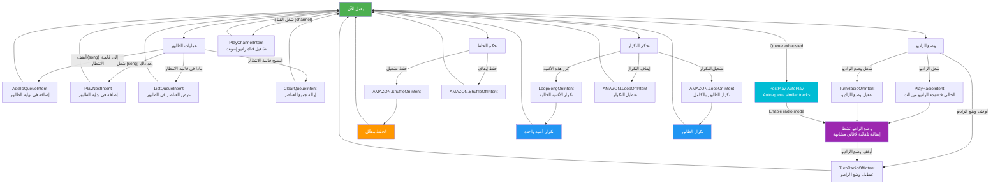

# الطابور والراديو (ar-SA)

```mermaid
graph TD
    Playing["يعمل الآن"] --> QueueOps["عمليات الطابور"]
    Playing --> RadioOps["وضع الراديو"]
    Playing --> ShuffleOps["تحكم الخلط"]
    Playing --> LoopOps["تحكم التكرار"]

    QueueOps -->|"أضف {song} إلى قائمة الانتظار"| AddQueue["AddToQueueIntent<br/>إضافة في نهاية الطابور"]
    QueueOps -->|"شغل {song} بعد ذلك"| PlayNext["PlayNextIntent<br/>إضافة في بداية الطابور"]
    QueueOps -->|"ماذا في قائمة الانتظار"| ListQueue["ListQueueIntent<br/>عرض العناصر في الطابور"]
    QueueOps -->|"امسح قائمة الانتظار"| ClearQueue["ClearQueueIntent<br/>إزالة جميع العناصر"]

    AddQueue --> Playing
    PlayNext --> Playing
    ListQueue --> Playing
    ClearQueue --> Playing

    RadioOps -->|"شغل الراديو"| PlayRadio["PlayRadioIntent<br/>بدء الراديو من التrack الحالي"]
    RadioOps -->|"شغل وضع الراديو"| RadioOn["TurnRadioOnIntent<br/>تفعيل وضع الراديو"]
    RadioOps -->|"أوقف وضع الراديو"| RadioOff["TurnRadioOffIntent<br/>تعطيل وضع الراديو"]

    PlayRadio --> RadioActive["وضع الراديو نشط<br/>إضافة تلقائية لأغاني مشابهة"]
    RadioOn --> RadioActive
    RadioOff --> Playing

    RadioActive -->|"أوقف وضع الراديو"| RadioOff

    ShuffleOps -->|"خلط تشغيل"| ShuffleOn["AMAZON.ShuffleOnIntent"]
    ShuffleOps -->|"خلط إيقاف"| ShuffleOff["AMAZON.ShuffleOffIntent"]

    ShuffleOn --> Shuffled["الخلط مفعّل"]
    ShuffleOff --> Playing
    Shuffled --> Playing

    LoopOps -->|"كرر هذه الأغنية"| LoopSong["LoopSongOnIntent<br/>تكرار الأغنية الحالية"]
    LoopOps -->|"تشغيل التكرار"| LoopAll["AMAZON.LoopOnIntent<br/>تكرار الطابور بالكامل"]
    LoopOps -->|"إيقاف التكرار"| LoopOff["AMAZON.LoopOffIntent<br/>تعطيل التكرار"]

    LoopSong --> SongLooping["تكرار أغنية واحدة"]
    LoopAll --> AllLooping["تكرار الطابور"]
    LoopOff --> Playing
    SongLooping --> Playing
    AllLooping --> Playing

    Playing -->|"شغل القناة {channel}"| Channel["PlayChannelIntent<br/>تشغيل قناة راديو إنترنت"]
    Channel --> Playing

    Playing -->|"Queue exhausted"| AutoPlay["PostPlay AutoPlay<br/>Auto-queue similar tracks"]
    AutoPlay -->|"Enable radio mode"| RadioActive

    style Playing fill:#4CAF50,color:#fff
    style RadioActive fill:#9C27B0,color:#fff
    style Shuffled fill:#FF9800,color:#fff
    style SongLooping fill:#2196F3,color:#fff
    style AllLooping fill:#2196F3,color:#fff
    style AutoPlay fill:#00BCD4,color:#fff
```
