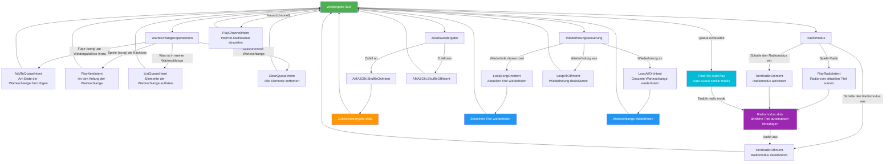

# Warteschlange und Radio (de-DE)

```mermaid
graph TD
    Playing["Wiedergabe läuft"] --> QueueOps["Warteschlangenoperationen"]
    Playing --> RadioOps["Radiomodus"]
    Playing --> ShuffleOps["Zufallswiedergabe"]
    Playing --> LoopOps["Wiederholungssteuerung"]

    QueueOps -->|"Füge {song} zur Wiedergabeliste hinzu"| AddQueue["AddToQueueIntent<br/>Am Ende der Warteschlange hinzufügen"]
    QueueOps -->|"Spiele {song} als Nächstes"| PlayNext["PlayNextIntent<br/>An den Anfang der Warteschlange"]
    QueueOps -->|"Was ist in meiner Warteschlange"| ListQueue["ListQueueIntent<br/>Elemente der Warteschlange auflisten"]
    QueueOps -->|"Lösche meine Warteschlange"| ClearQueue["ClearQueueIntent<br/>Alle Elemente entfernen"]

    AddQueue --> Playing
    PlayNext --> Playing
    ListQueue --> Playing
    ClearQueue --> Playing

    RadioOps -->|"Spiele Radio"| PlayRadio["PlayRadioIntent<br/>Radio vom aktuellen Titel starten"]
    RadioOps -->|"Schalte den Radiomodus ein"| RadioOn["TurnRadioOnIntent<br/>Radiomodus aktivieren"]
    RadioOps -->|"Schalte den Radiomodus aus"| RadioOff["TurnRadioOffIntent<br/>Radiomodus deaktivieren"]

    PlayRadio --> RadioActive["Radiomodus aktiv<br/>ähnliche Titel automatisch hinzufügen"]
    RadioOn --> RadioActive
    RadioOff --> Playing

    RadioActive -->|"Radio aus"| RadioOff

    ShuffleOps -->|"Zufall an"| ShuffleOn["AMAZON.ShuffleOnIntent"]
    ShuffleOps -->|"Zufall aus"| ShuffleOff["AMAZON.ShuffleOffIntent"]

    ShuffleOn --> Shuffled["Zufallswiedergabe aktiv"]
    ShuffleOff --> Playing
    Shuffled --> Playing

    LoopOps -->|"Wiederhole dieses Lied"| LoopSong["LoopSongOnIntent<br/>Aktuellen Titel wiederholen"]
    LoopOps -->|"Wiederholung an"| LoopAll["LoopAllOnIntent<br/>Gesamte Warteschlange wiederholen"]
    LoopOps -->|"Wiederholung aus"| LoopOff["LoopAllOffIntent<br/>Wiederholung deaktivieren"]

    LoopSong --> SongLooping["Einzelnen Titel wiederholen"]
    LoopAll --> AllLooping["Warteschlange wiederholen"]
    LoopOff --> Playing
    SongLooping --> Playing
    AllLooping --> Playing

    Playing -->|"Kanal {channel}"| Channel["PlayChannelIntent<br/>Internet-Radiokanal abspielen"]
    Channel --> Playing

    Playing -->|"Queue exhausted"| AutoPlay["PostPlay AutoPlay<br/>Auto-queue similar tracks"]
    AutoPlay -->|"Enable radio mode"| RadioActive

    style Playing fill:#4CAF50,color:#fff
    style RadioActive fill:#9C27B0,color:#fff
    style Shuffled fill:#FF9800,color:#fff
    style SongLooping fill:#2196F3,color:#fff
    style AllLooping fill:#2196F3,color:#fff
    style AutoPlay fill:#00BCD4,color:#fff
```
