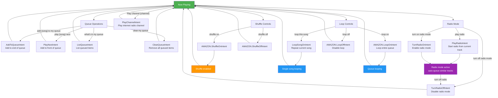

# Queue & Radio (en-US)

```mermaid
graph TD
    Playing["Now Playing"] --> QueueOps["Queue Operations"]
    Playing --> RadioOps["Radio Mode"]
    Playing --> ShuffleOps["Shuffle Controls"]
    Playing --> LoopOps["Loop Controls"]

    QueueOps -->|"add {song} to my queue"| AddQueue["AddToQueueIntent<br/>Add to end of queue"]
    QueueOps -->|"play {song} next"| PlayNext["PlayNextIntent<br/>Add to front of queue"]
    QueueOps -->|"what's in my queue"| ListQueue["ListQueueIntent<br/>List queued items"]
    QueueOps -->|"clear my queue"| ClearQueue["ClearQueueIntent<br/>Remove all queued items"]

    AddQueue --> Playing
    PlayNext --> Playing
    ListQueue --> Playing
    ClearQueue --> Playing

    RadioOps -->|"play radio"| PlayRadio["PlayRadioIntent<br/>Start radio from current track"]
    RadioOps -->|"turn on radio mode"| RadioOn["TurnRadioOnIntent<br/>Enable radio mode"]
    RadioOps -->|"turn off radio mode"| RadioOff["TurnRadioOffIntent<br/>Disable radio mode"]

    PlayRadio --> RadioActive["Radio mode active<br/>auto-queue similar tracks"]
    RadioOn --> RadioActive
    RadioOff --> Playing

    RadioActive -->|"turn off radio"| RadioOff

    ShuffleOps -->|"shuffle on"| ShuffleOn["AMAZON.ShuffleOnIntent"]
    ShuffleOps -->|"shuffle off"| ShuffleOff["AMAZON.ShuffleOffIntent"]

    ShuffleOn --> Shuffled["Shuffle enabled"]
    ShuffleOff --> Playing
    Shuffled --> Playing

    LoopOps -->|"loop this song"| LoopSong["LoopSongOnIntent<br/>Repeat current song"]
    LoopOps -->|"loop on"| LoopAll["AMAZON.LoopOnIntent<br/>Loop entire queue"]
    LoopOps -->|"loop off"| LoopOff["AMAZON.LoopOffIntent<br/>Disable loop"]

    LoopSong --> SongLooping["Single song looping"]
    LoopAll --> AllLooping["Queue looping"]
    LoopOff --> Playing
    SongLooping --> Playing
    AllLooping --> Playing

    Playing -->|"Play channel {channel}"| Channel["PlayChannelIntent<br/>Play internet radio channel"]
    Channel --> Playing

    style Playing fill:#4CAF50,color:#fff
    style RadioActive fill:#9C27B0,color:#fff
    style Shuffled fill:#FF9800,color:#fff
    style SongLooping fill:#2196F3,color:#fff
    style AllLooping fill:#2196F3,color:#fff
```
