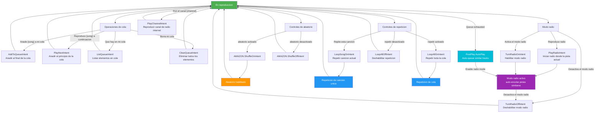

# Cola y Radio (es-ES)

```mermaid
graph TD
    Playing["En reproduccion"] --> QueueOps["Operaciones de cola"]
    Playing --> RadioOps["Modo radio"]
    Playing --> ShuffleOps["Controles de aleatorio"]
    Playing --> LoopOps["Controles de repeticion"]

    QueueOps -->|"Anade {song} a mi cola"| AddQueue["AddToQueueIntent<br/>Anadir al final de la cola"]
    QueueOps -->|"Reproduce {song} a continuacion"| PlayNext["PlayNextIntent<br/>Anadir al principio de la cola"]
    QueueOps -->|"Que hay en mi cola"| ListQueue["ListQueueIntent<br/>Listar elementos en cola"]
    QueueOps -->|"Borra mi cola"| ClearQueue["ClearQueueIntent<br/>Eliminar todos los elementos"]

    AddQueue --> Playing
    PlayNext --> Playing
    ListQueue --> Playing
    ClearQueue --> Playing

    RadioOps -->|"Reproduce radio"| PlayRadio["PlayRadioIntent<br/>Iniciar radio desde la pista actual"]
    RadioOps -->|"Activa el modo radio"| RadioOn["TurnRadioOnIntent<br/>Habilitar modo radio"]
    RadioOps -->|"Desactiva el modo radio"| RadioOff["TurnRadioOffIntent<br/>Deshabilitar modo radio"]

    PlayRadio --> RadioActive["Modo radio activo<br/>auto-encolar pistas similares"]
    RadioOn --> RadioActive
    RadioOff --> Playing

    RadioActive -->|"Desactiva el modo radio"| RadioOff

    ShuffleOps -->|"aleatorio activado"| ShuffleOn["AMAZON.ShuffleOnIntent"]
    ShuffleOps -->|"aleatorio desactivado"| ShuffleOff["AMAZON.ShuffleOffIntent"]

    ShuffleOn --> Shuffled["Aleatorio habilitado"]
    ShuffleOff --> Playing
    Shuffled --> Playing

    LoopOps -->|"Repite esta cancion"| LoopSong["LoopSongOnIntent<br/>Repetir cancion actual"]
    LoopOps -->|"repetir activado"| LoopAll["LoopAllOnIntent<br/>Repetir toda la cola"]
    LoopOps -->|"repetir desactivado"| LoopOff["LoopAllOffIntent<br/>Deshabilitar repeticion"]

    LoopSong --> SongLooping["Repeticion de cancion unica"]
    LoopAll --> AllLooping["Repeticion de cola"]
    LoopOff --> Playing
    SongLooping --> Playing
    AllLooping --> Playing

    Playing -->|"Pon el canal {channel}"| Channel["PlayChannelIntent<br/>Reproducir canal de radio internet"]
    Channel --> Playing

    Playing -->|"Queue exhausted"| AutoPlay["PostPlay AutoPlay<br/>Auto-queue similar tracks"]
    AutoPlay -->|"Enable radio mode"| RadioActive

    style Playing fill:#4CAF50,color:#fff
    style RadioActive fill:#9C27B0,color:#fff
    style Shuffled fill:#FF9800,color:#fff
    style SongLooping fill:#2196F3,color:#fff
    style AllLooping fill:#2196F3,color:#fff
    style AutoPlay fill:#00BCD4,color:#fff
```
