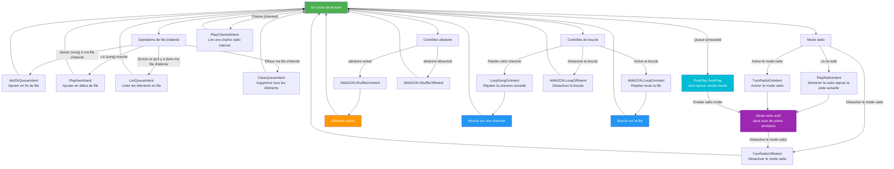

# File d'attente et Radio (fr-FR)

```mermaid
graph TD
    Playing["En cours de lecture"] --> QueueOps["Opérations de file d'attente"]
    Playing --> RadioOps["Mode radio"]
    Playing --> ShuffleOps["Contrôles aléatoire"]
    Playing --> LoopOps["Contrôles de boucle"]

    QueueOps -->|"Ajoute {song} à ma file d'attente"| AddQueue["AddToQueueIntent<br/>Ajouter en fin de file"]
    QueueOps -->|"Lis {song} ensuite"| PlayNext["PlayNextIntent<br/>Ajouter en début de file"]
    QueueOps -->|"Qu'est-ce qu'il y a dans ma file d'attente"| ListQueue["ListQueueIntent<br/>Lister les éléments en file"]
    QueueOps -->|"Efface ma file d'attente"| ClearQueue["ClearQueueIntent<br/>Supprimer tous les éléments"]

    AddQueue --> Playing
    PlayNext --> Playing
    ListQueue --> Playing
    ClearQueue --> Playing

    RadioOps -->|"Lis la radio"| PlayRadio["PlayRadioIntent<br/>Démarrer la radio depuis la piste actuelle"]
    RadioOps -->|"Active le mode radio"| RadioOn["TurnRadioOnIntent<br/>Activer le mode radio"]
    RadioOps -->|"Désactive le mode radio"| RadioOff["TurnRadioOffIntent<br/>Désactiver le mode radio"]

    PlayRadio --> RadioActive["Mode radio actif<br/>ajout auto de pistes similaires"]
    RadioOn --> RadioActive
    RadioOff --> Playing

    RadioActive -->|"Désactive le mode radio"| RadioOff

    ShuffleOps -->|"aléatoire activé"| ShuffleOn["AMAZON.ShuffleOnIntent"]
    ShuffleOps -->|"aléatoire désactivé"| ShuffleOff["AMAZON.ShuffleOffIntent"]

    ShuffleOn --> Shuffled["Aléatoire activé"]
    ShuffleOff --> Playing
    Shuffled --> Playing

    LoopOps -->|"Répète cette chanson"| LoopSong["LoopSongOnIntent<br/>Répéter la chanson actuelle"]
    LoopOps -->|"Active la boucle"| LoopAll["AMAZON.LoopOnIntent<br/>Répéter toute la file"]
    LoopOps -->|"Désactive la boucle"| LoopOff["AMAZON.LoopOffIntent<br/>Désactiver la boucle"]

    LoopSong --> SongLooping["Boucle sur une chanson"]
    LoopAll --> AllLooping["Boucle sur la file"]
    LoopOff --> Playing
    SongLooping --> Playing
    AllLooping --> Playing

    Playing -->|"Chaîne {channel}"| Channel["PlayChannelIntent<br/>Lire une chaîne radio internet"]
    Channel --> Playing

    Playing -->|"Queue exhausted"| AutoPlay["PostPlay AutoPlay<br/>Auto-queue similar tracks"]
    AutoPlay -->|"Enable radio mode"| RadioActive

    style Playing fill:#4CAF50,color:#fff
    style RadioActive fill:#9C27B0,color:#fff
    style Shuffled fill:#FF9800,color:#fff
    style SongLooping fill:#2196F3,color:#fff
    style AllLooping fill:#2196F3,color:#fff
    style AutoPlay fill:#00BCD4,color:#fff
```
