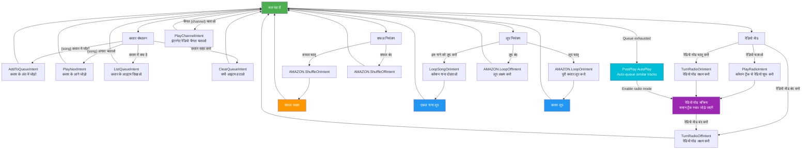

# कतार और रेडियो (hi-IN)

```mermaid
graph TD
    Playing["चल रहा है"] --> QueueOps["कतार संचालन"]
    Playing --> RadioOps["रेडियो मोड"]
    Playing --> ShuffleOps["शफल नियंत्रण"]
    Playing --> LoopOps["लूप नियंत्रण"]

    QueueOps -->|"{song} कतार में जोड़ो"| AddQueue["AddToQueueIntent<br/>कतार के अंत में जोड़ो"]
    QueueOps -->|"{song} अगला चलाओ"| PlayNext["PlayNextIntent<br/>कतार के आगे जोड़ो"]
    QueueOps -->|"कतार में क्या है"| ListQueue["ListQueueIntent<br/>कतार के आइटम दिखाओ"]
    QueueOps -->|"कतार साफ़ करो"| ClearQueue["ClearQueueIntent<br/>सभी आइटम हटाओ"]

    AddQueue --> Playing
    PlayNext --> Playing
    ListQueue --> Playing
    ClearQueue --> Playing

    RadioOps -->|"रेडियो चलाओ"| PlayRadio["PlayRadioIntent<br/>वर्तमान ट्रैक से रेडियो शुरू करो"]
    RadioOps -->|"रेडियो मोड चालू करो"| RadioOn["TurnRadioOnIntent<br/>रेडियो मोड सक्षम करो"]
    RadioOps -->|"रेडियो मोड बंद करो"| RadioOff["TurnRadioOffIntent<br/>रेडियो मोड अक्षम करो"]

    PlayRadio --> RadioActive["रेडियो मोड सक्रिय<br/>समान ट्रैक स्वतः जोड़े जाएंगे"]
    RadioOn --> RadioActive
    RadioOff --> Playing

    RadioActive -->|"रेडियो मोड बंद करो"| RadioOff

    ShuffleOps -->|"शफल चालू"| ShuffleOn["AMAZON.ShuffleOnIntent"]
    ShuffleOps -->|"शफल बंद"| ShuffleOff["AMAZON.ShuffleOffIntent"]

    ShuffleOn --> Shuffled["शफल सक्षम"]
    ShuffleOff --> Playing
    Shuffled --> Playing

    LoopOps -->|"इस गाने को लूप करो"| LoopSong["LoopSongOnIntent<br/>वर्तमान गाना दोहराओ"]
    LoopOps -->|"लूप चालू"| LoopAll["AMAZON.LoopOnIntent<br/>पूरी कतार लूप करो"]
    LoopOps -->|"लूप बंद"| LoopOff["AMAZON.LoopOffIntent<br/>लूप अक्षम करो"]

    LoopSong --> SongLooping["एकल गाना लूप"]
    LoopAll --> AllLooping["कतार लूप"]
    LoopOff --> Playing
    SongLooping --> Playing
    AllLooping --> Playing

    Playing -->|"चैनल {channel} चलाओ"| Channel["PlayChannelIntent<br/>इंटरनेट रेडियो चैनल चलाओ"]
    Channel --> Playing

    Playing -->|"Queue exhausted"| AutoPlay["PostPlay AutoPlay<br/>Auto-queue similar tracks"]
    AutoPlay -->|"Enable radio mode"| RadioActive

    style Playing fill:#4CAF50,color:#fff
    style RadioActive fill:#9C27B0,color:#fff
    style Shuffled fill:#FF9800,color:#fff
    style SongLooping fill:#2196F3,color:#fff
    style AllLooping fill:#2196F3,color:#fff
    style AutoPlay fill:#00BCD4,color:#fff
```
