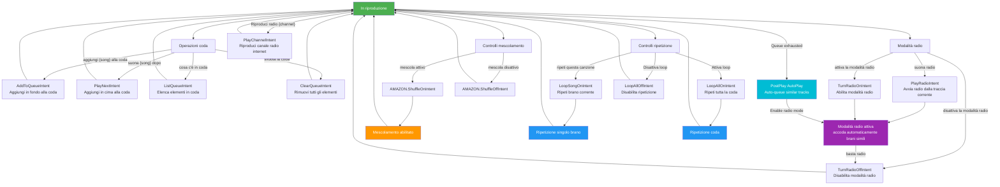

# Coda e Radio (it-IT)

```mermaid
graph TD
    Playing["In riproduzione"] --> QueueOps["Operazioni coda"]
    Playing --> RadioOps["Modalità radio"]
    Playing --> ShuffleOps["Controlli mescolamento"]
    Playing --> LoopOps["Controlli ripetizione"]

    QueueOps -->|"aggiungi {song} alla coda"| AddQueue["AddToQueueIntent<br/>Aggiungi in fondo alla coda"]
    QueueOps -->|"suona {song} dopo"| PlayNext["PlayNextIntent<br/>Aggiungi in cima alla coda"]
    QueueOps -->|"cosa c'è in coda"| ListQueue["ListQueueIntent<br/>Elenca elementi in coda"]
    QueueOps -->|"svuota la coda"| ClearQueue["ClearQueueIntent<br/>Rimuovi tutti gli elementi"]

    AddQueue --> Playing
    PlayNext --> Playing
    ListQueue --> Playing
    ClearQueue --> Playing

    RadioOps -->|"suona radio"| PlayRadio["PlayRadioIntent<br/>Avvia radio dalla traccia corrente"]
    RadioOps -->|"attiva la modalità radio"| RadioOn["TurnRadioOnIntent<br/>Abilita modalità radio"]
    RadioOps -->|"disattiva la modalità radio"| RadioOff["TurnRadioOffIntent<br/>Disabilita modalità radio"]

    PlayRadio --> RadioActive["Modalità radio attiva<br/>accoda automaticamente brani simili"]
    RadioOn --> RadioActive
    RadioOff --> Playing

    RadioActive -->|"basta radio"| RadioOff

    ShuffleOps -->|"mescola attivo"| ShuffleOn["AMAZON.ShuffleOnIntent"]
    ShuffleOps -->|"mescola disattivo"| ShuffleOff["AMAZON.ShuffleOffIntent"]

    ShuffleOn --> Shuffled["Mescolamento abilitato"]
    ShuffleOff --> Playing
    Shuffled --> Playing

    LoopOps -->|"ripeti questa canzone"| LoopSong["LoopSongOnIntent<br/>Ripeti brano corrente"]
    LoopOps -->|"Attiva loop"| LoopAll["LoopAllOnIntent<br/>Ripeti tutta la coda"]
    LoopOps -->|"Disattiva loop"| LoopOff["LoopAllOffIntent<br/>Disabilita ripetizione"]

    LoopSong --> SongLooping["Ripetizione singolo brano"]
    LoopAll --> AllLooping["Ripetizione coda"]
    LoopOff --> Playing
    SongLooping --> Playing
    AllLooping --> Playing

    Playing -->|"Riproduci radio {channel}"| Channel["PlayChannelIntent<br/>Riproduci canale radio internet"]
    Channel --> Playing

    Playing -->|"Queue exhausted"| AutoPlay["PostPlay AutoPlay<br/>Auto-queue similar tracks"]
    AutoPlay -->|"Enable radio mode"| RadioActive

    style Playing fill:#4CAF50,color:#fff
    style RadioActive fill:#9C27B0,color:#fff
    style Shuffled fill:#FF9800,color:#fff
    style SongLooping fill:#2196F3,color:#fff
    style AllLooping fill:#2196F3,color:#fff
    style AutoPlay fill:#00BCD4,color:#fff
```
