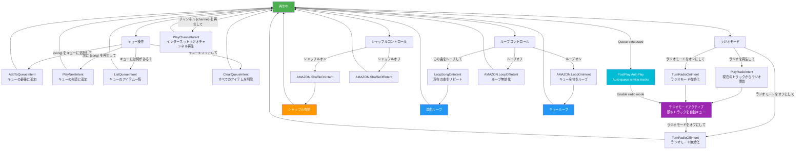

# キューとラジオ (ja-JP)

```mermaid
graph TD
    Playing["再生中"] --> QueueOps["キュー操作"]
    Playing --> RadioOps["ラジオモード"]
    Playing --> ShuffleOps["シャッフルコントロール"]
    Playing --> LoopOps["ループコントロール"]

    QueueOps -->|"{song} をキューに追加して"| AddQueue["AddToQueueIntent<br/>キューの最後に追加"]
    QueueOps -->|"次に {song} を再生して"| PlayNext["PlayNextIntent<br/>キューの先頭に追加"]
    QueueOps -->|"キューには何がある？"| ListQueue["ListQueueIntent<br/>キューのアイテム一覧"]
    QueueOps -->|"キューをクリアして"| ClearQueue["ClearQueueIntent<br/>すべてのアイテムを削除"]

    AddQueue --> Playing
    PlayNext --> Playing
    ListQueue --> Playing
    ClearQueue --> Playing

    RadioOps -->|"ラジオを再生して"| PlayRadio["PlayRadioIntent<br/>現在のトラックからラジオ開始"]
    RadioOps -->|"ラジオモードをオンにして"| RadioOn["TurnRadioOnIntent<br/>ラジオモード有効化"]
    RadioOps -->|"ラジオモードをオフにして"| RadioOff["TurnRadioOffIntent<br/>ラジオモード無効化"]

    PlayRadio --> RadioActive["ラジオモードアクティブ<br/>類似トラックを自動キュー"]
    RadioOn --> RadioActive
    RadioOff --> Playing

    RadioActive -->|"ラジオモードをオフにして"| RadioOff

    ShuffleOps -->|"シャッフルオン"| ShuffleOn["AMAZON.ShuffleOnIntent"]
    ShuffleOps -->|"シャッフルオフ"| ShuffleOff["AMAZON.ShuffleOffIntent"]

    ShuffleOn --> Shuffled["シャッフル有効"]
    ShuffleOff --> Playing
    Shuffled --> Playing

    LoopOps -->|"この曲をループして"| LoopSong["LoopSongOnIntent<br/>現在の曲をリピート"]
    LoopOps -->|"ループオン"| LoopAll["AMAZON.LoopOnIntent<br/>キュー全体をループ"]
    LoopOps -->|"ループオフ"| LoopOff["AMAZON.LoopOffIntent<br/>ループ無効化"]

    LoopSong --> SongLooping["単曲ループ"]
    LoopAll --> AllLooping["キューループ"]
    LoopOff --> Playing
    SongLooping --> Playing
    AllLooping --> Playing

    Playing -->|"チャンネル {channel} を再生して"| Channel["PlayChannelIntent<br/>インターネットラジオチャンネル再生"]
    Channel --> Playing

    Playing -->|"Queue exhausted"| AutoPlay["PostPlay AutoPlay<br/>Auto-queue similar tracks"]
    AutoPlay -->|"Enable radio mode"| RadioActive

    style Playing fill:#4CAF50,color:#fff
    style RadioActive fill:#9C27B0,color:#fff
    style Shuffled fill:#FF9800,color:#fff
    style SongLooping fill:#2196F3,color:#fff
    style AllLooping fill:#2196F3,color:#fff
    style AutoPlay fill:#00BCD4,color:#fff
```
