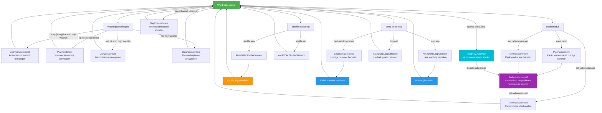

# Wachtrij en Radio (nl-NL)

```mermaid
graph TD
    Playing["Wordt afgespeeld"] --> QueueOps["Wachtrijbewerkingen"]
    Playing --> RadioOps["Radiomodus"]
    Playing --> ShuffleOps["Shuffle-bediening"]
    Playing --> LoopOps["Loop-bediening"]

    QueueOps -->|"voeg {song} toe aan mijn wachtrij"| AddQueue["AddToQueueIntent<br/>Achteraan in wachtrij toevoegen"]
    QueueOps -->|"speel {song} hierna"| PlayNext["PlayNextIntent<br/>Vooraan in wachtrij toevoegen"]
    QueueOps -->|"wat zit er in mijn wachtrij"| ListQueue["ListQueueIntent<br/>Wachtrijitems weergeven"]
    QueueOps -->|"wis mijn wachtrij"| ClearQueue["ClearQueueIntent<br/>Alle wachtrijitems verwijderen"]

    AddQueue --> Playing
    PlayNext --> Playing
    ListQueue --> Playing
    ClearQueue --> Playing

    RadioOps -->|"speel radio"| PlayRadio["PlayRadioIntent<br/>Radio starten vanaf huidige nummer"]
    RadioOps -->|"zet radiomodus aan"| RadioOn["TurnRadioOnIntent<br/>Radiomodus inschakelen"]
    RadioOps -->|"zet radiomodus uit"| RadioOff["TurnRadioOffIntent<br/>Radiomodus uitschakelen"]

    PlayRadio --> RadioActive["Radiomodus actief<br/>automatisch vergelijkbare nummers in wachtrij"]
    RadioOn --> RadioActive
    RadioOff --> Playing

    RadioActive -->|"zet radiomodus uit"| RadioOff

    ShuffleOps -->|"shuffle aan"| ShuffleOn["AMAZON.ShuffleOnIntent"]
    ShuffleOps -->|"shuffle uit"| ShuffleOff["AMAZON.ShuffleOffIntent"]

    ShuffleOn --> Shuffled["Shuffle ingeschakeld"]
    ShuffleOff --> Playing
    Shuffled --> Playing

    LoopOps -->|"herhaal dit nummer"| LoopSong["LoopSongOnIntent<br/>Huidige nummer herhalen"]
    LoopOps -->|"loop aan"| LoopAll["AMAZON.LoopOnIntent<br/>Hele wachtrij herhalen"]
    LoopOps -->|"loop uit"| LoopOff["AMAZON.LoopOffIntent<br/>Herhaling uitschakelen"]

    LoopSong --> SongLooping["Enkel nummer herhalen"]
    LoopAll --> AllLooping["Wachtrij herhalen"]
    LoopOff --> Playing
    SongLooping --> Playing
    AllLooping --> Playing

    Playing -->|"speel kanaal {channel}"| Channel["PlayChannelIntent<br/>Internetradiokanaal afspelen"]
    Channel --> Playing

    Playing -->|"Queue exhausted"| AutoPlay["PostPlay AutoPlay<br/>Auto-queue similar tracks"]
    AutoPlay -->|"Enable radio mode"| RadioActive

    style Playing fill:#4CAF50,color:#fff
    style RadioActive fill:#9C27B0,color:#fff
    style Shuffled fill:#FF9800,color:#fff
    style SongLooping fill:#2196F3,color:#fff
    style AllLooping fill:#2196F3,color:#fff
    style AutoPlay fill:#00BCD4,color:#fff
```
