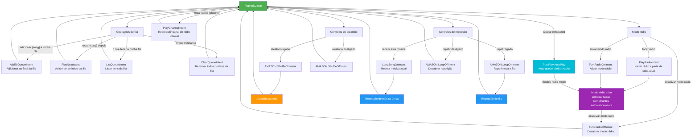

# Fila e Rádio (pt-BR)

```mermaid
graph TD
    Playing["Reproduzindo"] --> QueueOps["Operações de fila"]
    Playing --> RadioOps["Modo rádio"]
    Playing --> ShuffleOps["Controles de aleatório"]
    Playing --> LoopOps["Controles de repetição"]

    QueueOps -->|"adicionar {song} à minha fila"| AddQueue["AddToQueueIntent<br/>Adicionar ao final da fila"]
    QueueOps -->|"tocar {song} depois"| PlayNext["PlayNextIntent<br/>Adicionar ao início da fila"]
    QueueOps -->|"o que tem na minha fila"| ListQueue["ListQueueIntent<br/>Listar itens da fila"]
    QueueOps -->|"limpar minha fila"| ClearQueue["ClearQueueIntent<br/>Remover todos os itens da fila"]

    AddQueue --> Playing
    PlayNext --> Playing
    ListQueue --> Playing
    ClearQueue --> Playing

    RadioOps -->|"tocar rádio"| PlayRadio["PlayRadioIntent<br/>Iniciar rádio a partir da faixa atual"]
    RadioOps -->|"ativar modo rádio"| RadioOn["TurnRadioOnIntent<br/>Ativar modo rádio"]
    RadioOps -->|"desativar modo rádio"| RadioOff["TurnRadioOffIntent<br/>Desativar modo rádio"]

    PlayRadio --> RadioActive["Modo rádio ativo<br/>enfileirar faixas semelhantes automaticamente"]
    RadioOn --> RadioActive
    RadioOff --> Playing

    RadioActive -->|"desativar modo rádio"| RadioOff

    ShuffleOps -->|"aleatório ligado"| ShuffleOn["AMAZON.ShuffleOnIntent"]
    ShuffleOps -->|"aleatório desligado"| ShuffleOff["AMAZON.ShuffleOffIntent"]

    ShuffleOn --> Shuffled["Aleatório ativado"]
    ShuffleOff --> Playing
    Shuffled --> Playing

    LoopOps -->|"repetir esta música"| LoopSong["LoopSongOnIntent<br/>Repetir música atual"]
    LoopOps -->|"repetir ligado"| LoopAll["AMAZON.LoopOnIntent<br/>Repetir toda a fila"]
    LoopOps -->|"repetir desligado"| LoopOff["AMAZON.LoopOffIntent<br/>Desativar repetição"]

    LoopSong --> SongLooping["Repetição de música única"]
    LoopAll --> AllLooping["Repetição de fila"]
    LoopOff --> Playing
    SongLooping --> Playing
    AllLooping --> Playing

    Playing -->|"tocar canal {channel}"| Channel["PlayChannelIntent<br/>Reproduzir canal de rádio internet"]
    Channel --> Playing

    Playing -->|"Queue exhausted"| AutoPlay["PostPlay AutoPlay<br/>Auto-queue similar tracks"]
    AutoPlay -->|"Enable radio mode"| RadioActive

    style Playing fill:#4CAF50,color:#fff
    style RadioActive fill:#9C27B0,color:#fff
    style Shuffled fill:#FF9800,color:#fff
    style SongLooping fill:#2196F3,color:#fff
    style AllLooping fill:#2196F3,color:#fff
    style AutoPlay fill:#00BCD4,color:#fff
```
