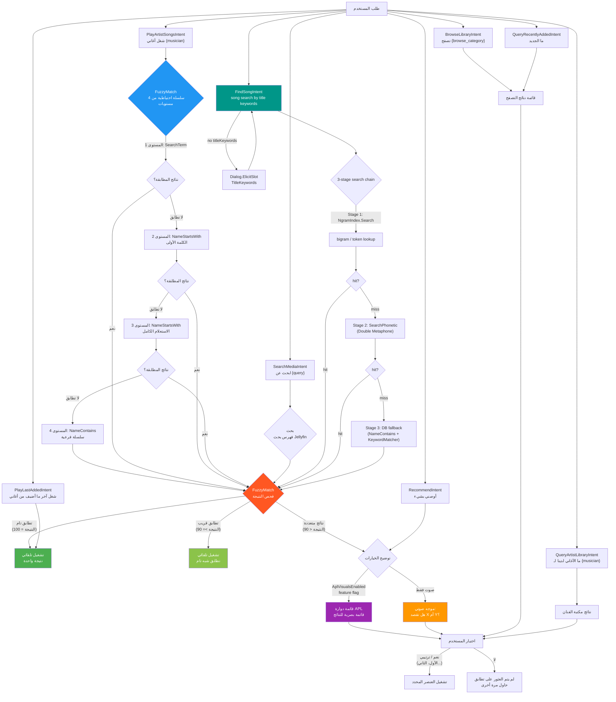

# البحث وتوضيح الخيارات (ar-SA)

```mermaid
graph TD
    Start["طلب المستخدم"] --> PlayArtist["PlayArtistSongsIntent<br/>شغل أغاني {musician}"]
    Start --> SearchMedia["SearchMediaIntent<br/>ابحث عن {query}"]

    PlayArtist --> FuzzyMatch{"FuzzyMatch<br/>سلسلة احتياطية من 4 مستويات"}
    SearchMedia --> SearchDB{"بحث<br/>فهرس بحث Jellyfin"}

    FuzzyMatch -->|"المستوى 1: SearchTerm"| FMResult{"نتائج المطابقة؟"}
    FMResult -->|"لا تطابق"| Tier2["المستوى 2: NameStartsWith<br/>الكلمة الأولى"]
    Tier2 --> FMResult2{"نتائج المطابقة؟"}
    FMResult2 -->|"لا تطابق"| Tier3["المستوى 3: NameStartsWith<br/>الاستعلام الكامل"]
    Tier3 --> FMResult3{"نتائج المطابقة؟"}
    FMResult3 -->|"لا تطابق"| Tier4["المستوى 4: NameContains<br/>سلسلة فرعية"]
    Tier4 --> ScoreCheck

    FMResult -->|"نعم"| ScoreCheck
    FMResult2 -->|"نعم"| ScoreCheck
    FMResult3 -->|"نعم"| ScoreCheck

    SearchDB --> ScoreCheck

    ScoreCheck{"FuzzyMatch<br/>فحص النتيجة"}
    ScoreCheck -->|"تطابق تام<br/>(النتيجة = 100)"| AutoPlay["تشغيل تلقائي<br/>نتيجة واحدة"]
    ScoreCheck -->|"تطابق قريب<br/>(النتيجة >= 90)"| AutoPlayNear["تشغيل تلقائي<br/>تطابق شبه تام"]
    ScoreCheck -->|"نتائج متعددة<br/>(النتيجة < 90)"| Disambig{"توضيح الخيارات"}

    Disambig -->|"AplVisualsEnabled<br/>feature flag"| Carousel["قائمة دوارة APL<br/>قائمة بصرية للنتائج"]
    Disambig -->|"صوت فقط"| VoicePrompt["موجه صوتي:<br/>هل تقصد X أم Y؟"]

    Carousel --> UserChoice["اختيار المستخدم"]
    VoicePrompt --> UserChoice

    UserChoice -->|"نعم / ترتيبي<br/>(الأول، الثاني...)"| PlaySelected["تشغيل العنصر المحدد"]
    UserChoice -->|"لا"| NoMatch["لم يتم العثور على تطابق<br/>حاول مرة أخرى"]

    Start --> BrowseLib["BrowseLibraryIntent<br/>تصفح {browse_category}"]
    Start --> QueryArtist["QueryArtistLibraryIntent<br/>ما الأغاني لدينا لـ {musician}"]

    BrowseLib --> BrowseResults["قائمة نتائج التصفح"]
    QueryArtist --> ArtistResults["نتائج مكتبة الفنان"]

    BrowseResults --> UserChoice
    ArtistResults --> UserChoice

    Start --> PlayLast["PlayLastAddedIntent<br/>شغل آخر ما أضيف من أغاني"]
    Start --> RecentQuery["QueryRecentlyAddedIntent<br/>ما الجديد"]

    PlayLast --> AutoPlay
    RecentQuery --> BrowseResults

    Start --> Recommend["RecommendIntent<br/>أوصني بشيء"]
    Recommend --> Disambig


    Start --> FindSong["FindSongIntent<br/>song search by title keywords"]
    FindSong --> SongChain{"3-stage search chain"}
    SongChain -->|"Stage 1: NgramIndex.Search"| Ngram["bigram / token lookup"]
    Ngram --> ChainHit{"hit?"}
    ChainHit -->|"miss"| Phonetic["Stage 2: SearchPhonetic<br/>(Double Metaphone)"]
    Phonetic --> ChainHit2{"hit?"}
    ChainHit2 -->|"miss"| DbFallback["Stage 3: DB fallback<br/>(NameContains + KeywordMatcher)"]
    ChainHit -->|"hit"| ScoreCheck
    ChainHit2 -->|"hit"| ScoreCheck
    DbFallback --> ScoreCheck
    FindSong -->|"no titleKeywords"| ElicitSong["Dialog.ElicitSlot<br/>TitleKeywords"]
    ElicitSong --> FindSong
    style FindSong fill:#009688,color:#fff

    style AutoPlay fill:#4CAF50,color:#fff
    style AutoPlayNear fill:#8BC34A,color:#fff
    style Carousel fill:#9C27B0,color:#fff
    style VoicePrompt fill:#FF9800,color:#fff
    style FuzzyMatch fill:#2196F3,color:#fff
    style ScoreCheck fill:#FF5722,color:#fff
```
