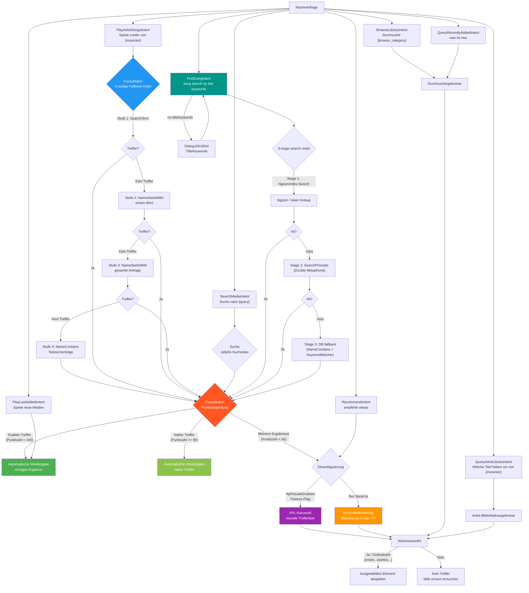

# Suche und Disambiguierung (de-DE)

```mermaid
graph TD
    Start["Nutzeranfrage"] --> PlayArtist["PlayArtistSongsIntent<br/>Spiele Lieder von {musician}"]
    Start --> SearchMedia["SearchMediaIntent<br/>Suche nach {query}"]

    PlayArtist --> FuzzyMatch{"FuzzyMatch<br/>4-stufige Fallback-Kette"}
    SearchMedia --> SearchDB{"Suche<br/>Jellyfin-Suchindex"}

    FuzzyMatch -->|"Stufe 1: SearchTerm"| FMResult{"Treffer?"}
    FMResult -->|"Kein Treffer"| Tier2["Stufe 2: NameStartsWith<br/>erstes Wort"]
    Tier2 --> FMResult2{"Treffer?"}
    FMResult2 -->|"Kein Treffer"| Tier3["Stufe 3: NameStartsWith<br/>gesamte Anfrage"]
    Tier3 --> FMResult3{"Treffer?"}
    FMResult3 -->|"Kein Treffer"| Tier4["Stufe 4: NameContains<br/>Teilzeichenfolge"]
    Tier4 --> ScoreCheck

    FMResult -->|"Ja"| ScoreCheck
    FMResult2 -->|"Ja"| ScoreCheck
    FMResult3 -->|"Ja"| ScoreCheck

    SearchDB --> ScoreCheck

    ScoreCheck{"FuzzyMatch<br/>Punktzahlprüfung"}
    ScoreCheck -->|"Exakter Treffer<br/>(Punktzahl = 100)"| AutoPlay["Automatische Wiedergabe<br/>einziges Ergebnis"]
    ScoreCheck -->|"Naher Treffer<br/>(Punktzahl >= 90)"| AutoPlayNear["Automatische Wiedergabe<br/>naher Treffer"]
    ScoreCheck -->|"Mehrere Ergebnisse<br/>(Punktzahl < 90)"| Disambig{"Disambiguierung"}

    Disambig -->|"AplVisualsEnabled<br/>Feature-Flag"| Carousel["APL-Karussell<br/>visuelle Trefferliste"]
    Disambig -->|"Nur Sprache"| VoicePrompt["Sprachaufforderung:<br/>Meintest du X oder Y?"]

    Carousel --> UserChoice["Nutzerauswahl"]
    VoicePrompt --> UserChoice

    UserChoice -->|"Ja / Ordinalzahl<br/>(erstes, zweites...)"| PlaySelected["Ausgewähltes Element abspielen"]
    UserChoice -->|"Nein"| NoMatch["Kein Treffer<br/>bitte erneut versuchen"]

    Start --> BrowseLib["BrowseLibraryIntent<br/>durchsuche {browse_category}"]
    Start --> QueryArtist["QueryArtistLibraryIntent<br/>Welche Titel haben wir von {musician}"]

    BrowseLib --> BrowseResults["Durchsuchergebnisse"]
    QueryArtist --> ArtistResults["Artist-Bibliotheksergebnisse"]

    BrowseResults --> UserChoice
    ArtistResults --> UserChoice

    Start --> PlayLast["PlayLastAddedIntent<br/>Spiele neue Medien"]
    Start --> RecentQuery["QueryRecentlyAddedIntent<br/>was ist neu"]

    PlayLast --> AutoPlay
    RecentQuery --> BrowseResults

    Start --> Recommend["RecommendIntent<br/>empfehle etwas"]
    Recommend --> Disambig


    Start --> FindSong["FindSongIntent<br/>song search by title keywords"]
    FindSong --> SongChain{"3-stage search chain"}
    SongChain -->|"Stage 1: NgramIndex.Search"| Ngram["bigram / token lookup"]
    Ngram --> ChainHit{"hit?"}
    ChainHit -->|"miss"| Phonetic["Stage 2: SearchPhonetic<br/>(Double Metaphone)"]
    Phonetic --> ChainHit2{"hit?"}
    ChainHit2 -->|"miss"| DbFallback["Stage 3: DB fallback<br/>(NameContains + KeywordMatcher)"]
    ChainHit -->|"hit"| ScoreCheck
    ChainHit2 -->|"hit"| ScoreCheck
    DbFallback --> ScoreCheck
    FindSong -->|"no titleKeywords"| ElicitSong["Dialog.ElicitSlot<br/>TitleKeywords"]
    ElicitSong --> FindSong
    style FindSong fill:#009688,color:#fff

    style AutoPlay fill:#4CAF50,color:#fff
    style AutoPlayNear fill:#8BC34A,color:#fff
    style Carousel fill:#9C27B0,color:#fff
    style VoicePrompt fill:#FF9800,color:#fff
    style FuzzyMatch fill:#2196F3,color:#fff
    style ScoreCheck fill:#FF5722,color:#fff
```
