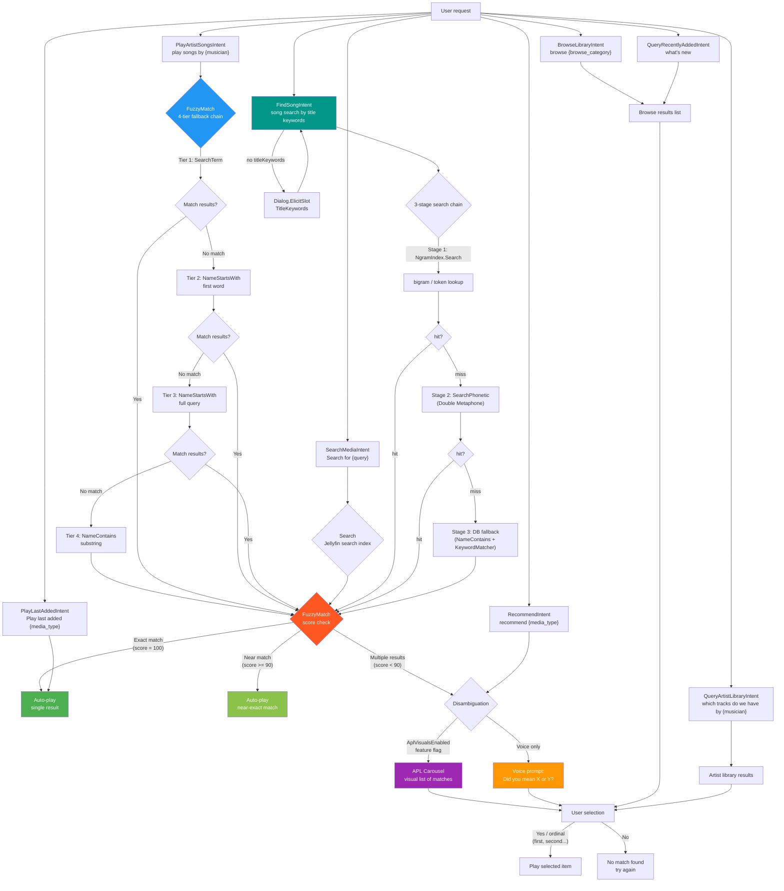

# Search & Disambiguation (en-CA)

```mermaid
graph TD
    Start["User request"] --> PlayArtist["PlayArtistSongsIntent<br/>play songs by {musician}"]
    Start --> SearchMedia["SearchMediaIntent<br/>Search for {query}"]

    PlayArtist --> FuzzyMatch{"FuzzyMatch<br/>4-tier fallback chain"}
    SearchMedia --> SearchDB{"Search<br/>Jellyfin search index"}

    FuzzyMatch -->|"Tier 1: SearchTerm"| FMResult{"Match results?"}
    FMResult -->|"No match"| Tier2["Tier 2: NameStartsWith<br/>first word"]
    Tier2 --> FMResult2{"Match results?"}
    FMResult2 -->|"No match"| Tier3["Tier 3: NameStartsWith<br/>full query"]
    Tier3 --> FMResult3{"Match results?"}
    FMResult3 -->|"No match"| Tier4["Tier 4: NameContains<br/>substring"]
    Tier4 --> ScoreCheck

    FMResult -->|"Yes"| ScoreCheck
    FMResult2 -->|"Yes"| ScoreCheck
    FMResult3 -->|"Yes"| ScoreCheck

    SearchDB --> ScoreCheck

    ScoreCheck{"FuzzyMatch<br/>score check"}
    ScoreCheck -->|"Exact match<br/>(score = 100)"| AutoPlay["Auto-play<br/>single result"]
    ScoreCheck -->|"Near match<br/>(score >= 90)"| AutoPlayNear["Auto-play<br/>near-exact match"]
    ScoreCheck -->|"Multiple results<br/>(score < 90)"| Disambig{"Disambiguation"}

    Disambig -->|"AplVisualsEnabled<br/>feature flag"| Carousel["APL Carousel<br/>visual list of matches"]
    Disambig -->|"Voice only"| VoicePrompt["Voice prompt:<br/>Did you mean X or Y?"]

    Carousel --> UserChoice["User selection"]
    VoicePrompt --> UserChoice

    UserChoice -->|"Yes / ordinal<br/>(first, second...)"| PlaySelected["Play selected item"]
    UserChoice -->|"No"| NoMatch["No match found<br/>try again"]

    Start --> BrowseLib["BrowseLibraryIntent<br/>browse {browse_category}"]
    Start --> QueryArtist["QueryArtistLibraryIntent<br/>which tracks do we have by {musician}"]

    BrowseLib --> BrowseResults["Browse results list"]
    QueryArtist --> ArtistResults["Artist library results"]

    BrowseResults --> UserChoice
    ArtistResults --> UserChoice

    Start --> PlayLast["PlayLastAddedIntent<br/>Play last added {media_type}"]
    Start --> RecentQuery["QueryRecentlyAddedIntent<br/>what's new"]

    PlayLast --> AutoPlay
    RecentQuery --> BrowseResults

    Start --> Recommend["RecommendIntent<br/>recommend {media_type}"]
    Recommend --> Disambig


    Start --> FindSong["FindSongIntent<br/>song search by title keywords"]
    FindSong --> SongChain{"3-stage search chain"}
    SongChain -->|"Stage 1: NgramIndex.Search"| Ngram["bigram / token lookup"]
    Ngram --> ChainHit{"hit?"}
    ChainHit -->|"miss"| Phonetic["Stage 2: SearchPhonetic<br/>(Double Metaphone)"]
    Phonetic --> ChainHit2{"hit?"}
    ChainHit2 -->|"miss"| DbFallback["Stage 3: DB fallback<br/>(NameContains + KeywordMatcher)"]
    ChainHit -->|"hit"| ScoreCheck
    ChainHit2 -->|"hit"| ScoreCheck
    DbFallback --> ScoreCheck
    FindSong -->|"no titleKeywords"| ElicitSong["Dialog.ElicitSlot<br/>TitleKeywords"]
    ElicitSong --> FindSong
    style FindSong fill:#009688,color:#fff

    style AutoPlay fill:#4CAF50,color:#fff
    style AutoPlayNear fill:#8BC34A,color:#fff
    style Carousel fill:#9C27B0,color:#fff
    style VoicePrompt fill:#FF9800,color:#fff
    style FuzzyMatch fill:#2196F3,color:#fff
    style ScoreCheck fill:#FF5722,color:#fff
```
