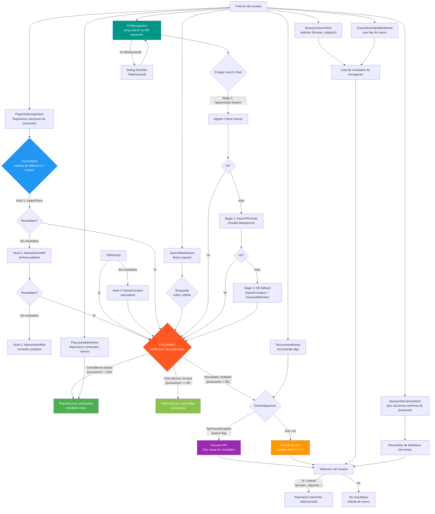

# Busqueda y Desambiguacion (es-ES)

```mermaid
graph TD
    Start["Peticion del usuario"] --> PlayArtist["PlayArtistSongsIntent<br/>Reproduce canciones de {musician}"]
    Start --> SearchMedia["SearchMediaIntent<br/>Busca {query}"]

    PlayArtist --> FuzzyMatch{"FuzzyMatch<br/>cadena de fallback a 4 niveles"}
    SearchMedia --> SearchDB{"Busqueda<br/>indice Jellyfin"}

    FuzzyMatch -->|"Nivel 1: SearchTerm"| FMResult{"Resultados?"}
    FMResult -->|"Sin resultados"| Tier2["Nivel 2: NameStartsWith<br/>primera palabra"]
    Tier2 --> FMResult2{"Resultados?"}
    FMResult2 -->|"Sin resultados"| Tier3["Nivel 3: NameStartsWith<br/>consulta completa"]
    FMResult3 -->|"Sin resultados"| Tier4["Nivel 4: NameContains<br/>subcadena"]
    FMResult2 -->|"Si"| ScoreCheck
    FMResult3 -->|"Si"| ScoreCheck
    Tier4 --> ScoreCheck
    FMResult -->|"Si"| ScoreCheck

    SearchDB --> ScoreCheck

    ScoreCheck{"FuzzyMatch<br/>verificacion de puntuacion"}
    ScoreCheck -->|"Coincidencia exacta<br/>(puntuacion = 100)"| AutoPlay["Reproduccion automatica<br/>resultado unico"]
    ScoreCheck -->|"Coincidencia cercana<br/>(puntuacion >= 90)"| AutoPlayNear["Reproduccion automatica<br/>casi exacta"]
    ScoreCheck -->|"Resultados multiples<br/>(puntuacion < 90)"| Disambig{"Desambiguacion"}

    Disambig -->|"AplVisualsEnabled<br/>feature flag"| Carousel["Carrusel APL<br/>lista visual de resultados"]
    Disambig -->|"Solo voz"| VoicePrompt["Prompt de voz:<br/>Querias decir X o Y?"]

    Carousel --> UserChoice["Seleccion del usuario"]
    VoicePrompt --> UserChoice

    UserChoice -->|"Si / ordinal<br/>(primero, segundo...)"| PlaySelected["Reproducir elemento seleccionado"]
    UserChoice -->|"No"| NoMatch["Sin resultados<br/>intenta de nuevo"]

    Start --> BrowseLib["BrowseLibraryIntent<br/>explorar {browse_category}"]
    Start --> QueryArtist["QueryArtistLibraryIntent<br/>Que canciones tenemos de {musician}"]

    BrowseLib --> BrowseResults["Lista de resultados de navegacion"]
    QueryArtist --> ArtistResults["Resultados de biblioteca del artista"]

    BrowseResults --> UserChoice
    ArtistResults --> UserChoice

    Start --> PlayLast["PlayLastAddedIntent<br/>Reproduce contenidos nuevos"]
    Start --> RecentQuery["QueryRecentlyAddedIntent<br/>que hay de nuevo"]

    PlayLast --> AutoPlay
    RecentQuery --> BrowseResults

    Start --> Recommend["RecommendIntent<br/>recomienda algo"]
    Recommend --> Disambig


    Start --> FindSong["FindSongIntent<br/>song search by title keywords"]
    FindSong --> SongChain{"3-stage search chain"}
    SongChain -->|"Stage 1: NgramIndex.Search"| Ngram["bigram / token lookup"]
    Ngram --> ChainHit{"hit?"}
    ChainHit -->|"miss"| Phonetic["Stage 2: SearchPhonetic<br/>(Double Metaphone)"]
    Phonetic --> ChainHit2{"hit?"}
    ChainHit2 -->|"miss"| DbFallback["Stage 3: DB fallback<br/>(NameContains + KeywordMatcher)"]
    ChainHit -->|"hit"| ScoreCheck
    ChainHit2 -->|"hit"| ScoreCheck
    DbFallback --> ScoreCheck
    FindSong -->|"no titleKeywords"| ElicitSong["Dialog.ElicitSlot<br/>TitleKeywords"]
    ElicitSong --> FindSong
    style FindSong fill:#009688,color:#fff

    style AutoPlay fill:#4CAF50,color:#fff
    style AutoPlayNear fill:#8BC34A,color:#fff
    style Carousel fill:#9C27B0,color:#fff
    style VoicePrompt fill:#FF9800,color:#fff
    style FuzzyMatch fill:#2196F3,color:#fff
    style ScoreCheck fill:#FF5722,color:#fff
```
