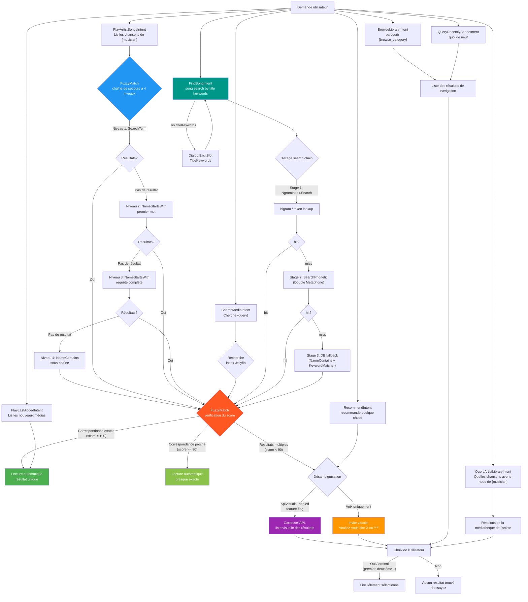

# Recherche et Désambiguïsation (fr-CA)

```mermaid
graph TD
    Start["Demande utilisateur"] --> PlayArtist["PlayArtistSongsIntent<br/>Lis les chansons de {musician}"]
    Start --> SearchMedia["SearchMediaIntent<br/>Cherche {query}"]

    PlayArtist --> FuzzyMatch{"FuzzyMatch<br/>chaîne de secours à 4 niveaux"}
    SearchMedia --> SearchDB{"Recherche<br/>index Jellyfin"}

    FuzzyMatch -->|"Niveau 1: SearchTerm"| FMResult{"Résultats?"}
    FMResult -->|"Pas de résultat"| Tier2["Niveau 2: NameStartsWith<br/>premier mot"]
    Tier2 --> FMResult2{"Résultats?"}
    FMResult2 -->|"Pas de résultat"| Tier3["Niveau 3: NameStartsWith<br/>requête complète"]
    Tier3 --> FMResult3{"Résultats?"}
    FMResult3 -->|"Pas de résultat"| Tier4["Niveau 4: NameContains<br/>sous-chaîne"]
    Tier4 --> ScoreCheck

    FMResult -->|"Oui"| ScoreCheck
    FMResult2 -->|"Oui"| ScoreCheck
    FMResult3 -->|"Oui"| ScoreCheck

    SearchDB --> ScoreCheck

    ScoreCheck{"FuzzyMatch<br/>vérification du score"}
    ScoreCheck -->|"Correspondance exacte<br/>(score = 100)"| AutoPlay["Lecture automatique<br/>résultat unique"]
    ScoreCheck -->|"Correspondance proche<br/>(score >= 90)"| AutoPlayNear["Lecture automatique<br/>presque exacte"]
    ScoreCheck -->|"Résultats multiples<br/>(score < 90)"| Disambig{"Désambiguïsation"}

    Disambig -->|"AplVisualsEnabled<br/>feature flag"| Carousel["Carrousel APL<br/>liste visuelle des résultats"]
    Disambig -->|"Voix uniquement"| VoicePrompt["Invite vocale:<br/>Vouliez-vous dire X ou Y?"]

    Carousel --> UserChoice["Choix de l'utilisateur"]
    VoicePrompt --> UserChoice

    UserChoice -->|"Oui / ordinal<br/>(premier, deuxième...)"| PlaySelected["Lire l'élément sélectionné"]
    UserChoice -->|"Non"| NoMatch["Aucun résultat trouvé<br/>réessayez"]

    Start --> BrowseLib["BrowseLibraryIntent<br/>parcourir {browse_category}"]
    Start --> QueryArtist["QueryArtistLibraryIntent<br/>Quelles chansons avons-nous de {musician}"]

    BrowseLib --> BrowseResults["Liste des résultats de navigation"]
    QueryArtist --> ArtistResults["Résultats de la médiathèque de l'artiste"]

    BrowseResults --> UserChoice
    ArtistResults --> UserChoice

    Start --> PlayLast["PlayLastAddedIntent<br/>Lis les nouveaux médias"]
    Start --> RecentQuery["QueryRecentlyAddedIntent<br/>quoi de neuf"]

    PlayLast --> AutoPlay
    RecentQuery --> BrowseResults

    Start --> Recommend["RecommendIntent<br/>recommande quelque chose"]
    Recommend --> Disambig


    Start --> FindSong["FindSongIntent<br/>song search by title keywords"]
    FindSong --> SongChain{"3-stage search chain"}
    SongChain -->|"Stage 1: NgramIndex.Search"| Ngram["bigram / token lookup"]
    Ngram --> ChainHit{"hit?"}
    ChainHit -->|"miss"| Phonetic["Stage 2: SearchPhonetic<br/>(Double Metaphone)"]
    Phonetic --> ChainHit2{"hit?"}
    ChainHit2 -->|"miss"| DbFallback["Stage 3: DB fallback<br/>(NameContains + KeywordMatcher)"]
    ChainHit -->|"hit"| ScoreCheck
    ChainHit2 -->|"hit"| ScoreCheck
    DbFallback --> ScoreCheck
    FindSong -->|"no titleKeywords"| ElicitSong["Dialog.ElicitSlot<br/>TitleKeywords"]
    ElicitSong --> FindSong
    style FindSong fill:#009688,color:#fff

    style AutoPlay fill:#4CAF50,color:#fff
    style AutoPlayNear fill:#8BC34A,color:#fff
    style Carousel fill:#9C27B0,color:#fff
    style VoicePrompt fill:#FF9800,color:#fff
    style FuzzyMatch fill:#2196F3,color:#fff
    style ScoreCheck fill:#FF5722,color:#fff
```
