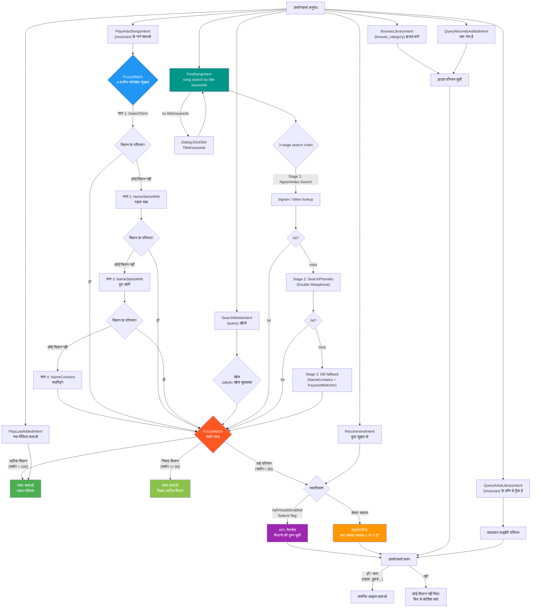

# खोज और स्पष्टीकरण (hi-IN)

```mermaid
graph TD
    Start["उपयोगकर्ता अनुरोध"] --> PlayArtist["PlayArtistSongsIntent<br/>{musician} के गाने चलाओ"]
    Start --> SearchMedia["SearchMediaIntent<br/>{query} खोजो"]

    PlayArtist --> FuzzyMatch{"FuzzyMatch<br/>4-स्तरीय फॉलबैक श्रृंखला"}
    SearchMedia --> SearchDB{"खोज<br/>Jellyfin खोज सूचकांक"}

    FuzzyMatch -->|"स्तर 1: SearchTerm"| FMResult{"मिलान के परिणाम?"}
    FMResult -->|"कोई मिलान नहीं"| Tier2["स्तर 2: NameStartsWith<br/>पहला शब्द"]
    Tier2 --> FMResult2{"मिलान के परिणाम?"}
    FMResult2 -->|"कोई मिलान नहीं"| Tier3["स्तर 3: NameStartsWith<br/>पूरा क्वेरी"]
    Tier3 --> FMResult3{"मिलान के परिणाम?"}
    FMResult3 -->|"कोई मिलान नहीं"| Tier4["स्तर 4: NameContains<br/>सबस्ट्रिंग"]
    Tier4 --> ScoreCheck

    FMResult -->|"हाँ"| ScoreCheck
    FMResult2 -->|"हाँ"| ScoreCheck
    FMResult3 -->|"हाँ"| ScoreCheck

    SearchDB --> ScoreCheck

    ScoreCheck{"FuzzyMatch<br/>स्कोर जांच"}
    ScoreCheck -->|"सटीक मिलान<br/>(स्कोर = 100)"| AutoPlay["स्वतः चलाओ<br/>एकल परिणाम"]
    ScoreCheck -->|"निकट मिलान<br/>(स्कोर >= 90)"| AutoPlayNear["स्वतः चलाओ<br/>निकट-सटीक मिलान"]
    ScoreCheck -->|"कई परिणाम<br/>(स्कोर < 90)"| Disambig{"स्पष्टीकरण"}

    Disambig -->|"AplVisualsEnabled<br/>feature flag"| Carousel["APL कैरसेल<br/>मिलानों की दृश्य सूची"]
    Disambig -->|"केवल आवाज़"| VoicePrompt["आवाज़ प्रॉम्प्ट:<br/>क्या आपका मतलब X या Y है?"]

    Carousel --> UserChoice["उपयोगकर्ता चयन"]
    VoicePrompt --> UserChoice

    UserChoice -->|"हाँ / क्रम<br/>(पहला, दूसरा...)"| PlaySelected["चयनित आइटम चलाओ"]
    UserChoice -->|"नहीं"| NoMatch["कोई मिलान नहीं मिला<br/>फिर से कोशिश करो"]

    Start --> BrowseLib["BrowseLibraryIntent<br/>{browse_category} ब्राउज़ करो"]
    Start --> QueryArtist["QueryArtistLibraryIntent<br/>{musician} के कौन से ट्रैक हैं"]

    BrowseLib --> BrowseResults["ब्राउज़ परिणाम सूची"]
    QueryArtist --> ArtistResults["कलाकार लाइब्रेरी परिणाम"]

    BrowseResults --> UserChoice
    ArtistResults --> UserChoice

    Start --> PlayLast["PlayLastAddedIntent<br/>नया मीडिया चलाओ"]
    Start --> RecentQuery["QueryRecentlyAddedIntent<br/>क्या नया है"]

    PlayLast --> AutoPlay
    RecentQuery --> BrowseResults

    Start --> Recommend["RecommendIntent<br/>कुछ सुझाव दो"]
    Recommend --> Disambig


    Start --> FindSong["FindSongIntent<br/>song search by title keywords"]
    FindSong --> SongChain{"3-stage search chain"}
    SongChain -->|"Stage 1: NgramIndex.Search"| Ngram["bigram / token lookup"]
    Ngram --> ChainHit{"hit?"}
    ChainHit -->|"miss"| Phonetic["Stage 2: SearchPhonetic<br/>(Double Metaphone)"]
    Phonetic --> ChainHit2{"hit?"}
    ChainHit2 -->|"miss"| DbFallback["Stage 3: DB fallback<br/>(NameContains + KeywordMatcher)"]
    ChainHit -->|"hit"| ScoreCheck
    ChainHit2 -->|"hit"| ScoreCheck
    DbFallback --> ScoreCheck
    FindSong -->|"no titleKeywords"| ElicitSong["Dialog.ElicitSlot<br/>TitleKeywords"]
    ElicitSong --> FindSong
    style FindSong fill:#009688,color:#fff

    style AutoPlay fill:#4CAF50,color:#fff
    style AutoPlayNear fill:#8BC34A,color:#fff
    style Carousel fill:#9C27B0,color:#fff
    style VoicePrompt fill:#FF9800,color:#fff
    style FuzzyMatch fill:#2196F3,color:#fff
    style ScoreCheck fill:#FF5722,color:#fff
```
