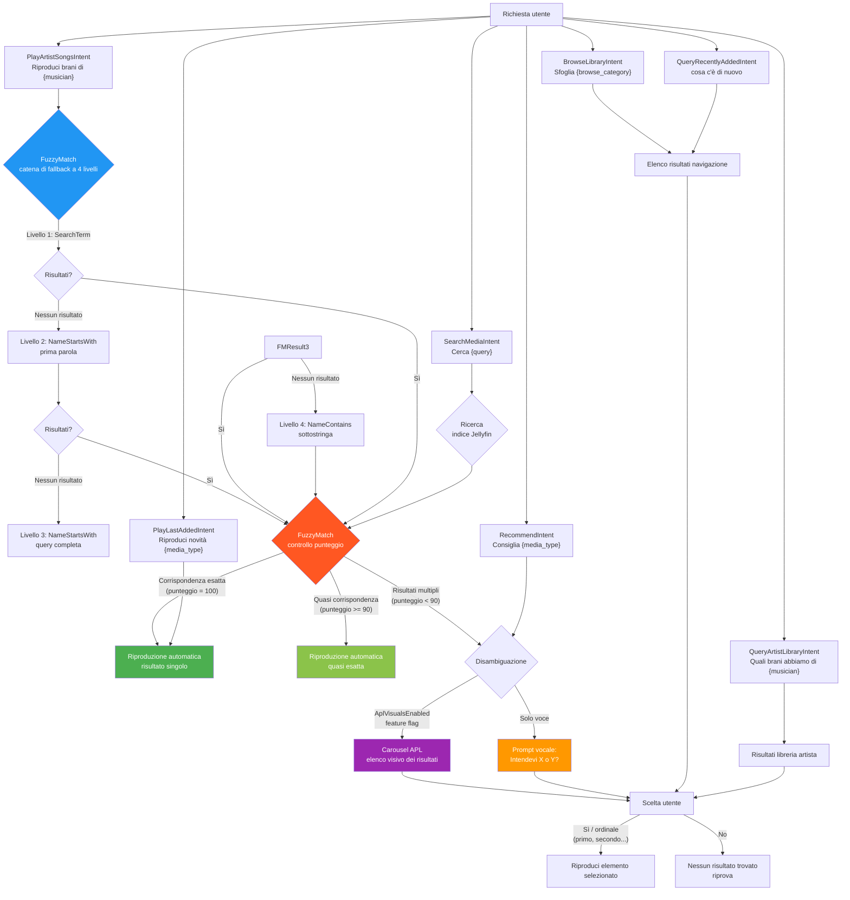

# Ricerca e Disambiguazione (it-IT)

```mermaid
graph TD
    Start["Richiesta utente"] --> PlayArtist["PlayArtistSongsIntent<br/>Riproduci brani di {musician}"]
    Start --> SearchMedia["SearchMediaIntent<br/>Cerca {query}"]

    PlayArtist --> FuzzyMatch{"FuzzyMatch<br/>catena di fallback a 4 livelli"}
    SearchMedia --> SearchDB{"Ricerca<br/>indice Jellyfin"}

    FuzzyMatch -->|"Livello 1: SearchTerm"| FMResult{"Risultati?"}
    FMResult -->|"Nessun risultato"| Tier2["Livello 2: NameStartsWith<br/>prima parola"]
    Tier2 --> FMResult2{"Risultati?"}
    FMResult2 -->|"Nessun risultato"| Tier3["Livello 3: NameStartsWith<br/>query completa"]
    FMResult3 -->|"Nessun risultato"| Tier4["Livello 4: NameContains<br/>sottostringa"]
    FMResult2 -->|"Sì"| ScoreCheck
    FMResult3 -->|"Sì"| ScoreCheck
    Tier4 --> ScoreCheck
    FMResult -->|"Sì"| ScoreCheck

    SearchDB --> ScoreCheck

    ScoreCheck{"FuzzyMatch<br/>controllo punteggio"}
    ScoreCheck -->|"Corrispondenza esatta<br/>(punteggio = 100)"| AutoPlay["Riproduzione automatica<br/>risultato singolo"]
    ScoreCheck -->|"Quasi corrispondenza<br/>(punteggio >= 90)"| AutoPlayNear["Riproduzione automatica<br/>quasi esatta"]
    ScoreCheck -->|"Risultati multipli<br/>(punteggio < 90)"| Disambig{"Disambiguazione"}

    Disambig -->|"AplVisualsEnabled<br/>feature flag"| Carousel["Carousel APL<br/>elenco visivo dei risultati"]
    Disambig -->|"Solo voce"| VoicePrompt["Prompt vocale:<br/>Intendevi X o Y?"]

    Carousel --> UserChoice["Scelta utente"]
    VoicePrompt --> UserChoice

    UserChoice -->|"Sì / ordinale<br/>(primo, secondo...)"| PlaySelected["Riproduci elemento selezionato"]
    UserChoice -->|"No"| NoMatch["Nessun risultato trovato<br/>riprova"]

    Start --> BrowseLib["BrowseLibraryIntent<br/>Sfoglia {browse_category}"]
    Start --> QueryArtist["QueryArtistLibraryIntent<br/>Quali brani abbiamo di {musician}"]

    BrowseLib --> BrowseResults["Elenco risultati navigazione"]
    QueryArtist --> ArtistResults["Risultati libreria artista"]

    BrowseResults --> UserChoice
    ArtistResults --> UserChoice

    Start --> PlayLast["PlayLastAddedIntent<br/>Riproduci novità {media_type}"]
    Start --> RecentQuery["QueryRecentlyAddedIntent<br/>cosa c'è di nuovo"]

    PlayLast --> AutoPlay
    RecentQuery --> BrowseResults

    Start --> Recommend["RecommendIntent<br/>Consiglia {media_type}"]
    Recommend --> Disambig

    style AutoPlay fill:#4CAF50,color:#fff
    style AutoPlayNear fill:#8BC34A,color:#fff
    style Carousel fill:#9C27B0,color:#fff
    style VoicePrompt fill:#FF9800,color:#fff
    style FuzzyMatch fill:#2196F3,color:#fff
    style ScoreCheck fill:#FF5722,color:#fff
```
