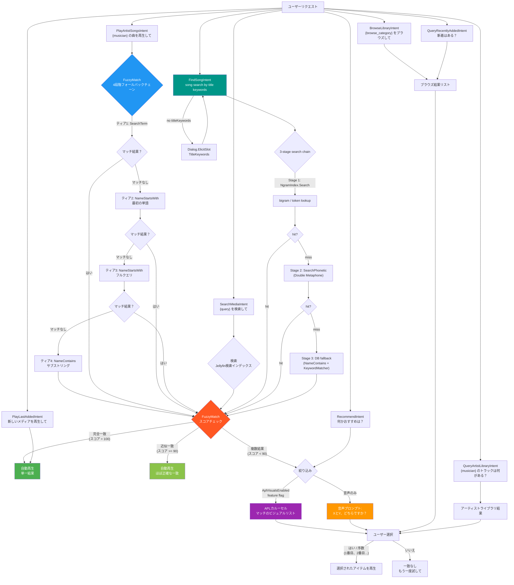

# 検索と絞り込み (ja-JP)

```mermaid
graph TD
    Start["ユーザーリクエスト"] --> PlayArtist["PlayArtistSongsIntent<br/>{musician} の曲を再生して"]
    Start --> SearchMedia["SearchMediaIntent<br/>{query} を検索して"]

    PlayArtist --> FuzzyMatch{"FuzzyMatch<br/>4段階フォールバックチェーン"}
    SearchMedia --> SearchDB{"検索<br/>Jellyfin検索インデックス"}

    FuzzyMatch -->|"ティア1: SearchTerm"| FMResult{"マッチ結果？"}
    FMResult -->|"マッチなし"| Tier2["ティア2: NameStartsWith<br/>最初の単語"]
    Tier2 --> FMResult2{"マッチ結果？"}
    FMResult2 -->|"マッチなし"| Tier3["ティア3: NameStartsWith<br/>フルクエリ"]
    Tier3 --> FMResult3{"マッチ結果？"}
    FMResult3 -->|"マッチなし"| Tier4["ティア4: NameContains<br/>サブストリング"]
    Tier4 --> ScoreCheck

    FMResult -->|"はい"| ScoreCheck
    FMResult2 -->|"はい"| ScoreCheck
    FMResult3 -->|"はい"| ScoreCheck

    SearchDB --> ScoreCheck

    ScoreCheck{"FuzzyMatch<br/>スコアチェック"}
    ScoreCheck -->|"完全一致<br/>(スコア = 100)"| AutoPlay["自動再生<br/>単一結果"]
    ScoreCheck -->|"近似一致<br/>(スコア >= 90)"| AutoPlayNear["自動再生<br/>ほぼ正確な一致"]
    ScoreCheck -->|"複数結果<br/>(スコア < 90)"| Disambig{"絞り込み"}

    Disambig -->|"AplVisualsEnabled<br/>feature flag"| Carousel["APLカルーセル<br/>マッチのビジュアルリスト"]
    Disambig -->|"音声のみ"| VoicePrompt["音声プロンプト:<br/>XとY、どちらですか？"]

    Carousel --> UserChoice["ユーザー選択"]
    VoicePrompt --> UserChoice

    UserChoice -->|"はい / 序数<br/>(1番目、2番目...)"| PlaySelected["選択されたアイテムを再生"]
    UserChoice -->|"いいえ"| NoMatch["一致なし<br/>もう一度試して"]

    Start --> BrowseLib["BrowseLibraryIntent<br/>{browse_category} をブラウズして"]
    Start --> QueryArtist["QueryArtistLibraryIntent<br/>{musician} のトラックは何がある？"]

    BrowseLib --> BrowseResults["ブラウズ結果リスト"]
    QueryArtist --> ArtistResults["アーティストライブラリ結果"]

    BrowseResults --> UserChoice
    ArtistResults --> UserChoice

    Start --> PlayLast["PlayLastAddedIntent<br/>新しいメディアを再生して"]
    Start --> RecentQuery["QueryRecentlyAddedIntent<br/>新着はある？"]

    PlayLast --> AutoPlay
    RecentQuery --> BrowseResults

    Start --> Recommend["RecommendIntent<br/>何かおすすめは？"]
    Recommend --> Disambig


    Start --> FindSong["FindSongIntent<br/>song search by title keywords"]
    FindSong --> SongChain{"3-stage search chain"}
    SongChain -->|"Stage 1: NgramIndex.Search"| Ngram["bigram / token lookup"]
    Ngram --> ChainHit{"hit?"}
    ChainHit -->|"miss"| Phonetic["Stage 2: SearchPhonetic<br/>(Double Metaphone)"]
    Phonetic --> ChainHit2{"hit?"}
    ChainHit2 -->|"miss"| DbFallback["Stage 3: DB fallback<br/>(NameContains + KeywordMatcher)"]
    ChainHit -->|"hit"| ScoreCheck
    ChainHit2 -->|"hit"| ScoreCheck
    DbFallback --> ScoreCheck
    FindSong -->|"no titleKeywords"| ElicitSong["Dialog.ElicitSlot<br/>TitleKeywords"]
    ElicitSong --> FindSong
    style FindSong fill:#009688,color:#fff

    style AutoPlay fill:#4CAF50,color:#fff
    style AutoPlayNear fill:#8BC34A,color:#fff
    style Carousel fill:#9C27B0,color:#fff
    style VoicePrompt fill:#FF9800,color:#fff
    style FuzzyMatch fill:#2196F3,color:#fff
    style ScoreCheck fill:#FF5722,color:#fff
```
