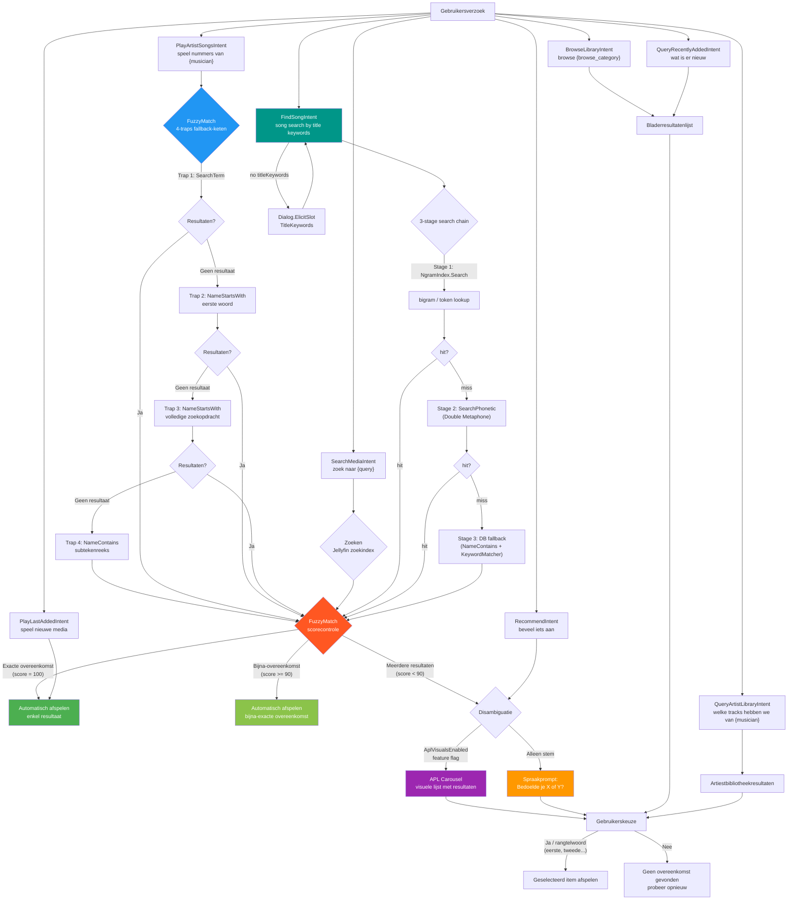

# Zoeken en Disambiguatie (nl-NL)

```mermaid
graph TD
    Start["Gebruikersverzoek"] --> PlayArtist["PlayArtistSongsIntent<br/>speel nummers van {musician}"]
    Start --> SearchMedia["SearchMediaIntent<br/>zoek naar {query}"]

    PlayArtist --> FuzzyMatch{"FuzzyMatch<br/>4-traps fallback-keten"}
    SearchMedia --> SearchDB{"Zoeken<br/>Jellyfin zoekindex"}

    FuzzyMatch -->|"Trap 1: SearchTerm"| FMResult{"Resultaten?"}
    FMResult -->|"Geen resultaat"| Tier2["Trap 2: NameStartsWith<br/>eerste woord"]
    Tier2 --> FMResult2{"Resultaten?"}
    FMResult2 -->|"Geen resultaat"| Tier3["Trap 3: NameStartsWith<br/>volledige zoekopdracht"]
    Tier3 --> FMResult3{"Resultaten?"}
    FMResult3 -->|"Geen resultaat"| Tier4["Trap 4: NameContains<br/>subtekenreeks"]
    Tier4 --> ScoreCheck

    FMResult -->|"Ja"| ScoreCheck
    FMResult2 -->|"Ja"| ScoreCheck
    FMResult3 -->|"Ja"| ScoreCheck

    SearchDB --> ScoreCheck

    ScoreCheck{"FuzzyMatch<br/>scorecontrole"}
    ScoreCheck -->|"Exacte overeenkomst<br/>(score = 100)"| AutoPlay["Automatisch afspelen<br/>enkel resultaat"]
    ScoreCheck -->|"Bijna-overeenkomst<br/>(score >= 90)"| AutoPlayNear["Automatisch afspelen<br/>bijna-exacte overeenkomst"]
    ScoreCheck -->|"Meerdere resultaten<br/>(score < 90)"| Disambig{"Disambiguatie"}

    Disambig -->|"AplVisualsEnabled<br/>feature flag"| Carousel["APL Carousel<br/>visuele lijst met resultaten"]
    Disambig -->|"Alleen stem"| VoicePrompt["Spraakprompt:<br/>Bedoelde je X of Y?"]

    Carousel --> UserChoice["Gebruikerskeuze"]
    VoicePrompt --> UserChoice

    UserChoice -->|"Ja / rangtelwoord<br/>(eerste, tweede...)"| PlaySelected["Geselecteerd item afspelen"]
    UserChoice -->|"Nee"| NoMatch["Geen overeenkomst gevonden<br/>probeer opnieuw"]

    Start --> BrowseLib["BrowseLibraryIntent<br/>browse {browse_category}"]
    Start --> QueryArtist["QueryArtistLibraryIntent<br/>welke tracks hebben we van {musician}"]

    BrowseLib --> BrowseResults["Bladerresultatenlijst"]
    QueryArtist --> ArtistResults["Artiestbibliotheekresultaten"]

    BrowseResults --> UserChoice
    ArtistResults --> UserChoice

    Start --> PlayLast["PlayLastAddedIntent<br/>speel nieuwe media"]
    Start --> RecentQuery["QueryRecentlyAddedIntent<br/>wat is er nieuw"]

    PlayLast --> AutoPlay
    RecentQuery --> BrowseResults

    Start --> Recommend["RecommendIntent<br/>beveel iets aan"]
    Recommend --> Disambig


    Start --> FindSong["FindSongIntent<br/>song search by title keywords"]
    FindSong --> SongChain{"3-stage search chain"}
    SongChain -->|"Stage 1: NgramIndex.Search"| Ngram["bigram / token lookup"]
    Ngram --> ChainHit{"hit?"}
    ChainHit -->|"miss"| Phonetic["Stage 2: SearchPhonetic<br/>(Double Metaphone)"]
    Phonetic --> ChainHit2{"hit?"}
    ChainHit2 -->|"miss"| DbFallback["Stage 3: DB fallback<br/>(NameContains + KeywordMatcher)"]
    ChainHit -->|"hit"| ScoreCheck
    ChainHit2 -->|"hit"| ScoreCheck
    DbFallback --> ScoreCheck
    FindSong -->|"no titleKeywords"| ElicitSong["Dialog.ElicitSlot<br/>TitleKeywords"]
    ElicitSong --> FindSong
    style FindSong fill:#009688,color:#fff

    style AutoPlay fill:#4CAF50,color:#fff
    style AutoPlayNear fill:#8BC34A,color:#fff
    style Carousel fill:#9C27B0,color:#fff
    style VoicePrompt fill:#FF9800,color:#fff
    style FuzzyMatch fill:#2196F3,color:#fff
    style ScoreCheck fill:#FF5722,color:#fff
```
