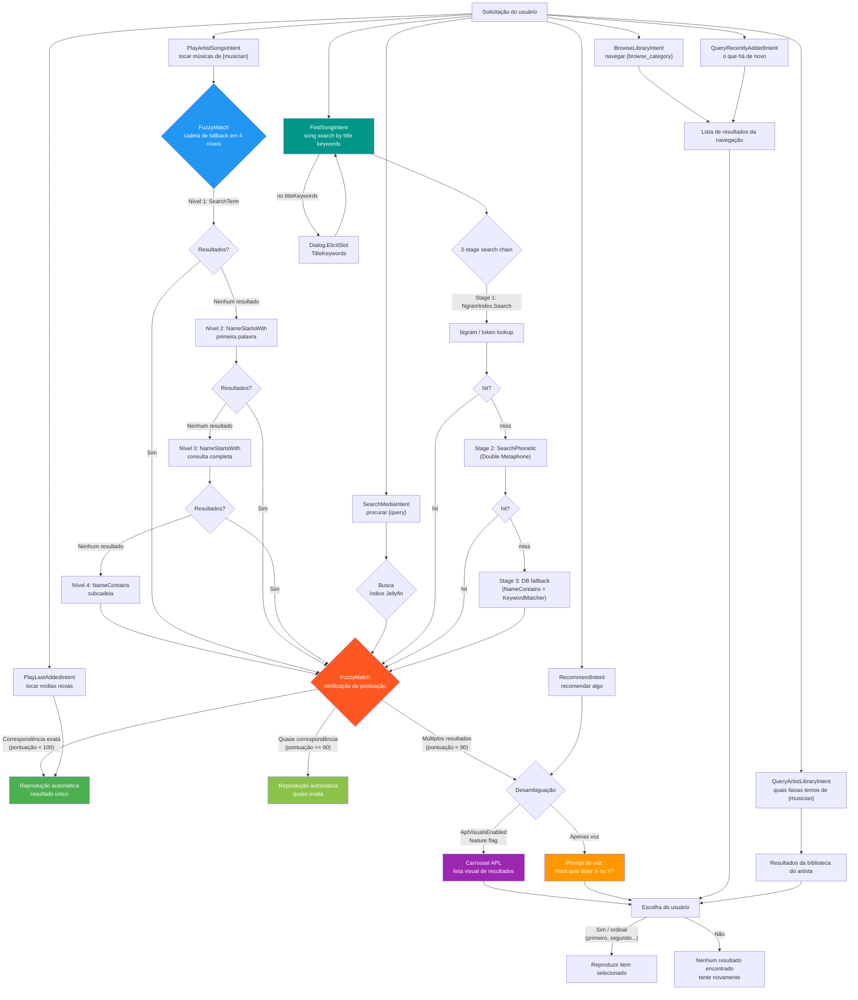

# Busca e Desambiguação (pt-BR)

```mermaid
graph TD
    Start["Solicitação do usuário"] --> PlayArtist["PlayArtistSongsIntent<br/>tocar músicas de {musician}"]
    Start --> SearchMedia["SearchMediaIntent<br/>procurar {query}"]

    PlayArtist --> FuzzyMatch{"FuzzyMatch<br/>cadeia de fallback em 4 níveis"}
    SearchMedia --> SearchDB{"Busca<br/>índice Jellyfin"}

    FuzzyMatch -->|"Nível 1: SearchTerm"| FMResult{"Resultados?"}
    FMResult -->|"Nenhum resultado"| Tier2["Nível 2: NameStartsWith<br/>primeira palavra"]
    Tier2 --> FMResult2{"Resultados?"}
    FMResult2 -->|"Nenhum resultado"| Tier3["Nível 3: NameStartsWith<br/>consulta completa"]
    Tier3 --> FMResult3{"Resultados?"}
    FMResult3 -->|"Nenhum resultado"| Tier4["Nível 4: NameContains<br/>subcadeia"]
    Tier4 --> ScoreCheck

    FMResult -->|"Sim"| ScoreCheck
    FMResult2 -->|"Sim"| ScoreCheck
    FMResult3 -->|"Sim"| ScoreCheck

    SearchDB --> ScoreCheck

    ScoreCheck{"FuzzyMatch<br/>verificação de pontuação"}
    ScoreCheck -->|"Correspondência exata<br/>(pontuação = 100)"| AutoPlay["Reprodução automática<br/>resultado único"]
    ScoreCheck -->|"Quase correspondência<br/>(pontuação >= 90)"| AutoPlayNear["Reprodução automática<br/>quase exata"]
    ScoreCheck -->|"Múltiplos resultados<br/>(pontuação < 90)"| Disambig{"Desambiguação"}

    Disambig -->|"AplVisualsEnabled<br/>feature flag"| Carousel["Carrossel APL<br/>lista visual de resultados"]
    Disambig -->|"Apenas voz"| VoicePrompt["Prompt de voz:<br/>Você quis dizer X ou Y?"]

    Carousel --> UserChoice["Escolha do usuário"]
    VoicePrompt --> UserChoice

    UserChoice -->|"Sim / ordinal<br/>(primeiro, segundo...)"| PlaySelected["Reproduzir item selecionado"]
    UserChoice -->|"Não"| NoMatch["Nenhum resultado encontrado<br/>tente novamente"]

    Start --> BrowseLib["BrowseLibraryIntent<br/>navegar {browse_category}"]
    Start --> QueryArtist["QueryArtistLibraryIntent<br/>quais faixas temos de {musician}"]

    BrowseLib --> BrowseResults["Lista de resultados da navegação"]
    QueryArtist --> ArtistResults["Resultados da biblioteca do artista"]

    BrowseResults --> UserChoice
    ArtistResults --> UserChoice

    Start --> PlayLast["PlayLastAddedIntent<br/>tocar mídias novas"]
    Start --> RecentQuery["QueryRecentlyAddedIntent<br/>o que há de novo"]

    PlayLast --> AutoPlay
    RecentQuery --> BrowseResults

    Start --> Recommend["RecommendIntent<br/>recomendar algo"]
    Recommend --> Disambig


    Start --> FindSong["FindSongIntent<br/>song search by title keywords"]
    FindSong --> SongChain{"3-stage search chain"}
    SongChain -->|"Stage 1: NgramIndex.Search"| Ngram["bigram / token lookup"]
    Ngram --> ChainHit{"hit?"}
    ChainHit -->|"miss"| Phonetic["Stage 2: SearchPhonetic<br/>(Double Metaphone)"]
    Phonetic --> ChainHit2{"hit?"}
    ChainHit2 -->|"miss"| DbFallback["Stage 3: DB fallback<br/>(NameContains + KeywordMatcher)"]
    ChainHit -->|"hit"| ScoreCheck
    ChainHit2 -->|"hit"| ScoreCheck
    DbFallback --> ScoreCheck
    FindSong -->|"no titleKeywords"| ElicitSong["Dialog.ElicitSlot<br/>TitleKeywords"]
    ElicitSong --> FindSong
    style FindSong fill:#009688,color:#fff

    style AutoPlay fill:#4CAF50,color:#fff
    style AutoPlayNear fill:#8BC34A,color:#fff
    style Carousel fill:#9C27B0,color:#fff
    style VoicePrompt fill:#FF9800,color:#fff
    style FuzzyMatch fill:#2196F3,color:#fff
    style ScoreCheck fill:#FF5722,color:#fff
```
