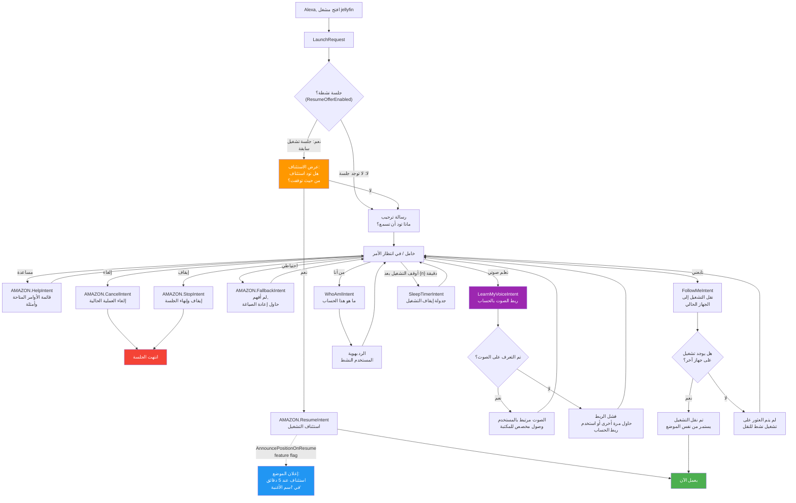

# إدارة الجلسة (ar-SA)

```mermaid
graph TD
    Open["Alexa, افتح مشغل jellyfin"] --> LaunchRequest["LaunchRequest"]

    LaunchRequest --> HasSession{"جلسة نشطة؟<br/>(ResumeOfferEnabled)"}

    HasSession -->|"نعم: جلسة تشغيل<br/>سابقة"| ResumeOffer["عرض الاستئناف:<br/>هل تود استئناف<br/>من حيث توقفت؟"]
    HasSession -->|"لا: لا توجد جلسة"| Welcome["رسالة ترحيب<br/>ماذا تود أن تسمع؟"]

    ResumeOffer -->|"نعم"| ResumePlay["AMAZON.ResumeIntent<br/>استئناف التشغيل"]
    ResumeOffer -->|"لا"| Welcome

    ResumePlay -.->|"AnnouncePositionOnResume<br/>feature flag"| PositionAnnounce["إعلان الموضع:<br/>استئناف عند 5 دقائق<br/>في 'اسم الأغنية'"]
    ResumePlay --> Playing["يعمل الآن"]

    Welcome --> Idle["خامل / في انتظار الأمر"]

    Idle -->|"مساعدة"| Help["AMAZON.HelpIntent<br/>قائمة الأوامر المتاحة<br/>وأمثلة"]
    Idle -->|"إلغاء"| Cancel["AMAZON.CancelIntent<br/>إلغاء العملية الحالية"]
    Idle -->|"إيقاف"| Stop["AMAZON.StopIntent<br/>إيقاف وإنهاء الجلسة"]
    Idle -->|"احتياطي"| Fallback["AMAZON.FallbackIntent<br/>لم أفهم,<br/>حاول إعادة الصياغة"]

    Help --> Idle
    Cancel --> EndSession["انتهت الجلسة"]
    Stop --> EndSession
    Fallback --> Idle

    Idle -->|"تعلم صوتي"| VoiceLink["LearnMyVoiceIntent<br/>ربط الصوت بالحساب"]
    VoiceLink --> VoiceResult{"تم التعرف على الصوت؟"}
    VoiceResult -->|"نعم"| Linked["الصوت مرتبط بالمستخدم<br/>وصول مخصص للمكتبة"]
    VoiceResult -->|"لا"| LinkFailed["فشل الربط<br/>حاول مرة أخرى أو استخدم ربط الحساب"]

    Linked --> Idle
    LinkFailed --> Idle

    Idle -->|"من أنا"| WhoAmI["WhoAmIIntent<br/>ما هو هذا الحساب"]
    WhoAmI --> IdentityResp["الرد بهوية<br/>المستخدم النشط"]
    IdentityResp --> Idle

    Idle -->|"تابعني"| FollowMe["FollowMeIntent<br/>نقل التشغيل إلى<br/>الجهاز الحالي"]
    FollowMe --> FollowTransfer{"هل يوجد تشغيل<br/>على جهاز آخر؟"}
    FollowTransfer -->|"نعم"| TransferOK["تم نقل التشغيل<br/>يستمر من نفس الموضع"]
    FollowTransfer -->|"لا"| NoTransfer["لم يتم العثور على<br/>تشغيل نشط للنقل"]

    TransferOK --> Playing
    NoTransfer --> Idle

    Idle -->|"أوقف التشغيل بعد {n} دقيقة"| Sleep["SleepTimerIntent<br/>جدولة إيقاف التشغيل"]
    Sleep --> Idle

    style Playing fill:#4CAF50,color:#fff
    style EndSession fill:#f44336,color:#fff
    style VoiceLink fill:#9C27B0,color:#fff
    style ResumeOffer fill:#FF9800,color:#fff
    style PositionAnnounce fill:#2196F3,color:#fff
```
