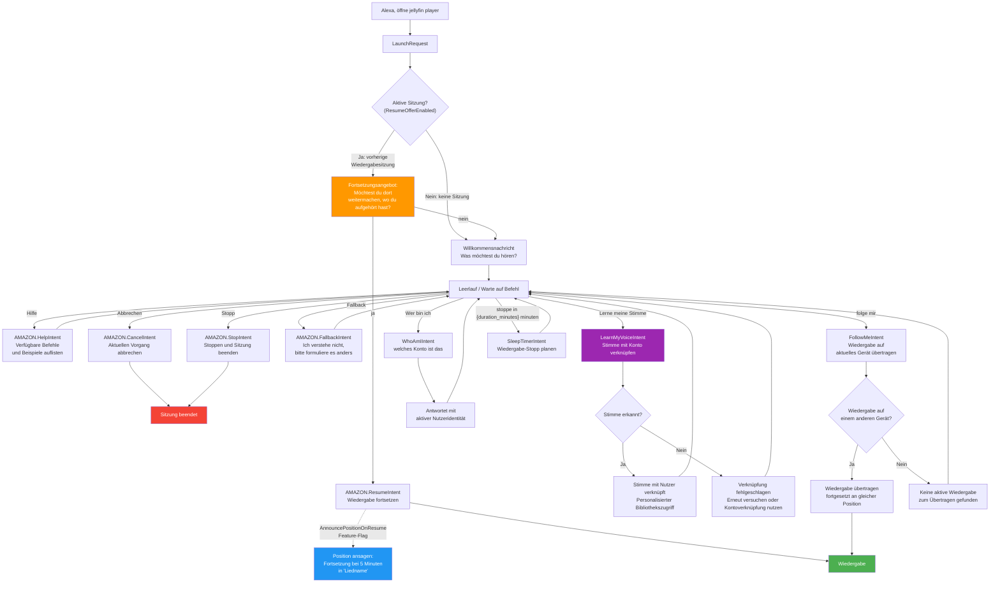

# Sitzungsverwaltung (de-DE)

```mermaid
graph TD
    Open["Alexa, öffne jellyfin player"] --> LaunchRequest["LaunchRequest"]

    LaunchRequest --> HasSession{"Aktive Sitzung?<br/>(ResumeOfferEnabled)"}

    HasSession -->|"Ja: vorherige<br/>Wiedergabesitzung"| ResumeOffer["Fortsetzungsangebot:<br/>Möchtest du dort<br/>weitermachen, wo du aufgehört hast?"]
    HasSession -->|"Nein: keine Sitzung"| Welcome["Willkommensnachricht<br/>Was möchtest du hören?"]

    ResumeOffer -->|"ja"| ResumePlay["AMAZON.ResumeIntent<br/>Wiedergabe fortsetzen"]
    ResumeOffer -->|"nein"| Welcome

    ResumePlay -.->|"AnnouncePositionOnResume<br/>Feature-Flag"| PositionAnnounce["Position ansagen:<br/>Fortsetzung bei 5 Minuten<br/>in 'Liedname'"]
    ResumePlay --> Playing["Wiedergabe"]

    Welcome --> Idle["Leerlauf / Warte auf Befehl"]

    Idle -->|"Hilfe"| Help["AMAZON.HelpIntent<br/>Verfügbare Befehle<br/>und Beispiele auflisten"]
    Idle -->|"Abbrechen"| Cancel["AMAZON.CancelIntent<br/>Aktuellen Vorgang abbrechen"]
    Idle -->|"Stopp"| Stop["AMAZON.StopIntent<br/>Stoppen und Sitzung beenden"]
    Idle -->|"Fallback"| Fallback["AMAZON.FallbackIntent<br/>Ich verstehe nicht,<br/>bitte formuliere es anders"]

    Help --> Idle
    Cancel --> EndSession["Sitzung beendet"]
    Stop --> EndSession
    Fallback --> Idle

    Idle -->|"Lerne meine Stimme"| VoiceLink["LearnMyVoiceIntent<br/>Stimme mit Konto verknüpfen"]
    VoiceLink --> VoiceResult{"Stimme erkannt?"}
    VoiceResult -->|"Ja"| Linked["Stimme mit Nutzer verknüpft<br/>Personalisierter Bibliothekszugriff"]
    VoiceResult -->|"Nein"| LinkFailed["Verknüpfung fehlgeschlagen<br/>Erneut versuchen oder Kontoverknüpfung nutzen"]

    Linked --> Idle
    LinkFailed --> Idle

    Idle -->|"Wer bin ich"| WhoAmI["WhoAmIIntent<br/>welches Konto ist das"]
    WhoAmI --> IdentityResp["Antwortet mit<br/>aktiver Nutzeridentität"]
    IdentityResp --> Idle

    Idle -->|"folge mir"| FollowMe["FollowMeIntent<br/>Wiedergabe auf<br/>aktuelles Gerät übertragen"]
    FollowMe --> FollowTransfer{"Wiedergabe auf<br/>einem anderen Gerät?"}
    FollowTransfer -->|"Ja"| TransferOK["Wiedergabe übertragen<br/>fortgesetzt an gleicher Position"]
    FollowTransfer -->|"Nein"| NoTransfer["Keine aktive Wiedergabe<br/>zum Übertragen gefunden"]

    TransferOK --> Playing
    NoTransfer --> Idle

    Idle -->|"stoppe in {duration_minutes} minuten"| Sleep["SleepTimerIntent<br/>Wiedergabe-Stopp planen"]
    Sleep --> Idle

    style Playing fill:#4CAF50,color:#fff
    style EndSession fill:#f44336,color:#fff
    style VoiceLink fill:#9C27B0,color:#fff
    style ResumeOffer fill:#FF9800,color:#fff
    style PositionAnnounce fill:#2196F3,color:#fff
```
