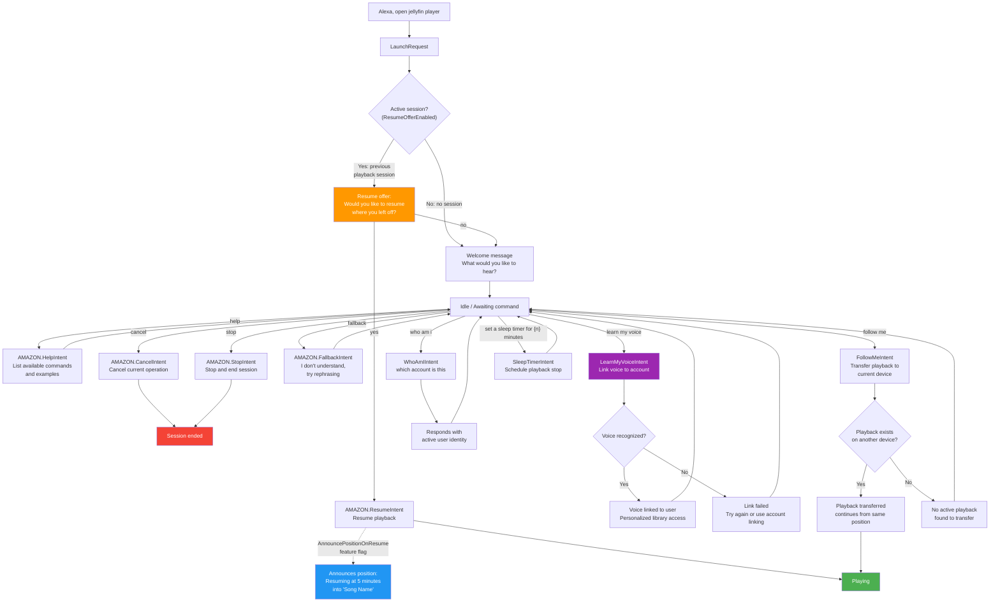

# Session Management (en-US)

```mermaid
graph TD
    Open["Alexa, open jellyfin player"] --> LaunchRequest["LaunchRequest"]

    LaunchRequest --> HasSession{"Active session?<br/>(ResumeOfferEnabled)"}

    HasSession -->|"Yes: previous<br/>playback session"| ResumeOffer["Resume offer:<br/>Would you like to resume<br/>where you left off?"]
    HasSession -->|"No: no session"| Welcome["Welcome message<br/>What would you like to hear?"]

    ResumeOffer -->|"yes"| ResumePlay["AMAZON.ResumeIntent<br/>Resume playback"]
    ResumeOffer -->|"no"| Welcome

    ResumePlay -.->|"AnnouncePositionOnResume<br/>feature flag"| PositionAnnounce["Announces position:<br/>Resuming at 5 minutes<br/>into 'Song Name'"]
    ResumePlay --> Playing["Playing"]

    Welcome --> Idle["Idle / Awaiting command"]

    Idle -->|"help"| Help["AMAZON.HelpIntent<br/>List available commands<br/>and examples"]
    Idle -->|"cancel"| Cancel["AMAZON.CancelIntent<br/>Cancel current operation"]
    Idle -->|"stop"| Stop["AMAZON.StopIntent<br/>Stop and end session"]
    Idle -->|"fallback"| Fallback["AMAZON.FallbackIntent<br/>I don't understand,<br/>try rephrasing"]

    Help --> Idle
    Cancel --> EndSession["Session ended"]
    Stop --> EndSession
    Fallback --> Idle

    Idle -->|"learn my voice"| VoiceLink["LearnMyVoiceIntent<br/>Link voice to account"]
    VoiceLink --> VoiceResult{"Voice recognized?"}
    VoiceResult -->|"Yes"| Linked["Voice linked to user<br/>Personalized library access"]
    VoiceResult -->|"No"| LinkFailed["Link failed<br/>Try again or use account linking"]

    Linked --> Idle
    LinkFailed --> Idle

    Idle -->|"who am i"| WhoAmI["WhoAmIIntent<br/>which account is this"]
    WhoAmI --> IdentityResp["Responds with<br/>active user identity"]
    IdentityResp --> Idle

    Idle -->|"follow me"| FollowMe["FollowMeIntent<br/>Transfer playback to<br/>current device"]
    FollowMe --> FollowTransfer{"Playback exists<br/>on another device?"}
    FollowTransfer -->|"Yes"| TransferOK["Playback transferred<br/>continues from same position"]
    FollowTransfer -->|"No"| NoTransfer["No active playback<br/>found to transfer"]

    TransferOK --> Playing
    NoTransfer --> Idle

    Idle -->|"set a sleep timer for {n} minutes"| Sleep["SleepTimerIntent<br/>Schedule playback stop"]
    Sleep --> Idle

    style Playing fill:#4CAF50,color:#fff
    style EndSession fill:#f44336,color:#fff
    style VoiceLink fill:#9C27B0,color:#fff
    style ResumeOffer fill:#FF9800,color:#fff
    style PositionAnnounce fill:#2196F3,color:#fff
```
