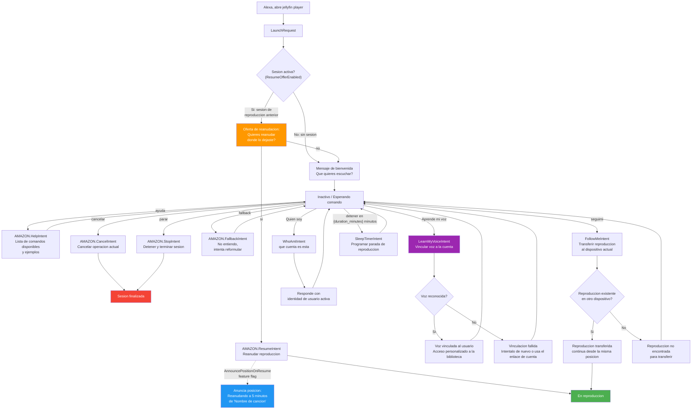

# Gestion de Sesion (es-US)

```mermaid
graph TD
    Open["Alexa, abre jellyfin player"] --> LaunchRequest["LaunchRequest"]

    LaunchRequest --> HasSession{"Sesion activa?<br/>(ResumeOfferEnabled)"}

    HasSession -->|"Si: sesion de<br/>reproduccion anterior"| ResumeOffer["Oferta de reanudacion:<br/>Quieres reanudar<br/>donde lo dejaste?"]
    HasSession -->|"No: sin sesion"| Welcome["Mensaje de bienvenida<br/>Que quieres escuchar?"]

    ResumeOffer -->|"si"| ResumePlay["AMAZON.ResumeIntent<br/>Reanudar reproduccion"]
    ResumeOffer -->|"no"| Welcome

    ResumePlay -.->|"AnnouncePositionOnResume<br/>feature flag"| PositionAnnounce["Anuncia posicion:<br/>Reanudando a 5 minutos<br/>de 'Nombre de cancion'"]
    ResumePlay --> Playing["En reproduccion"]

    Welcome --> Idle["Inactivo / Esperando comando"]

    Idle -->|"ayuda"| Help["AMAZON.HelpIntent<br/>Lista de comandos disponibles<br/>y ejemplos"]
    Idle -->|"cancelar"| Cancel["AMAZON.CancelIntent<br/>Cancelar operacion actual"]
    Idle -->|"parar"| Stop["AMAZON.StopIntent<br/>Detener y terminar sesion"]
    Idle -->|"fallback"| Fallback["AMAZON.FallbackIntent<br/>No entiendo,<br/>intenta reformular"]

    Help --> Idle
    Cancel --> EndSession["Sesion finalizada"]
    Stop --> EndSession
    Fallback --> Idle

    Idle -->|"Aprende mi voz"| VoiceLink["LearnMyVoiceIntent<br/>Vincular voz a la cuenta"]
    VoiceLink --> VoiceResult{"Voz reconocida?"}
    VoiceResult -->|"Si"| Linked["Voz vinculada al usuario<br/>Acceso personalizado a la biblioteca"]
    VoiceResult -->|"No"| LinkFailed["Vinculacion fallida<br/>Intentalo de nuevo o usa el enlace de cuenta"]

    Linked --> Idle
    LinkFailed --> Idle

    Idle -->|"Quien soy"| WhoAmI["WhoAmIIntent<br/>que cuenta es esta"]
    WhoAmI --> IdentityResp["Responde con<br/>identidad de usuario activa"]
    IdentityResp --> Idle

    Idle -->|"seguimi"| FollowMe["FollowMeIntent<br/>Transferir reproduccion<br/>al dispositivo actual"]
    FollowMe --> FollowTransfer{"Reproduccion existente<br/>en otro dispositivo?"}
    FollowTransfer -->|"Si"| TransferOK["Reproduccion transferida<br/>continua desde la misma posicion"]
    FollowTransfer -->|"No"| NoTransfer["Reproduccion no encontrada<br/>para transferir"]

    TransferOK --> Playing
    NoTransfer --> Idle

    Idle -->|"detener en {duration_minutes} minutos"| Sleep["SleepTimerIntent<br/>Programar parada de reproduccion"]
    Sleep --> Idle

    style Playing fill:#4CAF50,color:#fff
    style EndSession fill:#f44336,color:#fff
    style VoiceLink fill:#9C27B0,color:#fff
    style ResumeOffer fill:#FF9800,color:#fff
    style PositionAnnounce fill:#2196F3,color:#fff
```
