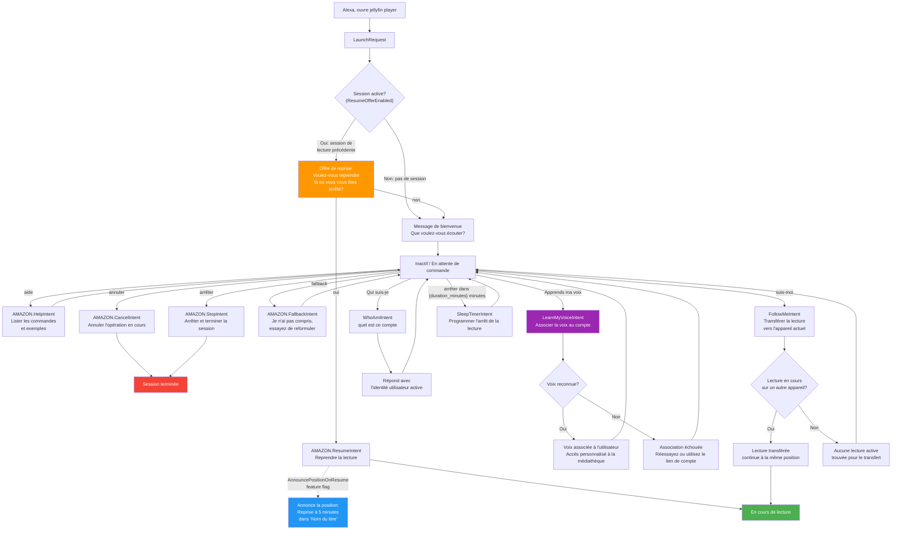

# Gestion de session (fr-FR)

```mermaid
graph TD
    Open["Alexa, ouvre jellyfin player"] --> LaunchRequest["LaunchRequest"]

    LaunchRequest --> HasSession{"Session active?<br/>(ResumeOfferEnabled)"}

    HasSession -->|"Oui: session de<br/>lecture précédente"| ResumeOffer["Offre de reprise:<br/>Voulez-vous reprendre<br/>là où vous vous êtes arrêté?"]
    HasSession -->|"Non: pas de session"| Welcome["Message de bienvenue<br/>Que voulez-vous écouter?"]

    ResumeOffer -->|"oui"| ResumePlay["AMAZON.ResumeIntent<br/>Reprendre la lecture"]
    ResumeOffer -->|"non"| Welcome

    ResumePlay -.->|"AnnouncePositionOnResume<br/>feature flag"| PositionAnnounce["Annonce la position:<br/>Reprise à 5 minutes<br/>dans 'Nom du titre'"]
    ResumePlay --> Playing["En cours de lecture"]

    Welcome --> Idle["Inactif / En attente de commande"]

    Idle -->|"aide"| Help["AMAZON.HelpIntent<br/>Lister les commandes<br/>et exemples"]
    Idle -->|"annuler"| Cancel["AMAZON.CancelIntent<br/>Annuler l'opération en cours"]
    Idle -->|"arrêter"| Stop["AMAZON.StopIntent<br/>Arrêter et terminer la session"]
    Idle -->|"fallback"| Fallback["AMAZON.FallbackIntent<br/>Je n'ai pas compris,<br/>essayez de reformuler"]

    Help --> Idle
    Cancel --> EndSession["Session terminée"]
    Stop --> EndSession
    Fallback --> Idle

    Idle -->|"Apprends ma voix"| VoiceLink["LearnMyVoiceIntent<br/>Associer la voix au compte"]
    VoiceLink --> VoiceResult{"Voix reconnue?"}
    VoiceResult -->|"Oui"| Linked["Voix associée à l'utilisateur<br/>Accès personnalisé à la médiathèque"]
    VoiceResult -->|"Non"| LinkFailed["Association échouée<br/>Réessayez ou utilisez le lien de compte"]

    Linked --> Idle
    LinkFailed --> Idle

    Idle -->|"Qui suis-je"| WhoAmI["WhoAmIIntent<br/>quel est ce compte"]
    WhoAmI --> IdentityResp["Répond avec<br/>l'identité utilisateur active"]
    IdentityResp --> Idle

    Idle -->|"suis-moi"| FollowMe["FollowMeIntent<br/>Transférer la lecture<br/>vers l'appareil actuel"]
    FollowMe --> FollowTransfer{"Lecture en cours<br/>sur un autre appareil?"}
    FollowTransfer -->|"Oui"| TransferOK["Lecture transférée<br/>continue à la même position"]
    FollowTransfer -->|"Non"| NoTransfer["Aucune lecture active<br/>trouvée pour le transfert"]

    TransferOK --> Playing
    NoTransfer --> Idle

    Idle -->|"arrêter dans {duration_minutes} minutes"| Sleep["SleepTimerIntent<br/>Programmer l'arrêt de la lecture"]
    Sleep --> Idle

    style Playing fill:#4CAF50,color:#fff
    style EndSession fill:#f44336,color:#fff
    style VoiceLink fill:#9C27B0,color:#fff
    style ResumeOffer fill:#FF9800,color:#fff
    style PositionAnnounce fill:#2196F3,color:#fff
```
