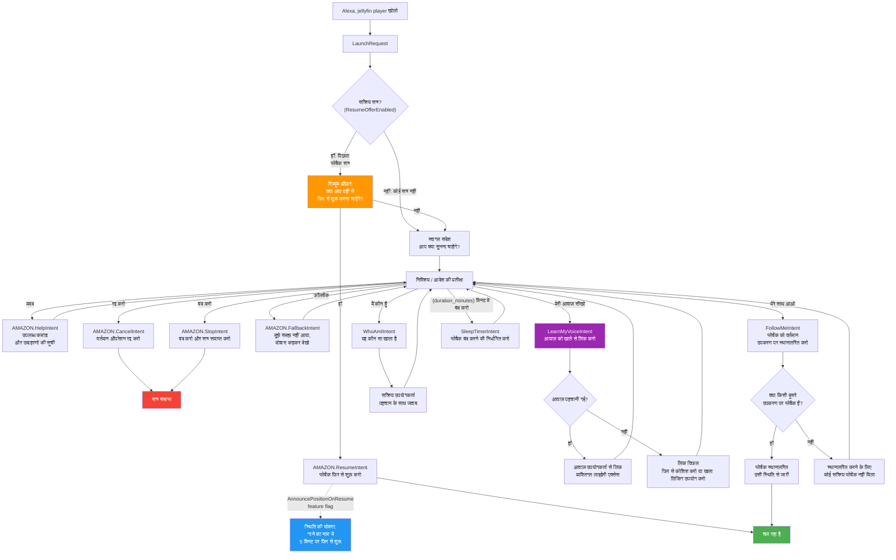

# सत्र प्रबंधन (hi-IN)

```mermaid
graph TD
    Open["Alexa, jellyfin player खोलो"] --> LaunchRequest["LaunchRequest"]

    LaunchRequest --> HasSession{"सक्रिय सत्र?<br/>(ResumeOfferEnabled)"}

    HasSession -->|"हाँ: पिछला<br/>प्लेबैक सत्र"| ResumeOffer["रिज़्यूम ऑफ़र:<br/>क्या आप वहीं से<br/>फिर से शुरू करना चाहेंगे?"]
    HasSession -->|"नहीं: कोई सत्र नहीं"| Welcome["स्वागत संदेश<br/>आप क्या सुनना चाहेंगे?"]

    ResumeOffer -->|"हाँ"| ResumePlay["AMAZON.ResumeIntent<br/>प्लेबैक फिर से शुरू करो"]
    ResumeOffer -->|"नहीं"| Welcome

    ResumePlay -.->|"AnnouncePositionOnResume<br/>feature flag"| PositionAnnounce["स्थिति की घोषणा:<br/>'गाने का नाम' में<br/>5 मिनट पर फिर से शुरू"]
    ResumePlay --> Playing["चल रहा है"]

    Welcome --> Idle["निष्क्रिय / आदेश की प्रतीक्षा"]

    Idle -->|"मदद"| Help["AMAZON.HelpIntent<br/>उपलब्ध कमांड<br/>और उदाहरणों की सूची"]
    Idle -->|"रद्द करो"| Cancel["AMAZON.CancelIntent<br/>वर्तमान ऑपरेशन रद्द करो"]
    Idle -->|"बंद करो"| Stop["AMAZON.StopIntent<br/>बंद करो और सत्र समाप्त करो"]
    Idle -->|"फॉलबैक"| Fallback["AMAZON.FallbackIntent<br/>मुझे समझ नहीं आया,<br/>दोबारा कहकर देखो"]

    Help --> Idle
    Cancel --> EndSession["सत्र समाप्त"]
    Stop --> EndSession
    Fallback --> Idle

    Idle -->|"मेरी आवाज़ सीखो"| VoiceLink["LearnMyVoiceIntent<br/>आवाज़ को खाते से लिंक करो"]
    VoiceLink --> VoiceResult{"आवाज़ पहचानी गई?"}
    VoiceResult -->|"हाँ"| Linked["आवाज़ उपयोगकर्ता से लिंक<br/>व्यक्तिगत लाइब्रेरी एक्सेस"]
    VoiceResult -->|"नहीं"| LinkFailed["लिंक विफल<br/>फिर से कोशिश करो या खाता लिंकिंग उपयोग करो"]

    Linked --> Idle
    LinkFailed --> Idle

    Idle -->|"मैं कौन हूँ"| WhoAmI["WhoAmIIntent<br/>यह कौन सा खाता है"]
    WhoAmI --> IdentityResp["सक्रिय उपयोगकर्ता<br/>पहचान के साथ जवाब"]
    IdentityResp --> Idle

    Idle -->|"मेरे साथ आओ"| FollowMe["FollowMeIntent<br/>प्लेबैक को वर्तमान<br/>उपकरण पर स्थानांतरित करो"]
    FollowMe --> FollowTransfer{"क्या किसी दूसरे<br/>उपकरण पर प्लेबैक है?"}
    FollowTransfer -->|"हाँ"| TransferOK["प्लेबैक स्थानांतरित<br/>उसी स्थिति से जारी"]
    FollowTransfer -->|"नहीं"| NoTransfer["स्थानांतरित करने के लिए<br/>कोई सक्रिय प्लेबैक नहीं मिला"]

    TransferOK --> Playing
    NoTransfer --> Idle

    Idle -->|"{duration_minutes} मिनट में बंद करो"| Sleep["SleepTimerIntent<br/>प्लेबैक बंद करने की निर्धारित करो"]
    Sleep --> Idle

    style Playing fill:#4CAF50,color:#fff
    style EndSession fill:#f44336,color:#fff
    style VoiceLink fill:#9C27B0,color:#fff
    style ResumeOffer fill:#FF9800,color:#fff
    style PositionAnnounce fill:#2196F3,color:#fff
```
