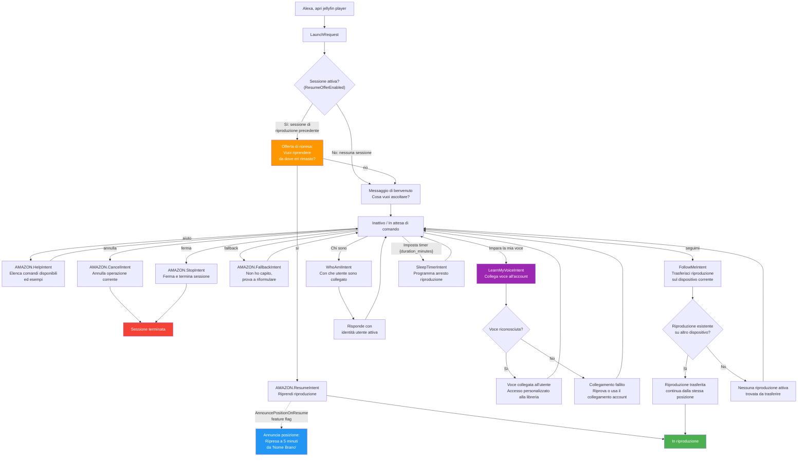

# Gestione Sessione (it-IT)

```mermaid
graph TD
    Open["Alexa, apri jellyfin player"] --> LaunchRequest["LaunchRequest"]

    LaunchRequest --> HasSession{"Sessione attiva?<br/>(ResumeOfferEnabled)"}

    HasSession -->|"Sì: sessione di<br/>riproduzione precedente"| ResumeOffer["Offerta di ripresa:<br/>Vuoi riprendere<br/>da dove eri rimasto?"]
    HasSession -->|"No: nessuna sessione"| Welcome["Messaggio di benvenuto<br/>Cosa vuoi ascoltare?"]

    ResumeOffer -->|"sì"| ResumePlay["AMAZON.ResumeIntent<br/>Riprendi riproduzione"]
    ResumeOffer -->|"no"| Welcome

    ResumePlay -.->|"AnnouncePositionOnResume<br/>feature flag"| PositionAnnounce["Annuncia posizione:<br/>Ripresa a 5 minuti<br/>da 'Nome Brano'"]
    ResumePlay --> Playing["In riproduzione"]

    Welcome --> Idle["Inattivo / In attesa di comando"]

    Idle -->|"aiuto"| Help["AMAZON.HelpIntent<br/>Elenca comandi disponibili<br/>ed esempi"]
    Idle -->|"annulla"| Cancel["AMAZON.CancelIntent<br/>Annulla operazione corrente"]
    Idle -->|"ferma"| Stop["AMAZON.StopIntent<br/>Ferma e termina sessione"]
    Idle -->|"fallback"| Fallback["AMAZON.FallbackIntent<br/>Non ho capito,<br/>prova a riformulare"]

    Help --> Idle
    Cancel --> EndSession["Sessione terminata"]
    Stop --> EndSession
    Fallback --> Idle

    Idle -->|"Impara la mia voce"| VoiceLink["LearnMyVoiceIntent<br/>Collega voce all'account"]
    VoiceLink --> VoiceResult{"Voce riconosciuta?"}
    VoiceResult -->|"Sì"| Linked["Voce collegata all'utente<br/>Accesso personalizzato alla libreria"]
    VoiceResult -->|"No"| LinkFailed["Collegamento fallito<br/>Riprova o usa il collegamento account"]

    Linked --> Idle
    LinkFailed --> Idle

    Idle -->|"Chi sono"| WhoAmI["WhoAmIIntent<br/>Con che utente sono collegato"]
    WhoAmI --> IdentityResp["Risponde con<br/>identità utente attiva"]
    IdentityResp --> Idle

    Idle -->|"seguimi"| FollowMe["FollowMeIntent<br/>Trasferisci riproduzione<br/>sul dispositivo corrente"]
    FollowMe --> FollowTransfer{"Riproduzione esistente<br/>su altro dispositivo?"}
    FollowTransfer -->|"Sì"| TransferOK["Riproduzione trasferita<br/>continua dalla stessa posizione"]
    FollowTransfer -->|"No"| NoTransfer["Nessuna riproduzione attiva<br/>trovata da trasferire"]

    TransferOK --> Playing
    NoTransfer --> Idle

    Idle -->|"Imposta timer {duration_minutes}"| Sleep["SleepTimerIntent<br/>Programma arresto riproduzione"]
    Sleep --> Idle

    style Playing fill:#4CAF50,color:#fff
    style EndSession fill:#f44336,color:#fff
    style VoiceLink fill:#9C27B0,color:#fff
    style ResumeOffer fill:#FF9800,color:#fff
    style PositionAnnounce fill:#2196F3,color:#fff
```
