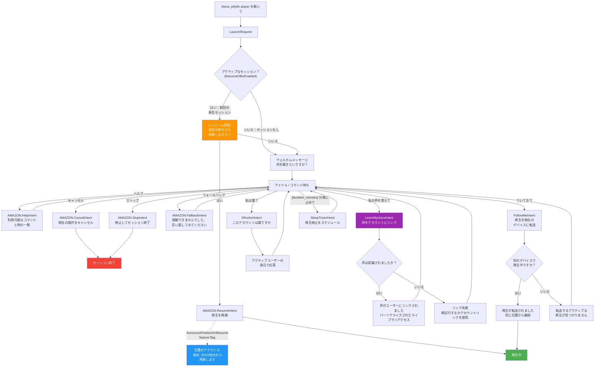

# セッション管理 (ja-JP)

```mermaid
graph TD
    Open["Alexa, jellyfin player を開いて"] --> LaunchRequest["LaunchRequest"]

    LaunchRequest --> HasSession{"アクティブなセッション？<br/>(ResumeOfferEnabled)"}

    HasSession -->|"はい：前回の<br/>再生セッション"| ResumeOffer["レジューム提案:<br/>前回の続きから<br/>再開しますか？"]
    HasSession -->|"いいえ：セッションなし"| Welcome["ウェルカムメッセージ<br/>何を聴きたいですか？"]

    ResumeOffer -->|"はい"| ResumePlay["AMAZON.ResumeIntent<br/>再生を再開"]
    ResumeOffer -->|"いいえ"| Welcome

    ResumePlay -.->|"AnnouncePositionOnResume<br/>feature flag"| PositionAnnounce["位置のアナウンス:<br/>'曲名' の5分地点から<br/>再開します"]
    ResumePlay --> Playing["再生中"]

    Welcome --> Idle["アイドル / コマンド待ち"]

    Idle -->|"ヘルプ"| Help["AMAZON.HelpIntent<br/>利用可能なコマンド<br/>と例の一覧"]
    Idle -->|"キャンセル"| Cancel["AMAZON.CancelIntent<br/>現在の操作をキャンセル"]
    Idle -->|"ストップ"| Stop["AMAZON.StopIntent<br/>停止してセッション終了"]
    Idle -->|"フォールバック"| Fallback["AMAZON.FallbackIntent<br/>理解できませんでした、<br/>言い直してみてください"]

    Help --> Idle
    Cancel --> EndSession["セッション終了"]
    Stop --> EndSession
    Fallback --> Idle

    Idle -->|"私の声を覚えて"| VoiceLink["LearnMyVoiceIntent<br/>声をアカウントにリンク"]
    VoiceLink --> VoiceResult{"声は認識されましたか？"}
    VoiceResult -->|"はい"| Linked["声がユーザーにリンクされました<br/>パーソナライズされたライブラリアクセス"]
    VoiceResult -->|"いいえ"| LinkFailed["リンク失敗<br/>再試行するかアカウントリンクを使用"]

    Linked --> Idle
    LinkFailed --> Idle

    Idle -->|"私は誰？"| WhoAmI["WhoAmIIntent<br/>このアカウントは誰ですか"]
    WhoAmI --> IdentityResp["アクティブユーザーの<br/>身元で応答"]
    IdentityResp --> Idle

    Idle -->|"ついてきて"| FollowMe["FollowMeIntent<br/>再生を現在の<br/>デバイスに転送"]
    FollowMe --> FollowTransfer{"別のデバイスで<br/>再生中ですか？"}
    FollowTransfer -->|"はい"| TransferOK["再生が転送されました<br/>同じ位置から継続"]
    FollowTransfer -->|"いいえ"| NoTransfer["転送するアクティブな<br/>再生が見つかりません"]

    TransferOK --> Playing
    NoTransfer --> Idle

    Idle -->|"{duration_minutes} 分後に止めて"| Sleep["SleepTimerIntent<br/>再生停止をスケジュール"]
    Sleep --> Idle

    style Playing fill:#4CAF50,color:#fff
    style EndSession fill:#f44336,color:#fff
    style VoiceLink fill:#9C27B0,color:#fff
    style ResumeOffer fill:#FF9800,color:#fff
    style PositionAnnounce fill:#2196F3,color:#fff
```
