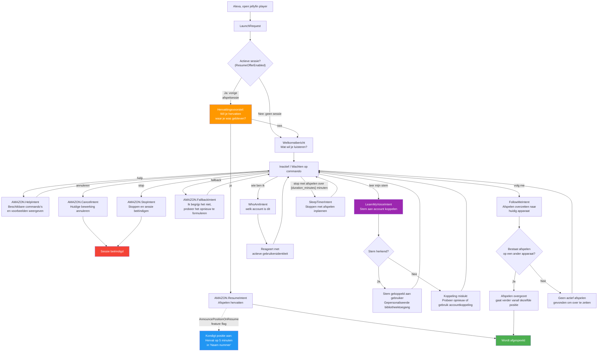

# Sessiebeheer (nl-NL)

```mermaid
graph TD
    Open["Alexa, open jellyfin player"] --> LaunchRequest["LaunchRequest"]

    LaunchRequest --> HasSession{"Actieve sessie?<br/>(ResumeOfferEnabled)"}

    HasSession -->|"Ja: vorige<br/>afspelsessie"| ResumeOffer["Hervattingsvoorstel:<br/>Wil je hervatten<br/>waar je was gebleven?"]
    HasSession -->|"Nee: geen sessie"| Welcome["Welkomstbericht<br/>Wat wil je luisteren?"]

    ResumeOffer -->|"ja"| ResumePlay["AMAZON.ResumeIntent<br/>Afspelen hervatten"]
    ResumeOffer -->|"nee"| Welcome

    ResumePlay -.->|"AnnouncePositionOnResume<br/>feature flag"| PositionAnnounce["Kondigt positie aan:<br/>Hervat op 5 minuten<br/>in 'Naam nummer'"]
    ResumePlay --> Playing["Wordt afgespeeld"]

    Welcome --> Idle["Inactief / Wachten op commando"]

    Idle -->|"help"| Help["AMAZON.HelpIntent<br/>Beschikbare commando's<br/>en voorbeelden weergeven"]
    Idle -->|"annuleren"| Cancel["AMAZON.CancelIntent<br/>Huidige bewerking annuleren"]
    Idle -->|"stop"| Stop["AMAZON.StopIntent<br/>Stoppen en sessie beëindigen"]
    Idle -->|"fallback"| Fallback["AMAZON.FallbackIntent<br/>Ik begrijp het niet,<br/>probeer het opnieuw te formuleren"]

    Help --> Idle
    Cancel --> EndSession["Sessie beëindigd"]
    Stop --> EndSession
    Fallback --> Idle

    Idle -->|"leer mijn stem"| VoiceLink["LearnMyVoiceIntent<br/>Stem aan account koppelen"]
    VoiceLink --> VoiceResult{"Stem herkend?"}
    VoiceResult -->|"Ja"| Linked["Stem gekoppeld aan gebruiker<br/>Gepersonaliseerde bibliotheektoegang"]
    VoiceResult -->|"Nee"| LinkFailed["Koppeling mislukt<br/>Probeer opnieuw of gebruik accountkoppeling"]

    Linked --> Idle
    LinkFailed --> Idle

    Idle -->|"wie ben ik"| WhoAmI["WhoAmIIntent<br/>welk account is dit"]
    WhoAmI --> IdentityResp["Reageert met<br/>actieve gebruikersidentiteit"]
    IdentityResp --> Idle

    Idle -->|"volg me"| FollowMe["FollowMeIntent<br/>Afspelen overzetten naar<br/>huidig apparaat"]
    FollowMe --> FollowTransfer{"Bestaat afspelen<br/>op een ander apparaat?"}
    FollowTransfer -->|"Ja"| TransferOK["Afspelen overgezet<br/>gaat verder vanaf dezelfde positie"]
    FollowTransfer -->|"Nee"| NoTransfer["Geen actief afspelen<br/>gevonden om over te zetten"]

    TransferOK --> Playing
    NoTransfer --> Idle

    Idle -->|"stop met afspelen over {duration_minutes} minuten"| Sleep["SleepTimerIntent<br/>Stoppen met afspelen inplannen"]
    Sleep --> Idle

    style Playing fill:#4CAF50,color:#fff
    style EndSession fill:#f44336,color:#fff
    style VoiceLink fill:#9C27B0,color:#fff
    style ResumeOffer fill:#FF9800,color:#fff
    style PositionAnnounce fill:#2196F3,color:#fff
```
