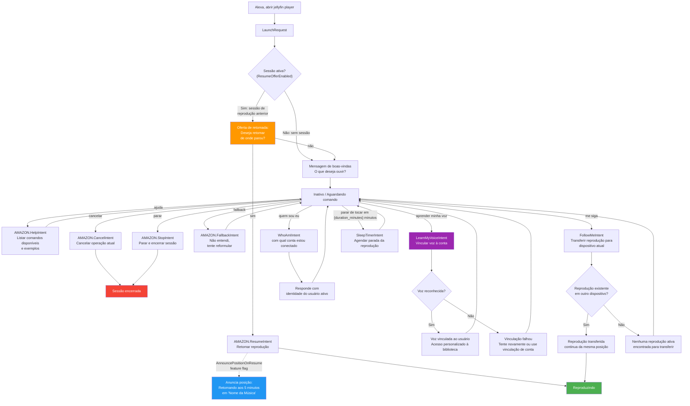

# Gerenciamento de Sessão (pt-BR)

```mermaid
graph TD
    Open["Alexa, abrir jellyfin player"] --> LaunchRequest["LaunchRequest"]

    LaunchRequest --> HasSession{"Sessão ativa?<br/>(ResumeOfferEnabled)"}

    HasSession -->|"Sim: sessão de<br/>reprodução anterior"| ResumeOffer["Oferta de retomada:<br/>Deseja retomar<br/>de onde parou?"]
    HasSession -->|"Não: sem sessão"| Welcome["Mensagem de boas-vindas<br/>O que deseja ouvir?"]

    ResumeOffer -->|"sim"| ResumePlay["AMAZON.ResumeIntent<br/>Retomar reprodução"]
    ResumeOffer -->|"não"| Welcome

    ResumePlay -.->|"AnnouncePositionOnResume<br/>feature flag"| PositionAnnounce["Anuncia posição:<br/>Retomando aos 5 minutos<br/>em 'Nome da Música'"]
    ResumePlay --> Playing["Reproduzindo"]

    Welcome --> Idle["Inativo / Aguardando comando"]

    Idle -->|"ajuda"| Help["AMAZON.HelpIntent<br/>Listar comandos disponíveis<br/>e exemplos"]
    Idle -->|"cancelar"| Cancel["AMAZON.CancelIntent<br/>Cancelar operação atual"]
    Idle -->|"parar"| Stop["AMAZON.StopIntent<br/>Parar e encerrar sessão"]
    Idle -->|"fallback"| Fallback["AMAZON.FallbackIntent<br/>Não entendi,<br/>tente reformular"]

    Help --> Idle
    Cancel --> EndSession["Sessão encerrada"]
    Stop --> EndSession
    Fallback --> Idle

    Idle -->|"aprender minha voz"| VoiceLink["LearnMyVoiceIntent<br/>Vincular voz à conta"]
    VoiceLink --> VoiceResult{"Voz reconhecida?"}
    VoiceResult -->|"Sim"| Linked["Voz vinculada ao usuário<br/>Acesso personalizado à biblioteca"]
    VoiceResult -->|"Não"| LinkFailed["Vinculação falhou<br/>Tente novamente ou use vinculação de conta"]

    Linked --> Idle
    LinkFailed --> Idle

    Idle -->|"quem sou eu"| WhoAmI["WhoAmIIntent<br/>com qual conta estou conectado"]
    WhoAmI --> IdentityResp["Responde com<br/>identidade do usuário ativo"]
    IdentityResp --> Idle

    Idle -->|"me siga"| FollowMe["FollowMeIntent<br/>Transferir reprodução para<br/>dispositivo atual"]
    FollowMe --> FollowTransfer{"Reprodução existente<br/>em outro dispositivo?"}
    FollowTransfer -->|"Sim"| TransferOK["Reprodução transferida<br/>continua da mesma posição"]
    FollowTransfer -->|"Não"| NoTransfer["Nenhuma reprodução ativa<br/>encontrada para transferir"]

    TransferOK --> Playing
    NoTransfer --> Idle

    Idle -->|"parar de tocar em {duration_minutes} minutos"| Sleep["SleepTimerIntent<br/>Agendar parada da reprodução"]
    Sleep --> Idle

    style Playing fill:#4CAF50,color:#fff
    style EndSession fill:#f44336,color:#fff
    style VoiceLink fill:#9C27B0,color:#fff
    style ResumeOffer fill:#FF9800,color:#fff
    style PositionAnnounce fill:#2196F3,color:#fff
```
